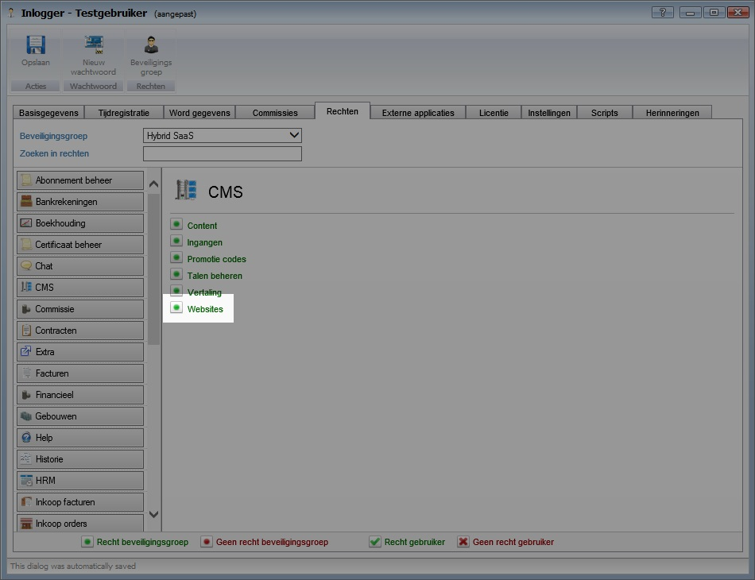
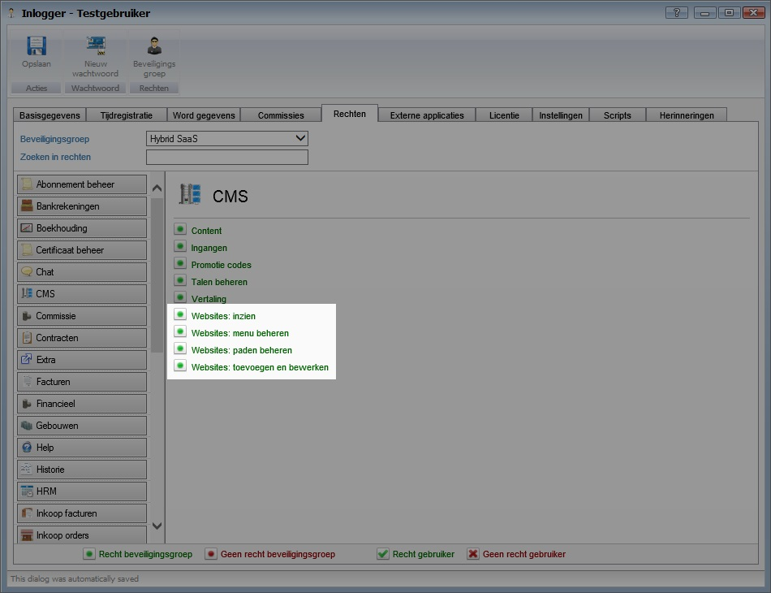

<properties>
	<page>
		<title>Release notes volgende versie</title>
	</page>
	<menu>
		<position>Release notes</position>
		<title>Volgende versie</title>
	</menu>
</properties>

# Release notes volgende versie #

In de release notes staan de wijzigingen voor de volgende productieversie van Hybrid SaaS.

De beschreven aanpassingen zijn nog niet algemeen beschikbaar. De volgende release van Hybrid SaaS zal deze functionaliteiten bevatten.

 

## Systeem ##

**Ongeldige bureaublad iconen**

Indien er een snelkoppeling op het bureaublad is geplaatst die verwijst naar een Hybrid SaaS optie die niet meer bestaat of is gewijzigd, kon een foutmelding optreden na het aanklikken. Na deze update zullen deze iconen niet meer worden getoond.

Bepaalde Hybrid SaaS functies kunnen wijzigen en daardoor kunnen snelkoppelingen die wijzen naar een pakketfunctie die niet meer geldig zijn. U kunt vanuit het menu opnieuw een snelkoppeling aanmaken. Soms kan het zijn dat functionaliteit is gewijzigd, raadpleeg hiervoor de release notes. 

  

## Module website ##

**Website rechten uitgebreid**

De website rechten zijn nu uitgebreid van één naar 4 rechten:

*van*

*naar*

Het is nu mogelijk om de volgende rechten apart in te stellen:

- Websites inzien
- Websites toevoegen/bewerken
- Website paden beheren
- Website menu's beheren 

Na de upgrade krijgen alle gebruikers die alleen rechten hadden voor websites, automatisch deze nieuwe rechten toegewezen.

