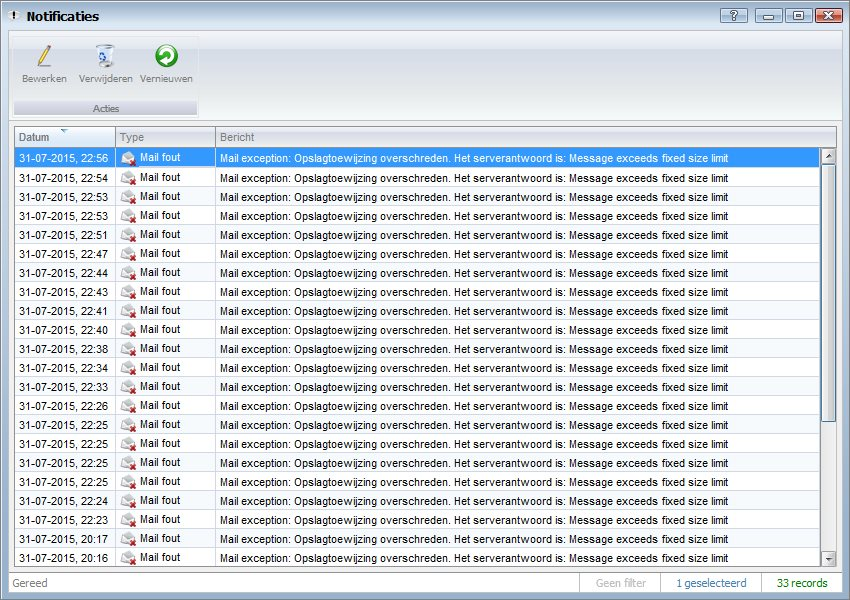
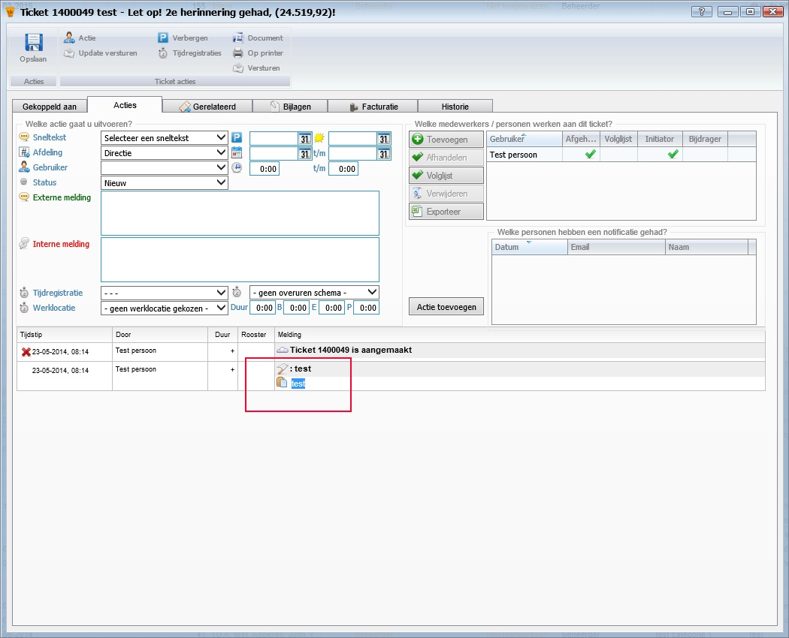

<properties>
	<page>
		<title>Release notes volgende versie</title>
	</page>
	<menu>
		<position>Release notes</position>
		<title>Volgende versie</title>
	</menu>
</properties>

# Release notes volgende versie #

In de release notes staan de wijzigingen voor de volgende productieversie van Hybrid SaaS.

De beschreven aanpassingen zijn nog niet algemeen beschikbaar. De volgende release van Hybrid SaaS zal deze functionaliteiten bevatten.

 

## Balans & Winst en verliesrekening ##

**Controle op ontbrekende boekstuknummer in de Inkoopfacturen**

In de balans & winst en verliesrekening is er nu een controlefunctie bij gekomen, er zal nu ook worden gecontroleerd of de boekstuknummers van alle "inkoopfacturen" in volgorde zullen doorlopen. 
Ontbreekt er een nummer, dan zal dit worden aangegeven en moeten worden opgelost, anders is het jaar niet afsluitbaar.

 
## E-mail feedback ##

**Email, feedback als er geen e-mail is verzonden**

Er is een nieuw overzichtsvenster toegevoegd voor applicatie beheerders. In dit venster komen notificaties over e-mails die niet verzonden zijn.

Ook is het nu mogelijk om een e-mail te krijgen als het verzenden niet is gelukt.

Zodra je het ingesteld hebt ontvang je een e-mail als het verzenden niet is gelukt. De e-mail ziet er als volgend uit.

## Ticket systeem ##

**Tekst selecteren in ticket historie**

Het is nu mogelijk om in de ticket historie tekst te selecteren om bijvoorbeeld de tekst te kopiëren.

