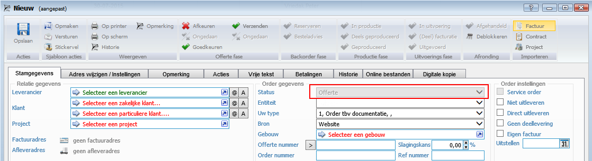

<properties>
	<page>
		<title>Versie 15.8.1708</title>
	</page>
	<menu>
		<position>Release notes</position>
		<title>Laatste versie (10-08-2015)</title>
	</menu>
</properties>

# Versie 15.8.1708 #
Uitgebracht op 10 augustus 2015

## Website ##

**Bestelling plaatsen via de website**

Als er een bestelling geplaatst werd via de website, kwam de status van de order automatisch op geaccepteerd te staan.

Er is nu een onderscheid gemaakt:

- Als de bestelling de betaalmethode *op rekening* of *handmatige* (overboeking) bevat, zal de status *offerte* worden geselecteerd
- Als de betaling via iDeal of met een andere betaalmogelijkheid is verricht, zal de status op *geaccepteerd* worden gezet

**Product data**

De data endpoint /data/product/{product}/related-products kon een dubbeling van producten geven.  