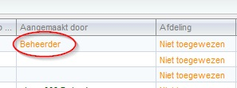

<properties>
	<page>
		<title>Versie 15.8.1714</title>
	</page>
	<menu>
		<position>Release notes</position>
		<title>Versie 15.8.1714 (12-08-2015)</title>
		<sort>98286</sort>
	</menu>
</properties>

# Versie 15.8.1714 #
Uitgebracht op 12 augustus 2015

## Tickets ##

**Ticket aanmaken, 'aangemaakt door'**

Als er een nieuwe ticket door een gebruiker werd aangemaakt, werd de 'aangemaakt door' kolom niet gevuld. Na deze update zal wel automatisch de naam van de gebruiker worden ingevuld.