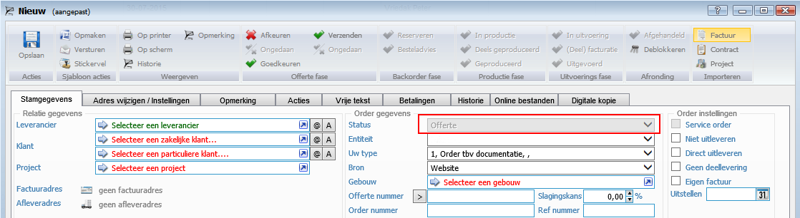

<properties>
	<page>
		<title>Release notes volgende versie</title>
	</page>
	<menu>
		<position>Release notes</position>
		<title>Volgende versie</title>
	</menu>
</properties>

# Release notes volgende versie #

In de release notes staan de wijzigingen voor de volgende productieversie van Hybrid SaaS.

De beschreven aanpassingen zijn nog niet algemeen beschikbaar. De volgende release van Hybrid SaaS zal deze functionaliteiten bevatten.

## Bestelling plaatsen via de website ##

Als er een bestelling geplaatst werd via de website, kwam de status van de order automatisch op geaccepteerd te staan.

Er is nu een onderscheid gemaakt:

- Als de bestelling de betaalmethode *op rekening* of *handmatige* (overboeking) bevat, zal de status *offerte* worden geselecteerd
- Als de betaling via iDeal of met een andere betaalmogelijkheid is verricht, zal de status op *geaccepteerd* worden gezet
