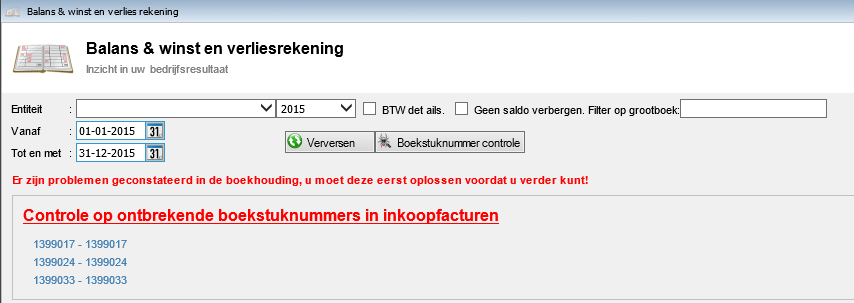
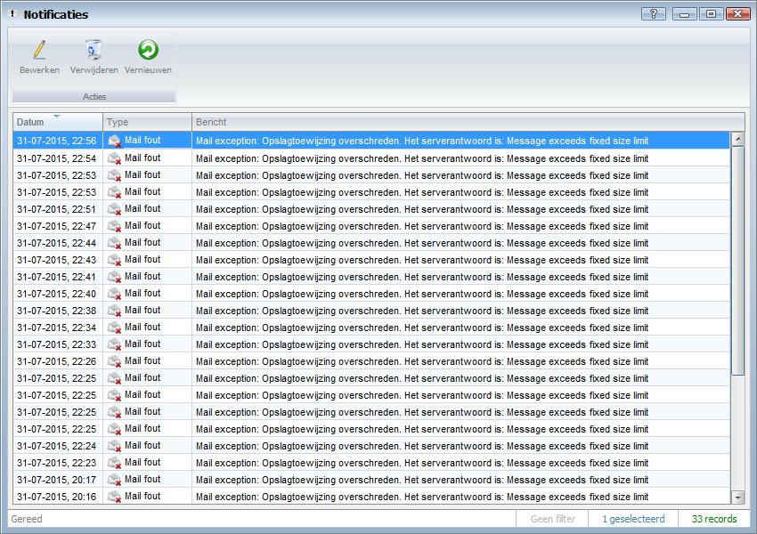
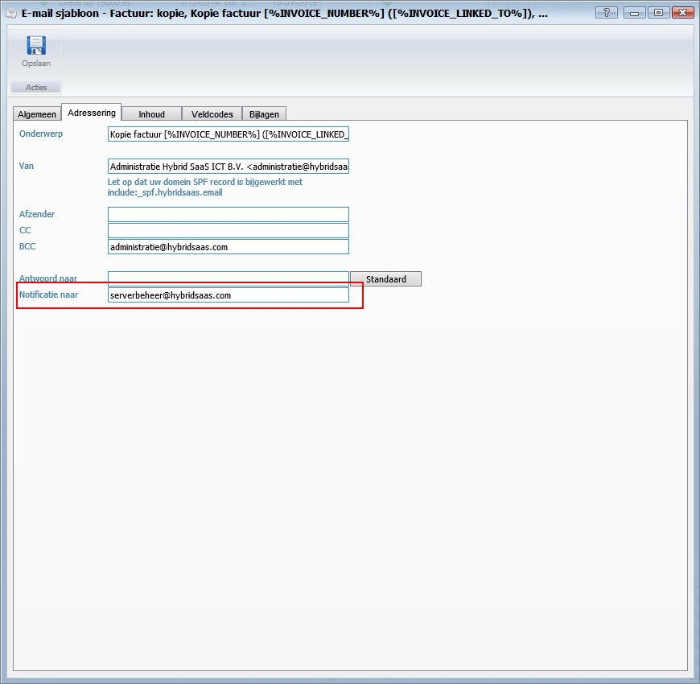
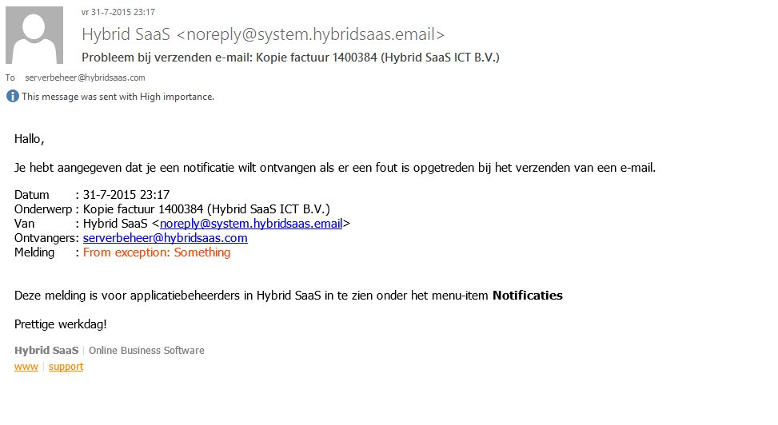
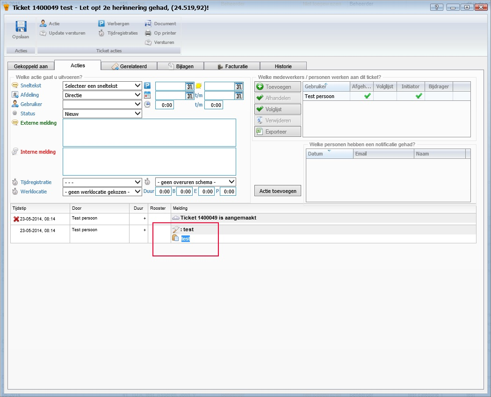
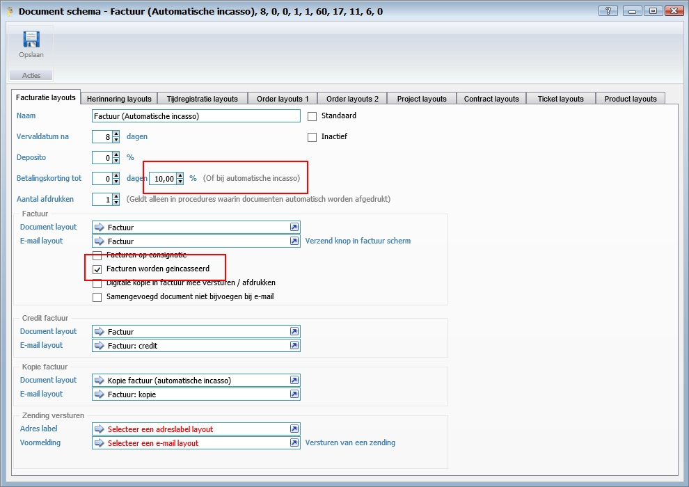
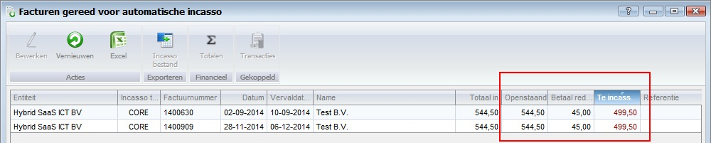
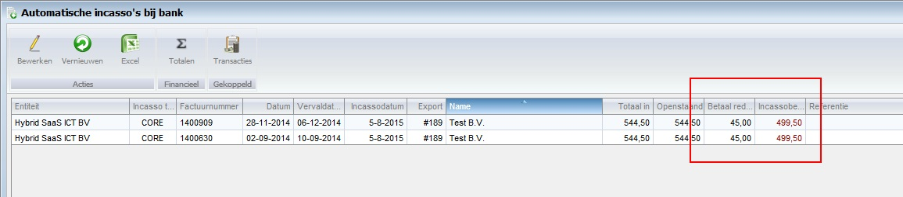
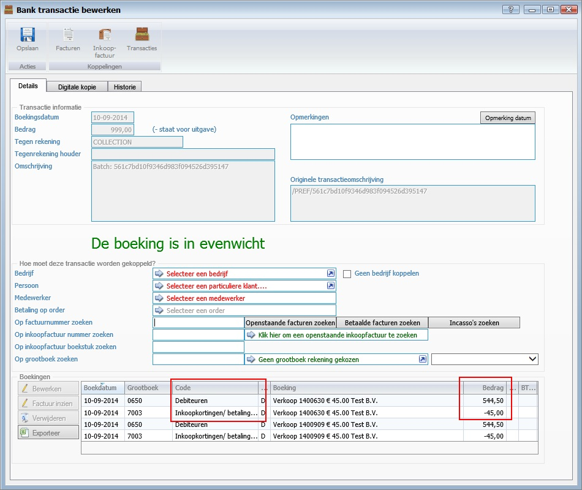
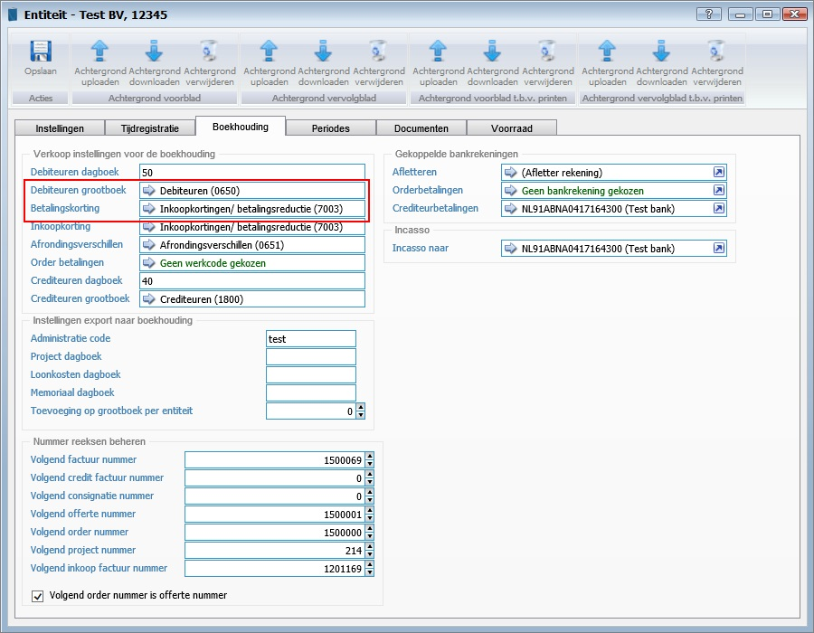

<properties>
	<page>
		<title>Release notes volgende versie</title>
	</page>
	<menu>
		<position>Release notes</position>
		<title>Volgende versie</title>
	</menu>
</properties>

# Release notes volgende versie #
In de release notes staan de wijzigingen voor de volgende productieversie van Hybrid SaaS.

De beschreven aanpassingen zijn nog niet algemeen beschikbaar. De volgende release van Hybrid SaaS zal deze functionaliteiten bevatten.

## Balans & Winst en verliesrekening ##

**Controle op ontbrekende boekstuknummer in de Inkoopfacturen**

In de balans & winst en verliesrekening is er nu een controlefunctie bij gekomen, er zal nu ook worden gecontroleerd of de boekstuknummers van alle "inkoopfacturen" in volgorde zullen doorlopen. 
Indien er nummers niet correct aansluiten, zal dit worden aangegeven:

## Systeemfunctionaliteit ##

**Email, feedback als er geen e-mail is verzonden**

Er is een nieuw overzichtsvenster toegevoegd voor applicatie beheerders. In dit venster komen notificaties terecht van e-mails die niet werden verzonden:

Ook is het nu mogelijk om een e-mail bericht te ontvangen indien het verzenden niet is gelukt.

Zodra je het hebt ingesteld ontvang je een e-mail als het verzenden niet is gelukt. De e-mail ziet er als volgt uit.

## Ticketsysteem ##

**Tekst selecteren in ticket historie**

Het is nu mogelijk om in de ticket historie tekst te selecteren en te kopiëren.

**XSS bij aanlevering vanuit e-mail**

Het kon voorkomen dat een xss werd doorgelaten indien een ticket was aangemaakt dmv een email. Dit is nu ondervangen.  

**Control characters vanuit e-mail**

Het kon voorkomen dat bepaalde systeem karakters een foutmelding kon geven in Hybrid SaaS. Deze karakters worden uitgefilterd en geven geen problemen meer.  

## Automatische incasso ##

Het was niet mogelijk om automatisch een betalingskorting toe te passen op automatische incassofacturen met een documentschema waar een betalingskorting van toepassing is.

Indien er een kortingspercentage is ingegeven en de facturen worden geïncasseerd zal Hybrid SaaS hier automatisch rekening mee houden:

In het overzichtsvenster '*Facturen gereed voor automatische incasso*' is de betalingskorting en het te incasseren bedrag zichtbaar:

Na export is ook bij het overzichtsvenster '*Automatische incasso's bij bank*' de betalingskorting en het te incasseren bedrag zichtbaar:

 

Na het inlezen van de banktransacties zullen de aangeboden automatische incasso's worden gesplitst over 2 grootboekrekeningen, het originele factuurbedrag en de betalingskorting

deze grootboek kan je instellen op in het entiteit-scherm

## Bankrekening ##

**Verwijderen van bankrekening import**

Het verwijderen van een bankrekeningimport gaf een foutmelding dat de periode was geblokkeerd, deze melding was niet terecht.

