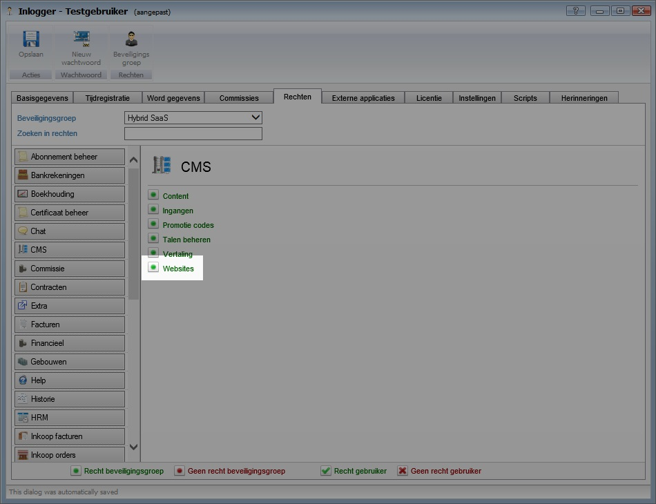
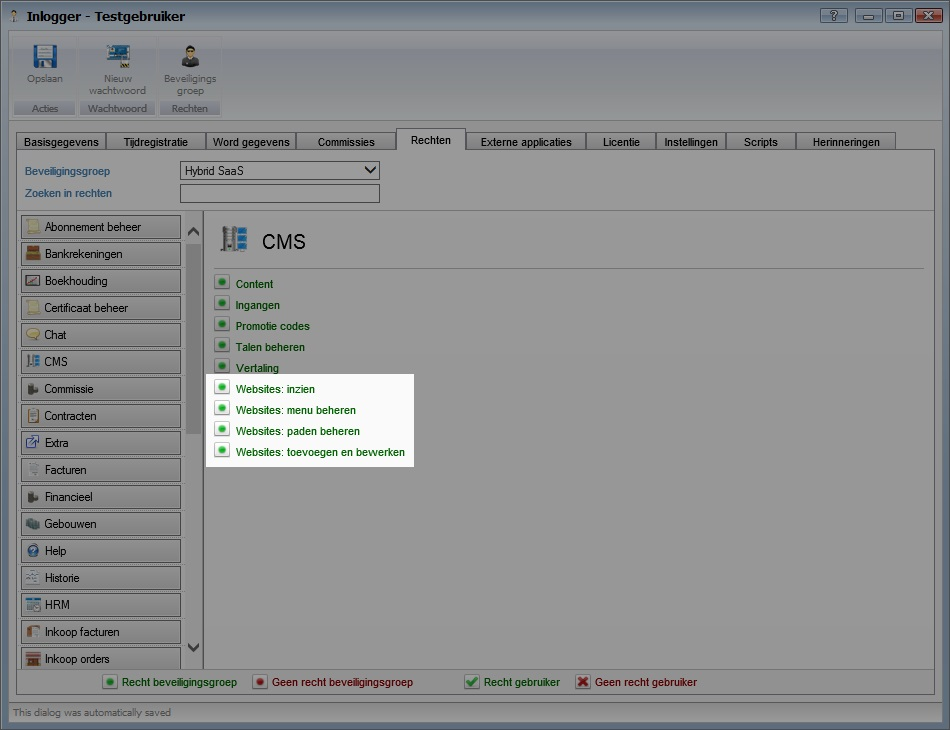

<properties>
	<page>
		<title>Release notes volgende versie</title>
	</page>
	<menu>
		<position>Release notes</position>
		<title>Volgende versie</title>
	</menu>
</properties>

# Release notes volgende versie #

In de release notes staan de wijzigingen voor de volgende productieversie van Hybrid SaaS.

De beschreven aanpassingen zijn nog niet algemeen beschikbaar. De volgende release van Hybrid SaaS zal deze functionaliteiten bevatten.

 

## Website rechten uitgebreid ##

De website rechten zijn nu uitgebreid van één naar 4 rechten:

van

- 

naar

- 

Het is nu mogelijk om apart de volgende rechten in te stellen:

- Websites inzien
- Websites toevoegen/bewerken
- Website paden beheren
- Website menu's beheren 

Na de upgrade krijgen alle gebruikers die alleen rechten hadden voor websites, automatisch deze nieuwe rechten toegewezen.

