<properties>
	<page>
		<title>Release notes volgende versie</title>
	</page>
	<menu>
		<position>Release notes </position>
		<title>Volgende versie</title>
	</menu>
</properties>

# Release notes volgende versie #

In de release notes staan de wijzigingen voor de volgende productieversie van Hybrid SaaS.

De beschreven aanpassingen zijn nog niet algemeen beschikbaar. De volgende release van Hybrid SaaS zal deze functionaliteiten bevatten.

 
---------------------------------------------------------------------------------------------------------	

**Verbetering werking geëxporteerde inkoopfacturen**

Op inkoopfacturen werden betalings en financiële exports niet altijd weergegeven.

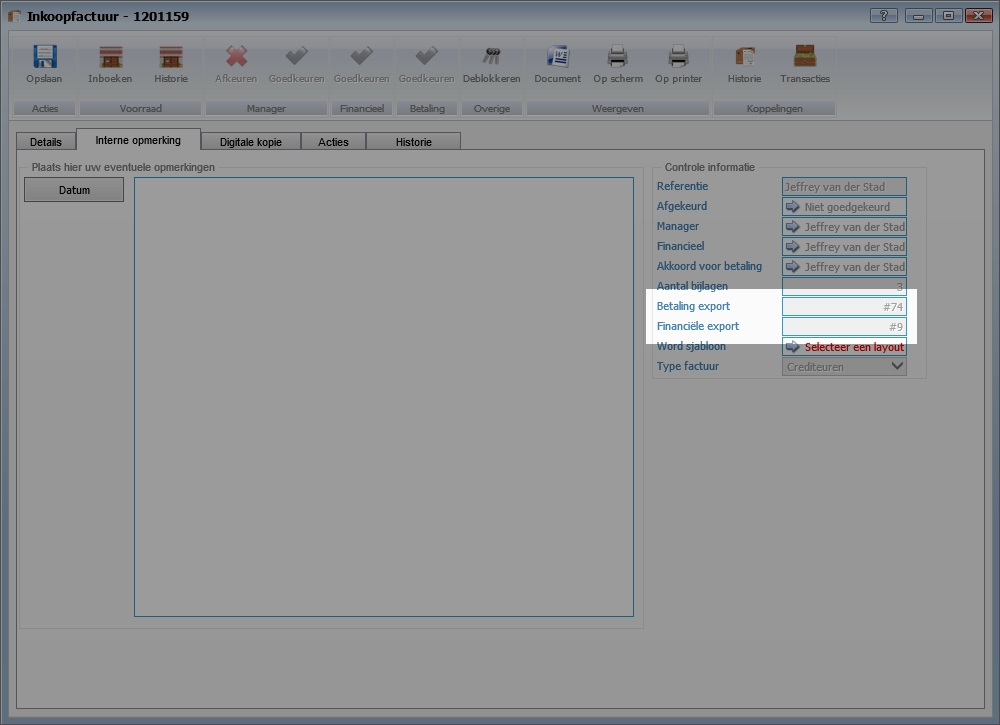

---------------------------------------------------------------------------------------------------------

Indien het deblokkeren van een inkoopfactuur niet mogelijk is omdat er een financiële export aanwezig is, verschijnt er nu een verbeterde melding die direct verwijst naar het nummer van de export.

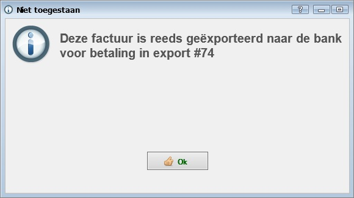

---------------------------------------------------------------------------------------------------------

**Verbetering werking geëxporteerde verkoopfacturen**

Indien het deblokkeren van een verkoopfactuur niet mogelijk is omdat er een financiële export aanwezig is, verschijnt er nu een verbeterde melding die direct verwijst naar het nummer van de export.

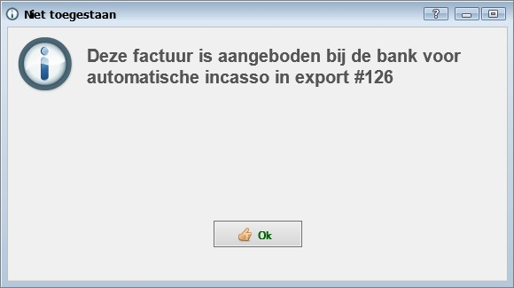

---------------------------------------------------------------------------------------------------------

**Individuele financiële export records ongedaan maken**

Het is mogelijk om losse transacties van een financiële export ongedaan te maken. Hiervoor is een nieuwe menu knop toegevoegd genaamd **Ongedaan maken** 

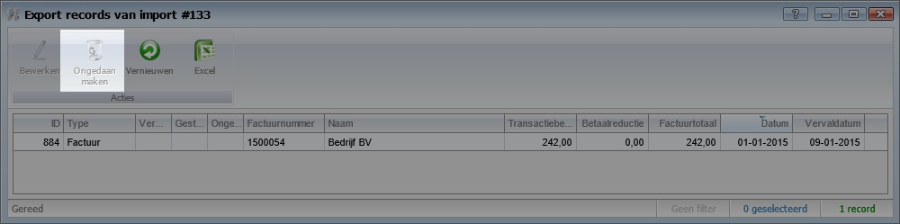

Na het aanklikken van deze knop en bevestigen van de onderstaande vraag zal de export ongedaan worden gemaakt en kan daarmee opnieuw worden aangeboden. Tevens kan na het ongedaan maken van de financiële export record de gekoppelde inkoop/verkoopfactuur worden gedeblokkeerd.

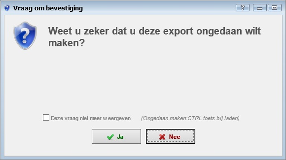

Na het ongedaan maken is dit ook zichtbaar in de het overzicht met gekoppelde records van de export in de kolom *Ongedaan gemaakt*

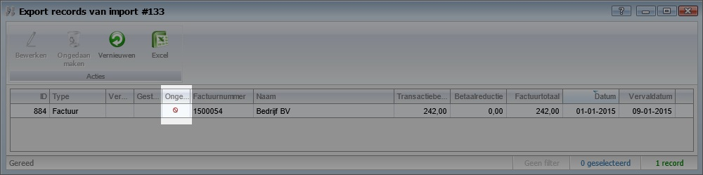

Tevens is de actie gelogd bij de gekoppelde factuur

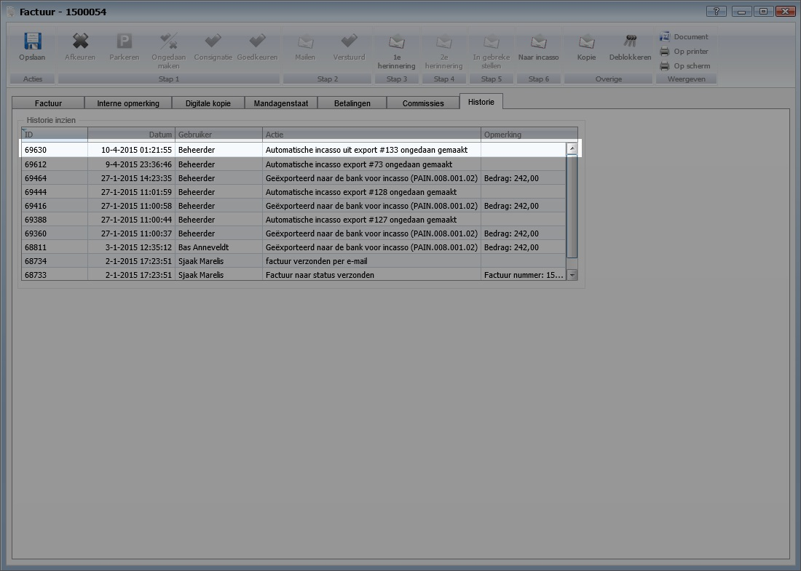

---------------------------------------------------------------------------------------------------------

**BTW**

Wijzigen van de standaard btw code vraagt of je de btw code van de adviesverkoopprijzen in producten wilt aanpassen, bij importeren van nieuwe producten uit excel zet het systeem nu ook standaard de btw code voor de adviesverkoopprijzen

---------------------------------------------------------------------------------------------------------

**BANK**

Indien er imports zijn zonder transacties (zoals rabobank ze aanlevert) zal deze als 'correct' worden weergegeven in de controle

---------------------------------------------------------------------------------------------------------

**CONTRACTEN**

Bij de keuze om een contractwaarde per 3 maanden (kwartaal) vast te leggen werd er in de planning een met afrondingen gewerkt. Hierdoor kwam er een verkeerde waarde op de factuur. Dit is aangepast. Het juiste bedrag wordt nu berekend en getoond op de factuur
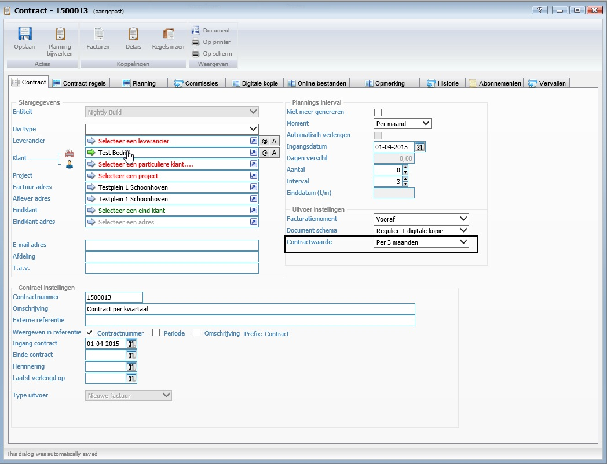

---------------------------------------------------------------------------------------------------------

**TIJDREGISTRATIE**

Overboekknop op meerdere plekken beschikbaar. Binnen de module tijdregistratie is de knop om een tijdregistratie over te boeken op meerder plaatsen toegevoegd. Zo is hij nu beschikbaar bij:

- Alle tijdregistraties
- Alle goed te keuren tijdregistraties
- Controle voor goedkeuring
- Alle afgekeurde tijdregistraties
- Goed te keuren tijdregistraties van mijn projecten

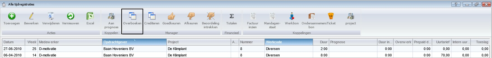

---------------------------------------------------------------------------------------------------------

**Bank**

Verwijderde incasso exports zijn niet meer zichtbaar (INKOOP)FACTUUR - Het deblokkeren houdt rekening met verwijderde en ongedane financiële exports

---------------------------------------------------------------------------------------------------------

**PROGNOSE**

 Directe koppeling op tijdregistratie gezet, zo kun je ook tijd overboeken tussen prognose onderdelen

---------------------------------------------------------------------------------------------------------

**TIJDREGISTATIES**

 Weergegeven uurtarieven worden bijgewerkt indien de factuur is aangepast of afgekeurd, via excel export zie je het originele tarief nog wel.

---------------------------------------------------------------------------------------------------------

**BANK**

 Mogelijkheid tot het ongedaan maken van individuele financiële export records + logging INKOOP/VERKOOPFACTUUR - Deblokkeren geeft betere melding door blokkade financieel export INKOOPFACTUUR - Weergave van gekoppelde financiële exports in tabblad interne opmerking

---------------------------------------------------------------------------------------------------------

**TIJDREGISTRATIE**

Koppeling met prognose / PROGNOSE nieuwe methode / TICKET doorbelasten (beta) / FACTUREN aantal gescande bijlagen zichtbaar

---------------------------------------------------------------------------------------------------------

**TICKET**

Gerelateerde tickets gaan niet meer automatisch mee met de status wijziging
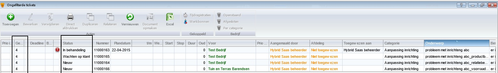

---------------------------------------------------------------------------------------------------------

**Adressen**

Je kunt aangeven welk adres in de storelocator wordt weergegeven

---------------------------------------------------------------------------------------------------------

**Storelocator**

De storelocator accepteerd nu ook EN /system/storelocator/?language=EN

---------------------------------------------------------------------------------------------------------

**TICKETS**

Opslaan van tickets is efficiënter geworden (x aantal loopings zaten er in), tevens bij actie toewijzen controleert het dialoog eerst of het onderwerp / categorie is ingegeven

---------------------------------------------------------------------------------------------------------

**GEBRUIKERS**

Je kunt aangeven per gebruiker of deze alle gebruikers kan selecteren bij een gebruikers selectie keuze, zo niet dan kun je dit per afdeling instellen

---------------------------------------------------------------------------------------------------------

**TICKETS**

Door facturen van tickets tegen een vaste prijs (naar meerdere opdrachtgevers)

---------------------------------------------------------------------------------------------------------

**INKOOPFACTUUR**

Bij wijzigen datum komt meteen de juiste boekperiode in de factuur

---------------------------------------------------------------------------------------------------------

**TICKET**

Door belasting kosten haalt laatste werkcode op en neemt de opdrachtgever over uit het ticket

---------------------------------------------------------------------------------------------------------

**MANDAGENSTAAT**

Na het verwijderen van een mandagenstaat komen de registraties nu weer terug als te verwerken. voorheen moest je alle registraties opnieuw goedkeuren

---------------------------------------------------------------------------------------------------------

**MANDAGENSTAAT**

Je kunt bij de werkcode aangeven of de registraties NIET op een mandagenstaat komen te staan, dit is handig voor interne uren. bij verwerken wordt het vinkje geen mandagenstaat aangezet op de tijdregistratie

---------------------------------------------------------------------------------------------------------

**CORRESPONDENTIE**

Koppeling vanuit kenmerk om de gekoppelde stukken in te zien

---------------------------------------------------------------------------------------------------------

**WERKCODE - FACTUREN**

Extra journalisatie (t.b.v. onderhanden werk)

---------------------------------------------------------------------------------------------------------

**WEBSITE**

Gerelateerde producten werden dubbel weergegeven.
Als je producten aan een ander product relateerde dan werd dit product dubbel opgeslagen en hierdoor ook dubbel zichtbaar op de website. dit is aangepast. 
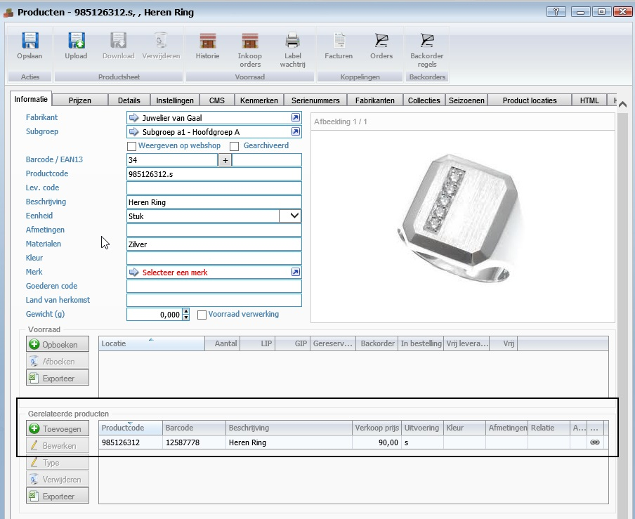

---------------------------------------------------------------------------------------------------------

**KENMERKEN**

Bulk CMS eigenschappen kunnen bewerken vanaf product kenmerken. Je kan nu via de product kenmerken de CMS gegevens in één keer aanpassen.
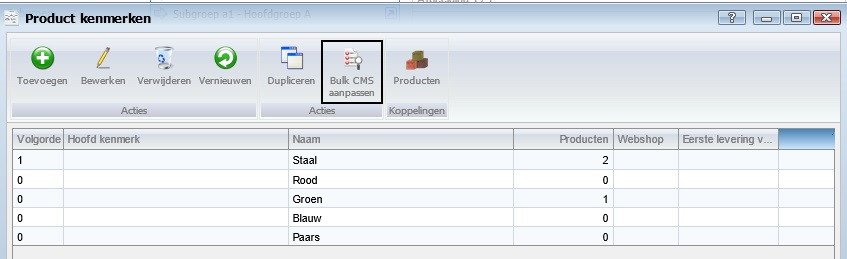
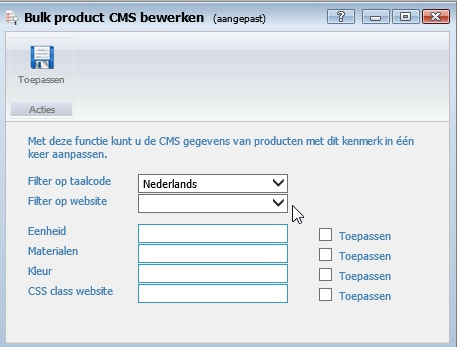
---------------------------------------------------------------------------------------------------------

**INKOOPFACTUUR**

Commissie afdracht velden beschikbaar gemaakt. Deze extra velden kunnen nu gebruikt worden in de word sjablonene die gebruik maken van de tabel "inkoopfacturen". 
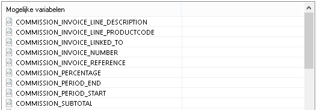

---------------------------------------------------------------------------------------------------------

**E-MAIL SJABLONEN**

De verlof aanvraag e-mail kan nu zelf worden beheerd door middel van een sjabloon. 

---------------------------------------------------------------------------------------------------------
**12**

---------------------------------------------------------------------------------------------------------
