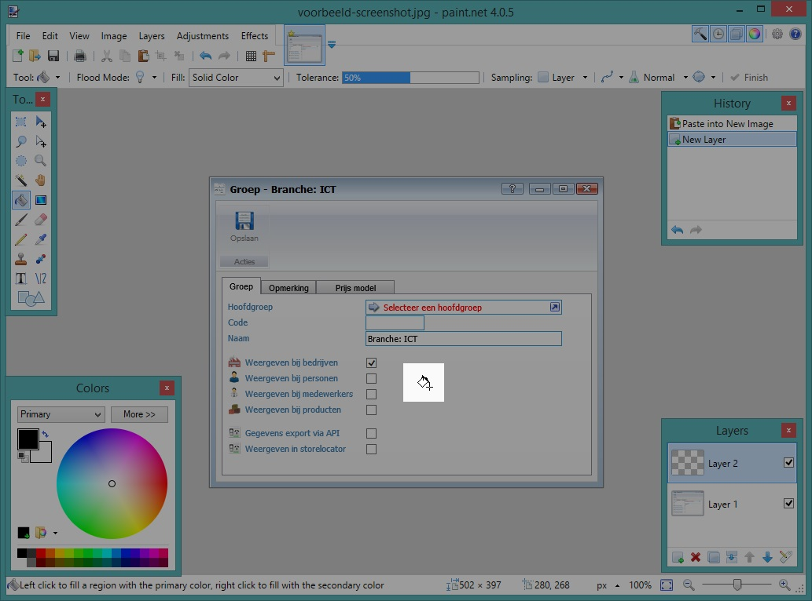

<properties>
	<page>
		<title>Afbeeldingen</title>
	</page>
	<menu>
		<position>Bijdragen / Afbeeldingen</position>
		<title>Gedeelte laten uitlichten</title>
	</menu>
</properties>

# Een gedeelte van een screenshot uitlichten #

In dit artikel leggen we uit hoe je een gedeelte van een afbeelding kan laten uitlichten door de rest van de afbeelding donkerder te maken. Stap voor stap leggen we uit hoe je dit kan bereiken.

Als voorbeeld gebruiken we onderstaande screenshot:

In dit voorbeeld willen gaan we alle keuzes *'weergeven bij'* laten oplichten.

Het eindresultaat zal er als volgt uitzien:

## Open de afbeelding in Paint.net ##

## Voeg een nieuwe laag toe ##
Voeg een nieuwe laag toe door in het lagen-hulpvenster op het plusje te klikken.

 

Of kies in het menu voor *Add New Layer*, of gebruik de sneltoets **Ctrl+Shift+N** 

## Bewerk de eigenschappen van de laag ##
Bewerk de eigenschappen van deze nieuwe laag door op de bewerk eigenschappen knop te klikken.

Of kies in het menu voor *Layer properties*, of gebruik de sneltoets **F4**. Je kan ook dubbelklikken op de laag.

## Wijzig het transparantie niveau ##

Pas het transparantieniveau (*Opacity*) aan naar **100** / 255

## Vul de laag met zwart ##

Gebruik de *fill-tool* / *paint-bucket* optie om de nieuwe laag te vullen met zwart. Je kan hiervoor de sneltoets **F** gebruiken.

Selecteer *zwart* als vul-kleur.

Vul de laag door met je muis ergens in de afbeelding te klikken, het maakt niet uit waar in de afbeelding.

De afbeelding zal er dan als volgt uitzien:

## Selecteer het gedeelte wat je wil benadrukken ##

Gebruik de *vierkant-selecteer* / *rectacle-select* optie om het gedeelte te selecteren dat je wil benadrukken. Je kan hiervoor de sneltoets **S** gebruiken.

Selecteer met je muis-toets ingedrukt het gedeelte dat aandacht nodig heeft:

## Verwijder het geselecteerde gedeelte ##

Verwijder het geselecteerde gedeelte door de sneltoets **DEL** te drukken

 

## Eindresultaat ##

Het eindresultaat is als volgt.

## Opslaan van bestand ##

Omdat je meerdere lagen hebt gebruikt en deze opslaat als JPEG-bestand, zal Paint.net je bij het opslaan vragen of de meerdere lagen samengevoegd (*flatten*) mag worden. 

----------
