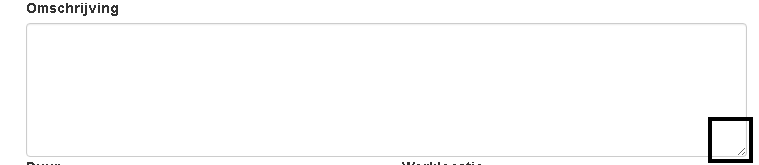
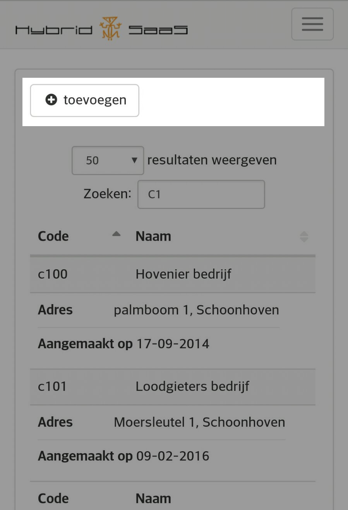
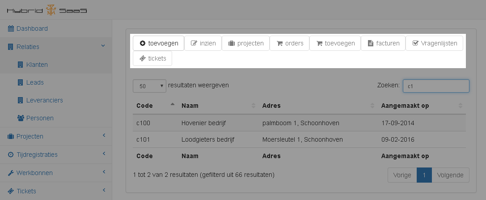
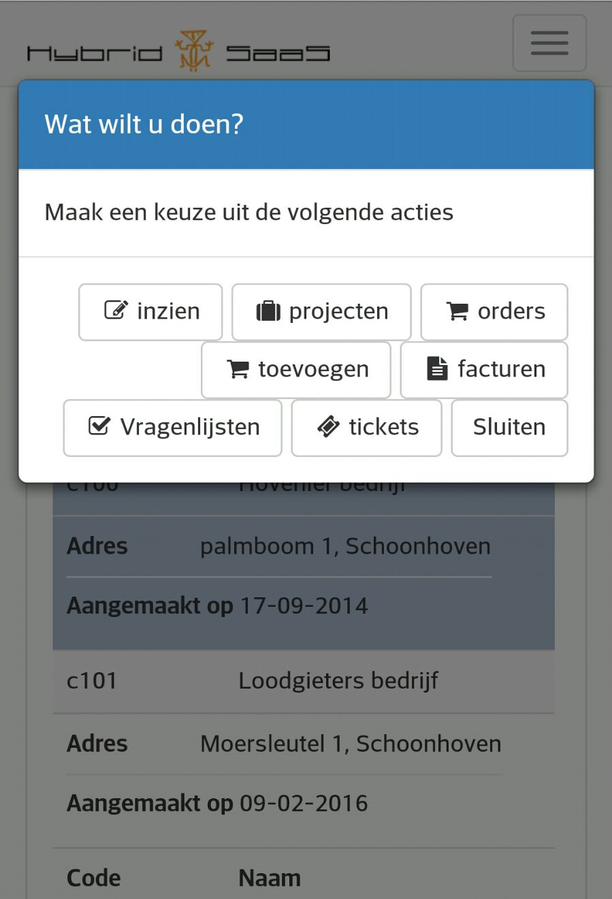
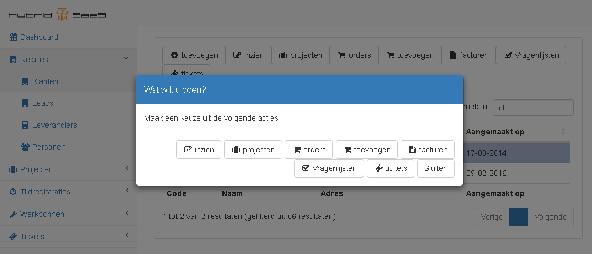

<properties>
	<page>
		<title>Diverse weetjes</title>
	</page>
	<menu>
		<position>Cloud / Diverse</position>
		<title>Diverse weetjes</title>
	</menu>
</properties>

# Installeren van de Cloud #

Om met de Cloud versie te kunnen werken, dient er een link te worden opgeslagen op de telefoon. Deze link zal als volgt zijn: https://`{bedrijfsnaam}`.hybridsaas.com/Cloud 
De gebruikersnaam en wachtwoord zijn gelijk aan de gegevens welke gebruikt worden om in te loggen in Hybrid SaaS.

Indien er een foutmelding komt voor het installeren van de Cloud, kan het zijn dat de bedrijfsnaam niet overeenkomt, Deze kan opgevraagd worden bij de Hybrid SaaS beheerder

## Schrijfvlak: ##

Bij sommige vakken in de Cloud is er rechts onderin 2 kleine streepjes te zien, daarmee kan het venster groter worden gemaakt

## Selecteren van regels: ##

De hele Cloud is opgedeeld in regels, in alle klanten, projecten, werkbonnen enz.… wordt alles weergegeven in regels. Hoeveel informatie er wordt weergegeven ligt aan het formaat van de tablet of telefoon. Hoe groter het scherm hoe meer inhoud je zal zien. 

De weergave via de computer is het weer anders dan op de telefoon, Zo heb je via de computer alle opties ook boven in het scherm staan, deze zijn op de telefoon niet beschikbaar. Dit is gedaan vanwege ruimtebesparing

**Op de telefoon**

**Op de computer**

Er kunnen op verschillend manieren regels geselecteerd worden, om te openen. 

- Door de regel 1 keer aan te klikken zal deze geselecteerd worden
- Door er nogmaals 1 keer op te klikken zal er een pop-up komen
  - in de pop-up zullen de acties worden getoond wat je met deze regel kan doen
- Door te dubbel klikken op de regel krijg je direct de pop-up met de acties

**Op de telefoon**

**Op de computer**

------

