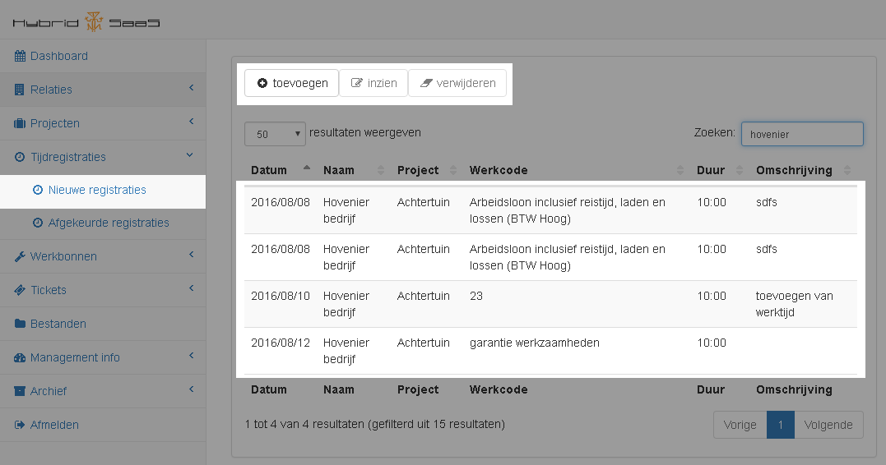
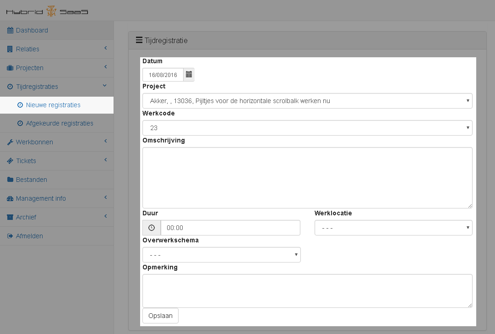
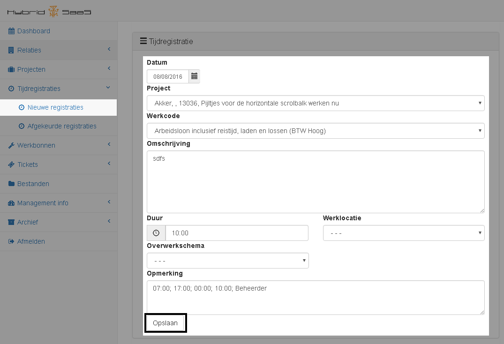

<properties>
	<page>
		<title>Proces tijdregistratie via de Cloud</title>
	</page>
	<menu>
		<position>Cloud / Tijdregistratie</position>
		<title>Proces tijdregistratie</title>
	</menu>
</properties>

# De tijdregistraties: #

Via de Cloud is het mogelijk om tijdregistraties op locatie aan te maken, In de Cloud zijn er 2 bakjes onder de tijdregistraties hieronder wordt beschreven welke functies deze hebben.

Er kan verschil zijn met de hieronder getoonde afbeeldingen, de site waarop de Cloud draait past zich aan de telefoon, tablet of ander hardware waar het programma op draait aan, indien er weinig ruimte op het scherm is zal er informatie verborgen worden, of de informatie word uitbreid naar beneneden toe (de pagina zal langer worden)

## Nieuwe registraties ##

Vanuit het bakje Nieuwe registraties, staat alle registraties in welke van de gebruiker zijn die ingelogd is welke nog niet goedgekeurd of doorgezet zijn.

### Een nieuwe registratie maken ###

Doormiddel van de knop toevoegen kan er een registratie worden gemaakt.
Er volgt vervolgens een scherm waar je alle gegevens kan invullen

#### Invullen van de registratie ####
Het volgende scherm wordt getoond voor het aanmaken van een registratie:

Na het opslaan van deze registratie zal deze bijgevoegd worden bij alle nieuwe registraties

### Een bestaande registratie bewerken ###

Bij wens kunnen registraties hier aangepast worden.
Door de regel in te zien kan deze bewerkt worden en opnieuw opgeslagen worden. Wanneer de registratie is goedgekeurd zal deze uit deze lijst verdwijnen.

## Afgekeurde registraties ##

Eventuele afgekeurde registraties worden hier weergegeven. Dit is meer ter informatie

----------
