<properties>
	<page>
		<title>Proces werkbonnen via de Cloud</title>
	</page>
	<menu>
		<position>Cloud / Werkbonnen</position>
		<title>Proces werkbonnen</title>
		<sort>B</sort>
	</menu>
</properties>

# De werkbonnen: #

Om met de Cloud versie te kunnen werken, dient er een link te worden opgeslagen op de telefoon. Deze link zal als volgt zijn: https://`{bedrijfsnaam}`.hybridsaas.com/Cloud 
De gebruikersnaam en wachtwoord zijn gelijk aan de gegevens welke gebruikt worden om in te loggen in Hybrid SaaS.

Indien er een foutmelding komt voor het installeren van de Cloud, kan het zijn dat de bedrijfsnaam niet overeenkomt, Deze kan opgevraagd worden bij de Hybrid SaaS beheerder

Via de Cloud is het mogelijk om werkbonnen op locatie aan te maken, te verwerken, informatie bij te voegen, of juist alle informatie op te vragen. Werkbonnen kunnen door de planning al klaar gezet worden in het dashboard, zodat de buitendienst medewerkers weten waar ze naar toe moeten. In de Cloud zijn er 4 bakjes onder de werkbonnen hieronder wordt beschreven welke functies deze hebben.

Er kan verschil zijn met de hieronder getoonde afbeeldingen, de site waarop de Cloud draait past zich aan de telefoon, tablet of ander hardware waar het programma op draait aan, indien er weinig ruimte op het scherm is zal er informatie verborgen worden, of de informatie word uitbreid naar beneneden toe (de pagina zal langer worden)

## Dasboard ##

Via het menu kan er gekozen worden voor Werkbonnen, daaronder zitten weer submenu's. Ook is het mogelijk om via andere bakjes bij de werkbonnen te kunnen komen, denk hierbij aan de relatie, daar zijn de projecten gekoppeld, en aan het project zitten de werkbonnen weer gekoppeld. Ook kan dit vanuit de projecten.

Indien er door de planning werkbonnen zijn klaar gezet voor de buitendienst medewerker ziet deze persoon dit op zijn dasboard, de gebruiker kan kiezen voor een overzicht per week of per dag. Door op de opdracht te klikken openend de werkbon direct en kan hij aangepast worden naar wens.

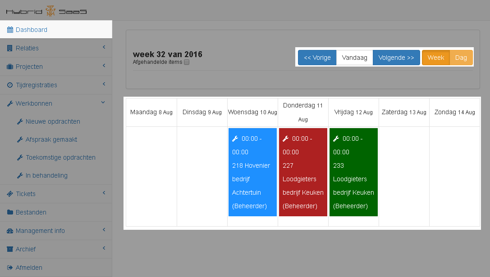

Er zijn 3 soorten statussen waarin de bon kan zitten waardoor hij op het dasboard zichtbaar is

- Indien de kleur **Groen** is bevindt de bon zich in de status: **Nieuw**
- Indien de kleur **Rood** is bevindt de bon zich in de status: **Opdracht bon**
- Indien de kleur **Blauw** is bevindt de bon zich in de status: **Afspraak gemaakt**

## Nieuwe opdrachten ##

Vanuit het bakje Nieuwe opdrachten, is het mogelijk om op locatie een werkbon aan te maken. Indien er nog bon in staan welke de status *opdracht bon* hebben zullen hier beschikbaar zijn. 

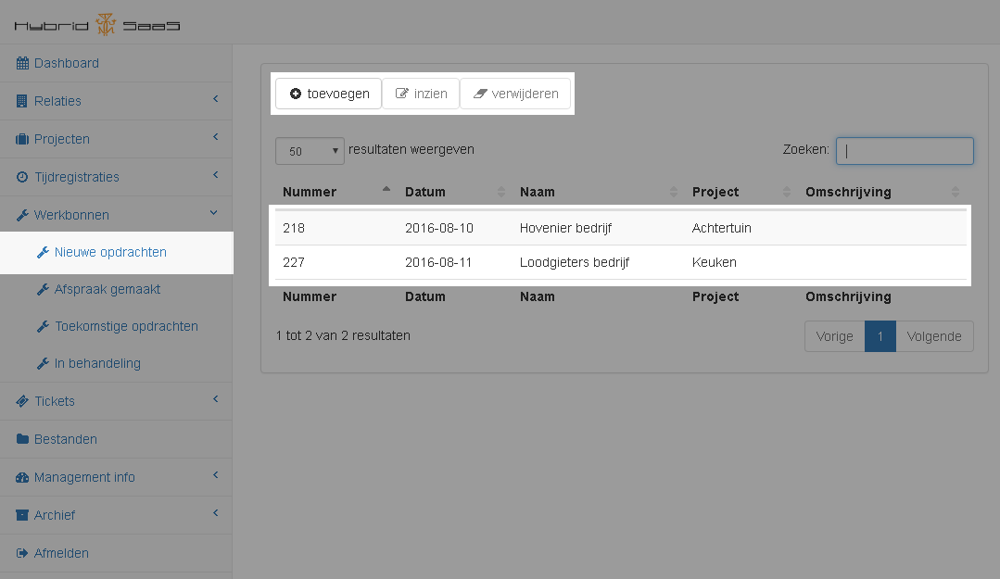

We kiezen nu voor de optie *Toevoegen*

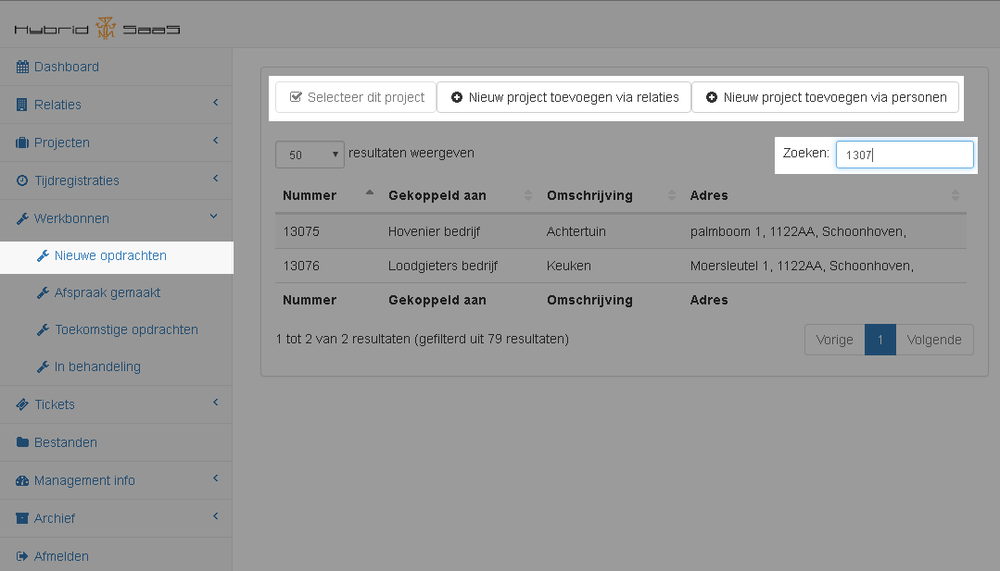

De lijst wat er nu getoond wordt kan wat lang zijn. Hier zullen alle projecten worden getoond. Doormiddel van de zoekfunctie is het mogelijk om te lijst te kunnen filteren, wat het zoeken makkelijker maakt.

Indien het gewenste project nog niet bestaat kan deze ook direct worden aangemaakt via de bovenste knoppen

We selecteren nu een al bestaande project.

Het volgende scherm is het begin van de werkbon, hierin kan al wat informatie over de opdracht worden ingevuld

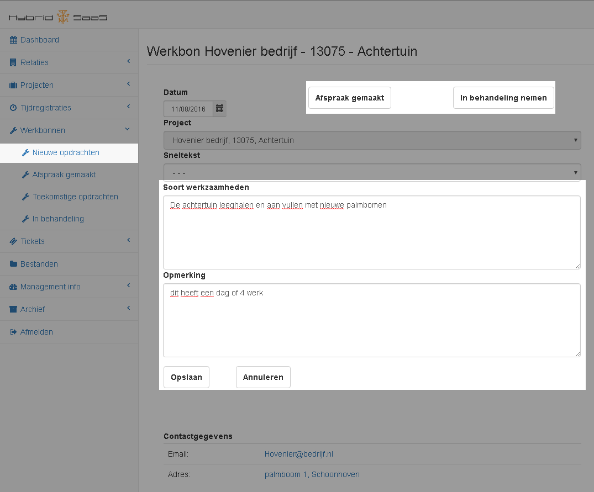

Indien er wordt gekozen voor opslaan blijft de bon de status *nieuwe opdrachten* houden, de informatie van de omschrijving is dan zichtbaar in het overzicht

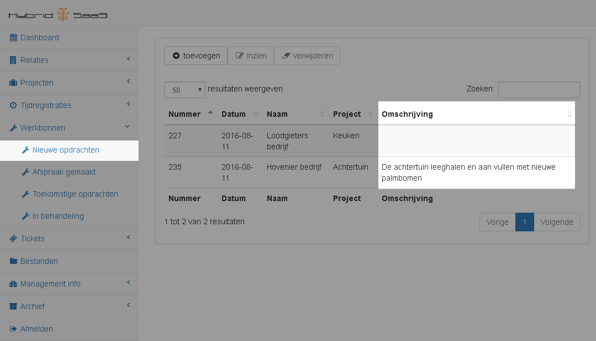

Als de bon wordt doorgezet naar *afspraak gemaakt* komt hij is de volgende status terecht, indien er word gekozen voor *in behandeling nemen* zal de bon doorgezet worden naar in behandeling

## Afspraak gemaakt ##

Indien er bonnen in de bak afspraak gemaakt staan kunnen deze op het moment van de afspraak worden geopend, deze bon kan nu verwerkt gaan worden.

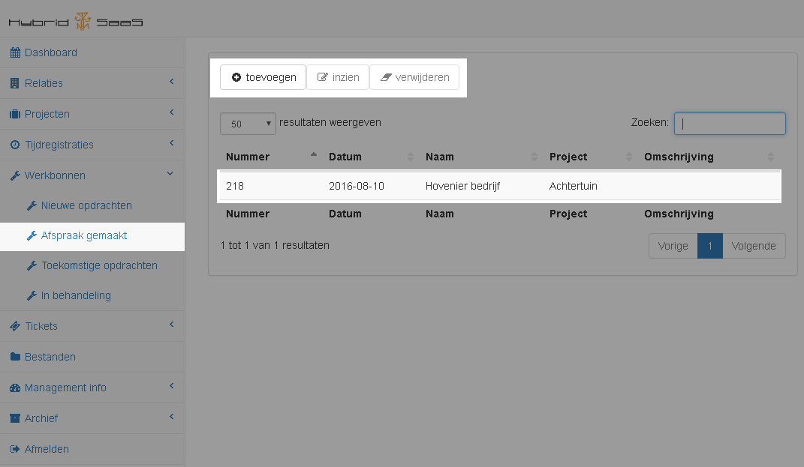

Vanuit de bak Afspraak gemaakt kan de bon verder worden ingevuld. Het volgende scherm wat zal worden getoond is de bon zoals hij in behandeling is.

## Toekomstige opdrachten ##

Er kunnen door de backoffice werkbonnen worden klaargezet welke een datum in de toekomst hebben. Deze worden tot dat de datum is genaderd hier verborgen. Denk hierbij aan een opdracht wat over een half jaar pas gaat lopen, alle informatie is al wel te verzamelen en hij is op de planning te zien.

## In behandeling ##

De bonnen welke in behandeling zijn zullen hier worden getoond. Hiervandaan kan hij verder ingevuld worden en worden verzonden naar de administratie.

Er zijn verschillende groepen waarmee je tijd en kosten kan toevoegen aan de werkbon, De uren groep staat vast deze kan qua naam niet aangepast worden. Wat in het voorbeeld als Materialen, Vuilafvoer en Machine gebruik en transport wordt vermeld zijn velden welke zelf gemaakt kunnen worden in Hybrid SaaS.
Deze optie maakt het zoeken in de producten wat makkelijker.

De namen dienen door een Hybrid SaaS beheerder worden ingevuld, daarnaast worden deze aan een hoofdgroep gekoppeld. Door de producten aan deze hoofdgroep te koppelen kunnen ze onderverdeeld worden in deze groepen

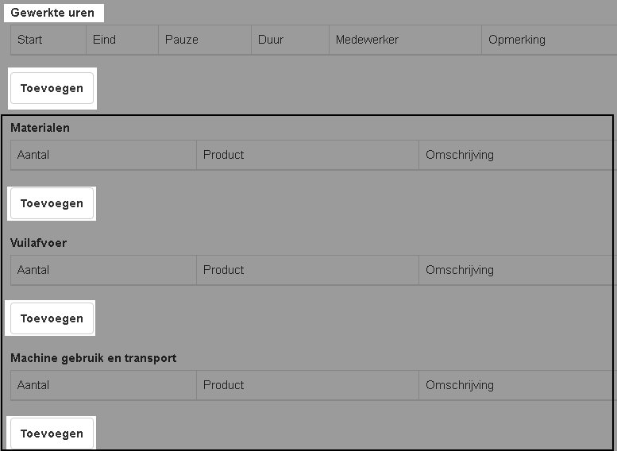

### Gewerkte uren ###

Doormiddel van de eerste toevoegen knop kan er tijd worden geschreven op deze werkbon

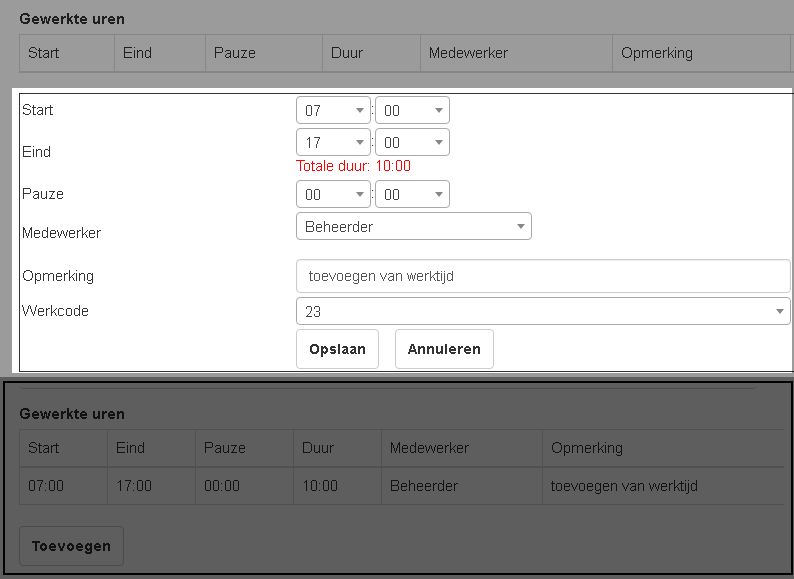

Er wordt standaard al een werktijd van begin 07:00 en eind 17:00 ingegeven. Deze is naar wens aan te passen. In het rood zal de totale duur worden getoond. De gebruiker welke is ingelogd zal worden weergegeven, Het is ook mogelijk om voor een andere collega tijd te schrijven. De registratie kan worden aangevuld met een opmerking, en de juiste werkcode dient te worden geselecteerd (denk hierbij aan of het een interne registratie bevat of een arbeidsloon registratie). 

Na het opslaan keert het scherm weer terug naar het overzicht, (zie eronder vermeld) Indien van toepassing kunnen er nog meer registraties worden gemaakt bijvoorbeeld op verschillende werkcodes of voor verschillende medewerkers.

#### In de Backoffice ####

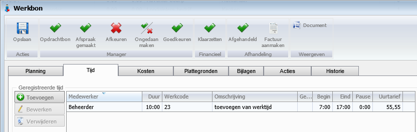

### Kosten toevoegen ###

Ook kunnen er extra kosten worden gemaakt welke in rekening gebracht moeten worden. Zo kan er bijvoorbeeld alle planten welke zijn geplant worden toegevoegd. Maar er zou ook gedacht kunnen worden dat er extra zand nodig was dan wat berekend was. Doormiddel van materialen toe te voegen wordt alles genoteerd wat het gebruikt wordt bij de opdracht.

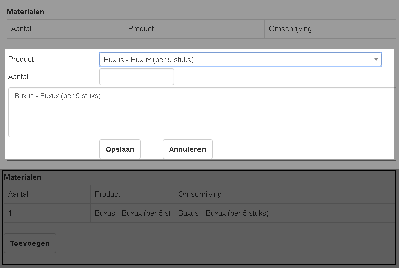

Er wordt een pull Down getoond met de daarin behorende producten, (dit is door de backoffice ingegeven). Het is mogelijk om nog een opmerking bij te voegen aan het product. Na het opslaan keert het scherm weer terug naar het overzicht, (zie eronder vermeld) Indien van toepassing kunnen er nog meer kosten worden toegevoegd aan de werkbon. 

#### In de Backoffice ####

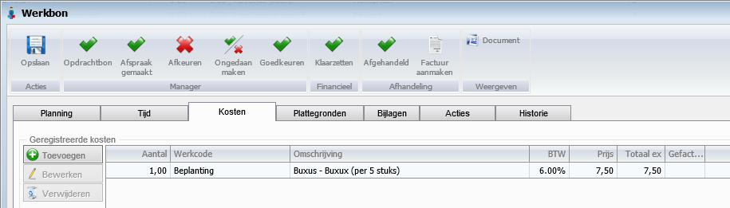

### Versturen naar de administratie ###

Indien alles is ingevuld is de werkbon klaar, indien er nog andere gegevens ingevuld moeten worden kan er gekozen worden voor alleen opslaan. In de backoffice blijft de bon als nieuw staan, Pas na het aanvinken van de optie **Versturen naar de administratie** zal deze verder in het proces komen.

#### In de Backoffice ####

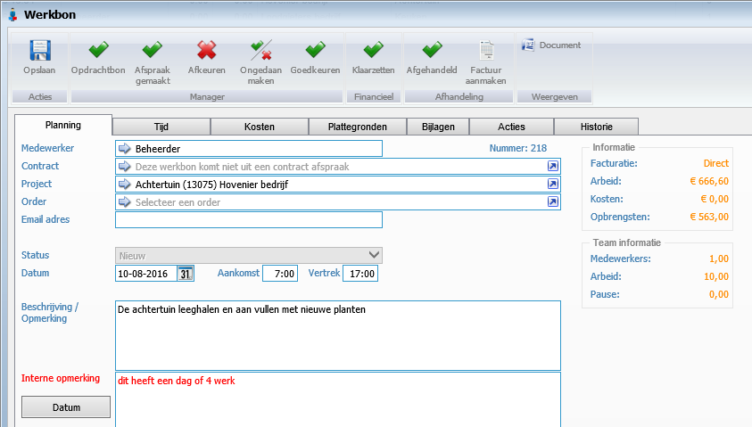

----------