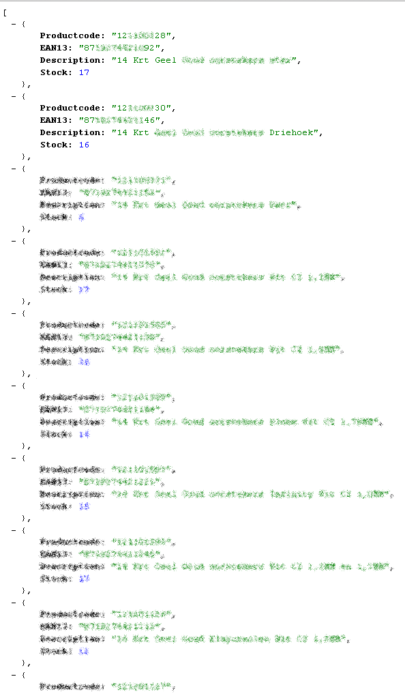
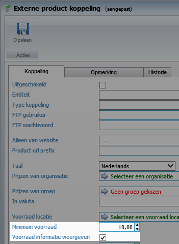
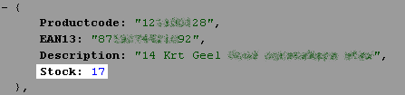
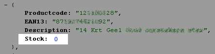
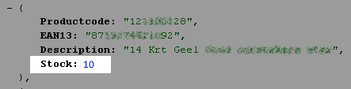
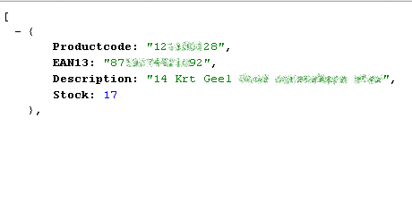
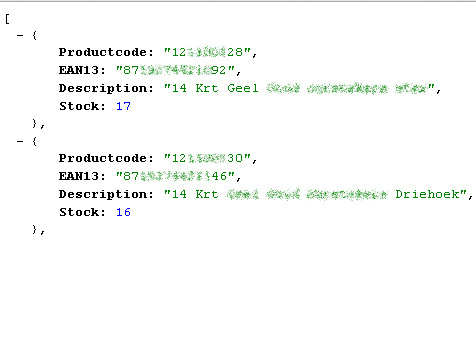
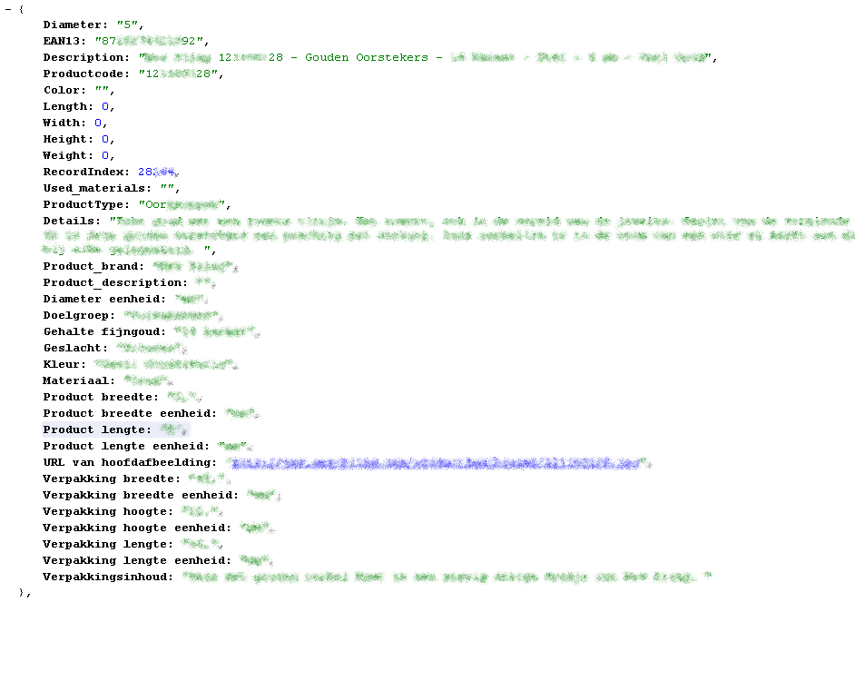
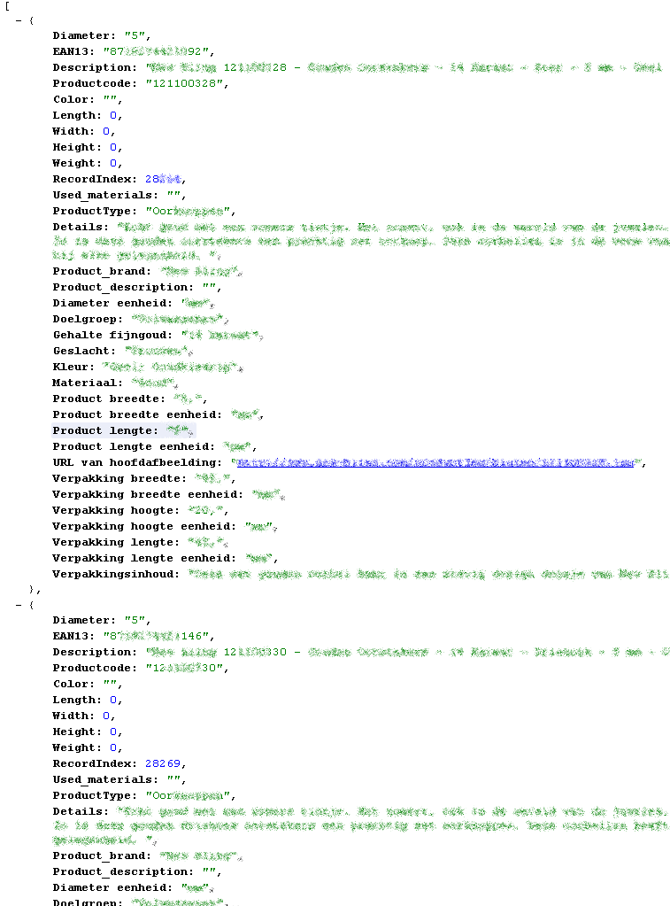
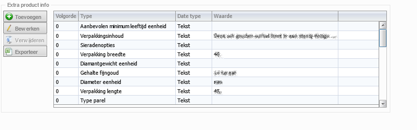

<properties>
	<page>
		<title>Rest API Authenthication</title>
	</page>
	<menu>
		<position> Developer / Externe Koppeling</position> 
		<title>Externe productkoppeling</title>
	</menu>
</properties>

# Externe Productkoppeling op basis van een Json file #

Deze handleiding is voor de developer die gebruik gaat maken van deze functie. Er worden op basis van URL-gegevens getoond, sommige gegevens worden door de gebruiker in Hybrid SaaS gezet, andere gegevens worden hard uit het systeem gehaald.
Hieronder volgt de beschrijven welke URL welke informatie laat zien

## De URL ##

Er wordt vanuit de beheerder van Hybrid SaaS een URL aangemaakt deze is als met de volgende gegevens opgebouwd:

**https://`{domein}`.hybridsaas.com/export/customer-stock-feed/`{koppelingId}`?output=json&secret=`{secretId}`**

- `{domein}`
  - De domeinnaam van de klant van Hybrid SaaS 
- `{koppelingId}`
  - Dit is de gecreëerde koppeling ’s ID van deze koppeling (deze is aangemaakt door het systeem)
- `{secretId}`
    - Dit is de geheime sleutel van het bestand

Aanvullende delen voor de url:
- `{Productcode}`
  - Dit is de productcode uit Hybrid SaaS
- &detail=1
  - Uitgebreide informatie over het product
- &page=1
  - Meerdere pagina's opvragen (max per pagina is 100)

De standaard URL geeft de volgende output:

### Verschillende voorraad weergave ###

Er kunnen op 2 manieren voorraden worden meegegeven. 

- Voorraad weergeven huidige waarde
- Alleen voorraad weergeven boven bepaalde aantal

##### Voorraad exacte voorraad waarde #####

De gebruiker heeft in Hybrid SaaS de keuze om de exacte waarde te laten zien, als hiervan het vinkje aanstaat word de exacte voorraad waarde meegegeven in de koppeling

##### Alleen voorraad weergeven boven bepaalde aantal #####

De gebruiker heeft in Hybrid SaaS de keuze om de voorraad als een vaste waarde te laten zien, De waarde welke ingevuld word bij *minimale aantal* zal dan worden gehanteerd 

Als de voorraad 
- Lager is dan de *Minimale aantal* Word getoond als: 0

- Hoger is dan de *Minimale aantal* Word getoond als: het aantal ingegeven bij minimale aantal

Let op! indien de voorraad hoger is dan het aangegeven minimale aantal zal er alleen het minimale aantal worden weergegeven

## 1 of meerdere producten opvragen ##

### 1 product opvragen ###

Doormiddel van **&sku=`{Productcode}`** achter de URL te zetten kan er gefilterd worden op een bepaald product

**https://`{domein}`.hybridsaas.com/export/customer-stock-feed/`{koppelingId}`?output=json&secret=`{secretId}`&sku=`{Productcode}`**

### Meerdere producten opvragen ###

Doormiddel van een, na de eerste productcode te zetten **&sku=`{Productcode}`,`{Productcode}`** kan er gefilterd worden op meerdere producten

**https://`{domein}`.hybridsaas.com/export/customer-stock-feed/`{koppelingId}`?output=json&secret=`{secretId}`&sku=`{Productcode}`,`{Productcode}`**

## De details van een product ##

### 1 product opvragen ###

Doormiddel van **&detail=1** achter de URL te zetten kunnen er details worden getoond van het product

**https://`{domein}`.hybridsaas.com/export/customer-stock-feed/`{koppelingId}`?output=json&secret=`{secretId}`&sku=`{Productcode}`&detail=1**

### Meerdere producten opvragen ###

Doormiddel van een, na de eerste productcode te zetten **&sku=`{Productcode}`,`{Productcode}`&detail=1** kan er gefilterd worden op meerdere producten met de details die daar bij horen

**https://`{domein}`.hybridsaas.com/export/customer-stock-feed/`{koppelingId}`?output=json&secret=`{secretId}`&sku=`{Productcode}`,`{Productcode}`&detail=1**

### De gegevens van de details ###

De gegevens welke worden getoond bij de details zijn gegevens welke door de gebruiker ingevuld kunnen worden in Hybrid SaaS. Dit kan in het product worden vast gelegd onder het tabblad CMS - Extra info.

## Meerdere pagina's opvragen ##

Doormiddel van **&page=1** achter de URL te zetten kunnen meerdere pagina's worden opgevraagd. (De max. per aantal producten per pagina is 100) 

De telling van de pagina's kan net zo lang doorgaan totdat er geen producten meer worden opgehaald

**https://`{domein}`.hybridsaas.com/export/customer-stock-feed/`{koppelingId}`?output=json&secret=`{secretId}`&page=1**

----------
