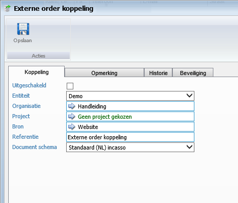
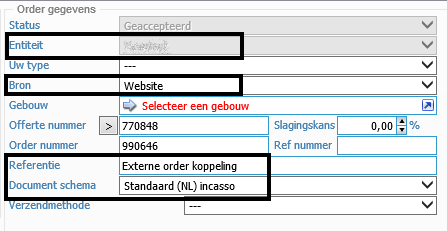
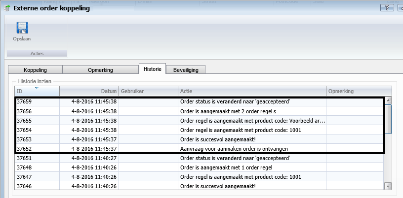
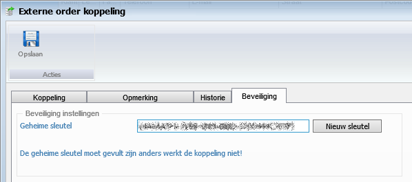
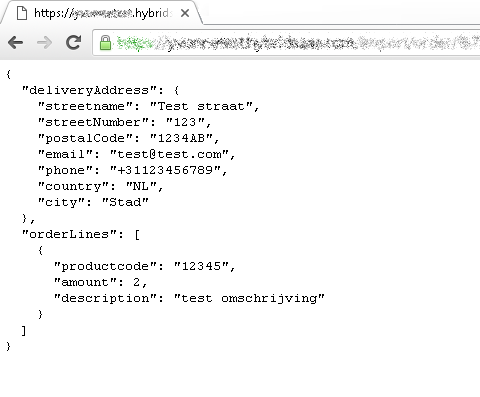
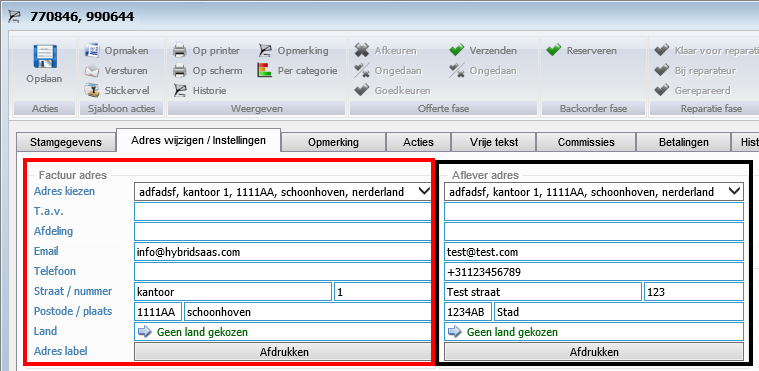
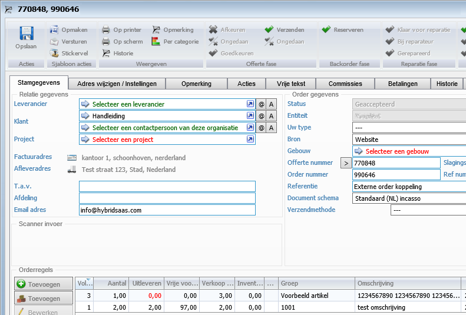
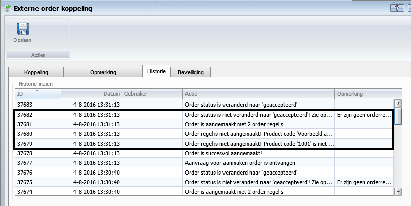

<properties>
	<page>
		<title> Externe Koppeling</title>
	</page>
	<menu>
		<position> Developer / Externe Koppeling</position> 
		<title>Externe orderkoppeling</title>
	</menu>
</properties>

# Externe orderkoppeling op basis van een Json file #

Deze handleiding is voor de developer die gebruik gaat maken van deze functie. Deze functie is alleen op basis van orders van de tegenpartij (Developer) naar Hybrid SaaS. 

## De URL ##

Er wordt vanuit de beheerder van Hybrid SaaS een URL aangemaakt deze is als met de volgende gegevens opgebouwd: Deze URL laat een lege pagina zien maar is de URL op tegen aan te programmeren

**https://`{domein}`.hybridsaas.com/import/order/`{koppelingId}`?secret=`{secretId}`**

- `{domein}`
  - De domeinnaam van de klant van Hybrid SaaS 
- `{koppelingId}`
  - Dit is de gecreëerde koppeling ’s ID van deze koppeling (deze is aangemaakt door het systeem)
- `{secretId}`
    - Dit is de geheime sleutel van de koppeling

Aanvullende delen voor de URL:
- &example=1
  - Hiermee is een voorbeeld pagina op te vragen
    - Hier staat in aangegeven wat de gewenste bestandformaat is voor het inlezen van de order
 
## De Instellingen in Hybrid SaaS ##

Er zijn een aantal instelling welke ingevuld moeten worden in Hybrid SaaS om de koppeling te kunnen laten werken

### Koppeling ###

- **Entiteit**
  - Vul hier de entiteit in waar de orders op moeten komen
- **Organisatie**
  - Over het algemeen zal hier de relatie worden ingevuld van de tegenpartij (Developer)
- **Bron**
  - Hier kan er aangegeven worden vanaf welke bron deze order is gekomen
- **Referentie**
  - Deze is terug te vinden bij de orders (hierop kan er gefilterd worden)
- **Document schema**
  - Hier dient een schema te worden gekozen welke bij de orders word vastgezet

**Een aantal gegevens zijn in de order weer terug te zien**

### Historie ###

Na elke order wordt er een historie bijgehouden, in de historie wordt aangetoond of het correct is aangemaakt of dat er fouten zijn geconstateerd

**Goed**

### Beveiliging ###

De `{secretId}` is hier te maken, doormiddel van de knop nieuwe sleutel zal er een code worden gegenereerd, deze code dient doorgegeven te worden naar de tegenpartij (developer)

## De voorbeeldpagina ##

Door de volgende URL is er een voorbeeld pagina op te vragen, Op deze pagina wordt er getoond welke waarde het bestand moet hebben om ingelezen te kunnen worden. 

**https://`{domein}`.hybridsaas.com/import/order/`{koppelingId}`?secret=`{secretId}`&example=1**

### Het adres ###

Het afleveradres is het adres wat van de klant is deze word in de order weergegeven onder afleveradres

`{
  "deliveryAddress": {`

    "streetname": "Test straat",
    "streetNumber": "123",
    "postalCode": "1234AB",
    "email": "test@test.com",
    "phone": "+31123456789",
    "country": "NL",
    "city": "Stad"
 ` },`

- Het factuuradres is het adres van de tegenpartij welke is ingevuld in de koppeling (rood)
- Het aflever adres van de klant word rechts getoond(zwart)

### De order regels ###

Daarna begint het bestand met de order regels, deze is al volgt opgebouwd

**1 orderregel:**

`"orderLines": [`

    {
      "productcode": "12345",
      "amount": 2,
      "description": "test omschrijving"
      }]}`

**2 of meerdere order regels:**

Als je 2 of meerdere regels wilt toevoegen dien je na elke eerste regel achter de **}** een **,** te plaatsen

  `"orderLines": [`

    {
      "productcode": "1001",
      "amount": 2,
      "description": "test omschrijving"
    },
   `{`

      "productcode": "Voorbeeld artikel",
      "amount": 1,
      "description": ""
    }
    ]}

Bij description kan er een eigen benaming worden gegeven, indien deze gevuld is zal deze omschrijving worden getoond in de order regel, indien deze niet is gevuld zal de beschrijving welke het product heeft in Hybrid SaaS worden getoond

## De aangemaakte order #

Na het indienen van de order dien je een melding terug te krijgen

- **ok=True**
  - Na het zien van deze melding zal de order zijn aangemaakt in Hybrid SaaS
- **ok=False**
  - Na het zien van deze melding zal er geen order zijn aangemaakt
    - Er zal een fout zitten in de gegevens van de koppeling (Dit dient door Hybrid SaaS te worden nagekeken)
- **runtime error 500**
  - Na het zien van deze melding zal er geen order zijn aangemaakt
    - Er een fout zitten in de bestandopbouw
- **geen melding**
  - Indien er geen melding naar voren komt zal er geen order zijn aangemaakt
    - De geheime sleutel zal niet correct zijn

Het kan ook zijn dat de melding OK is bevonden maar dat de order toch niet volledig is aangemaakt. Deze meldingen zijn in de historie van de koppeling terug te vinden
In het voorbeeld hieronder is te zien dat de productcode's niet herkend zijn, deze zijn ook niet aan de order toegevoegd

**Foutmelding**

----------