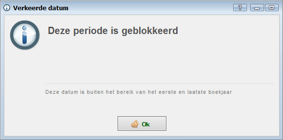
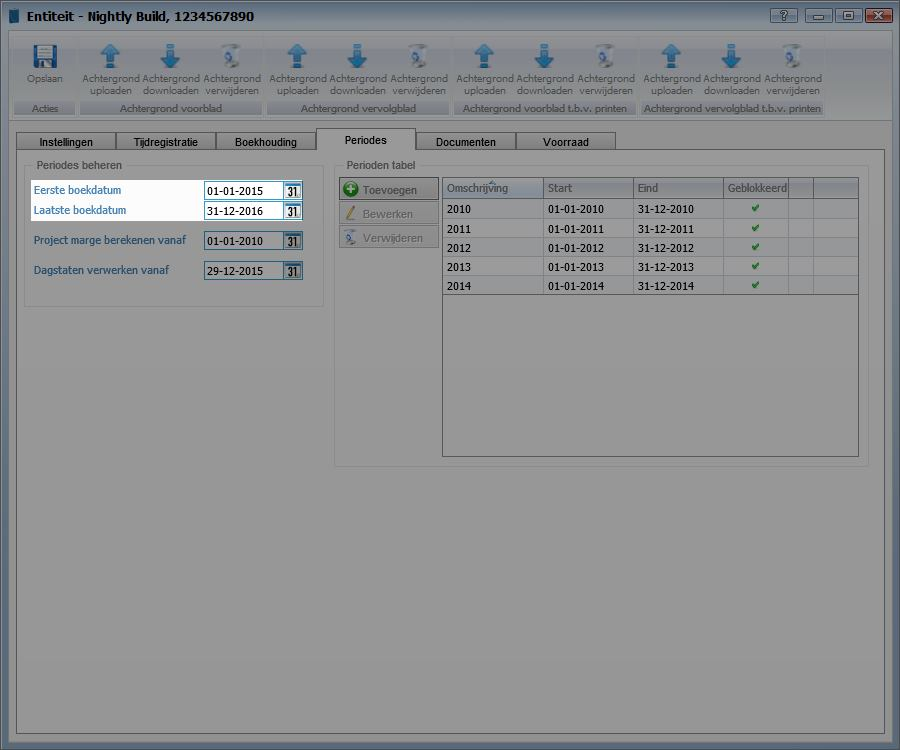
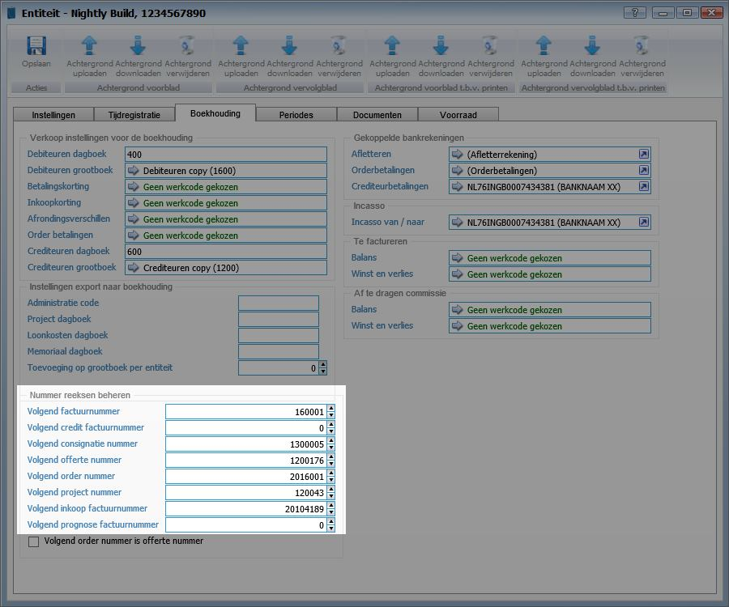

<properties>
	<page>
		<title>Begin van het nieuwe jaar</title>
	</page>
	<menu>
		<position>Het Systeem </position> 
		<title>Begin van het nieuwe jaar</title>
	</menu>
</properties>

# Begin van het nieuwe jaar #

Het nieuwe jaar brengt een paar kleine handeling die gedaan dienen te worden in Hybrid SaaS. Hieronder zijn een aantal zaken beschreven zodat u ook in het nieuwe jaar zorgeloos van Hybrid SaaS gebruik kunt maken.

# Boekingsperiode #

Om er voor te zorgen dat financiële boekingen niet in een verkeerd tijdvak worden geboekt werkt Hybrid SaaS met boekingsperiodes. Met een boekingsperiode wordt bepaald vanaf en tot welke datum boekingen gedaan mogen worden. Dit heeft onder andere invloed op facturatie, offerte/ orders, inkoopfacturatie en inkooporders.

Indien er een boeking wordt gedaan in een periode welke is afgesloten verschijnt de melding "Deze periode is geblokkeerd".

## Boekingsperiode aanpassen ##

Om de boekingsperiode aan te passen ga naar: **Entiteiten** > Klik op de betreffende entiteit > **Tabblad Periodes**

Onder de rubriek "Periodes beheren" kan de eerste en laatste boekdatum worden ingevuld.

Het kan voorkomen dat er in het nieuwe jaar nog boekingen gedaan dienen te worden welke betrekking heeft op het voorgaande jaar. Wij raden daarom aan de "eerste boekdatum" te handhaven en enkel de "laatste boekdatum" aan te passen.  

Wanneer alle boekingen (van het voorgaande jaar) zijn verwekt is het mogelijk om de periode af te sluiten. Klik hiervoor onder de rubriek "Periode tabellen" op toevoegen om een periode te blokkeren.

# Nummerreeksen aanpassen #

Bij de start van een nieuw jaar kan er voor worden gekozen om de nummerreeksen van bijvoorbeeld factuurnummers, ordernummers en boekstuknummers opnieuw te laten starten. 

**Entiteiten** > Klik op de betreffende entiteit > **Boekhouding**

Bij de rubriek "nummerreeksen beheren" kunnen de reeksen opnieuw worden ingesteld.

# Beginbalans #

Werkt u met de Balans - Winst & Verlies rekening van Hybrid SaaS dan hoeft u niets te doen. De eindsaldi van het voorgaande jaar wordt automatisch meegenomen naar het nieuwe jaar.