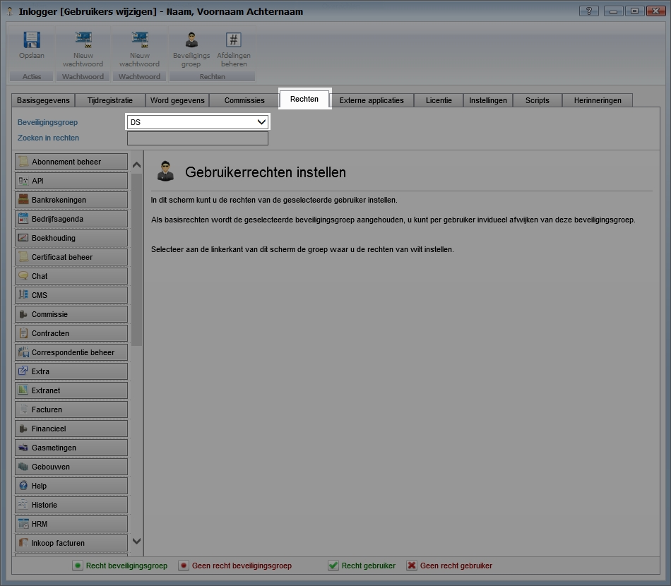
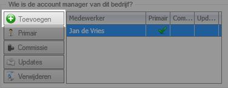
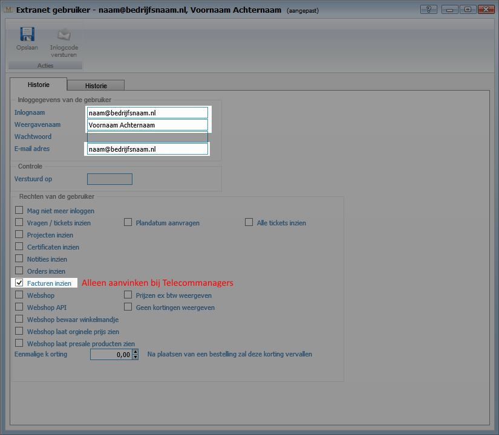

<properties>
	<page>
		<title>Gebruikers toevoegen externe portal</title>
	</page>
	<menu>
		<position>Het Systeem </position> 
		<title>Gebruikers toevoegen externe portal</title>
	</menu>
</properties>

# Type gebruikers #

Er zijn een aantal verschillende gebruikers welke op verschillende plekken in Hybrid SaaS aangemaakt dienen te worden. Voorals nog kennen we de volgende gebruikers:

- Operations medewerkers
- Direct sales medewerkers
- Indirect sales medewerker
- Telecommanagers
- Eindgebruikers

# Gebruikers aanmaken #

De verschillende type gebruikers worden op verschillende plekken in Hybrid SaaS aangemaakt.

De volgende gebruikers worden aangemaakt als Hybrid SaaS gebruikers:

- Operations medewerkers
- Direct sales medewerkers
- Indirect sales medewerker

De volgende gebruikers worden aangemaakt als Hybrid SaaS extranet gebruikers:

- Telecommanagers
- Eindgebruikers

## Gebruiker toevoegen als (interne) gebruiker ##

- Operations medewerkers
- Direct sales medewerkers
- Indirect sales medewerker

Ga naar "Gebruikers wijzigen"

Klik op toevoegen om een nieuwe gebruiker toe te voegen. Via het onderstaande scherm kan er een nieuwe gebruiker worden toegevoegd.

Let op! Vink alle opties aan zoals hierboven is weergegeven.

Gebruik voor de inlognaam het e-mailadres van de gebruiker. Het e-mailadres mag maar één keer voorkomen. Dit o.a. in verband met het opvragen van een wachtwoord. 

## Gebruiker koppelen aan Beveiligingsgroep ##

Koppel de gebruiker aan de juiste beveiligingsgroep. 

Indien gebruiker niet aan een beveiligingsgroep is gekoppeld zal er extern gaan data worden weergegeven.

De procedure voor het aanmaken is voor alle bovengenoemde gebruikers hetzelfde. Het enige verschil is dat Direct sales medewerkers en Indirect sales medewerker als accountmanager aan een bedrijf gekoppeld dienen te worden. Wordt een gebruiker niet aan een bedrijf gekoppeld wordt deze automatisch als Operations medewerkers aangemerkt. Dit houdt in dat deze gebruiker alle informatie van alle relaties in de portal kan raadplegen.

### Accountmanager koppelen aan bedrijf ###

Door een gebruiker als accountmanager aan een bedrijf te koppelen zal deze enkel de bedrijven zijn waar hij/zij aan gekoppeld is. Alle andere bedrijven en informatie zal voor deze gebruikers niet zichtbaar zijn.

Ga naar "Relaties"

Open het betreffende bedrijf waar de accountmanager aan gekoppeld dient te worden.

Voeg de gebruiker toe op de relatiekaart op het tabblad "stamgegevens"

## Gebruiker toevoegen als (externe) gebruiker ##

De volgende gebruikers dienen als gebruiker op de relatiekaart aangemaakt te worden:

- Telecommanagers
- Eindgebruikers

Ga naar het betreffende bedrijf en ga naar het tabblad "Extranet"

Klik op toevoegen om een nieuwe extranet gebruiker aan te te maken

De procedure voor het aanmaken is voor alle bovengenoemde gebruikers hetzelfde. Het enige verschil is dat Telecommanagers facturen van het bedrijf mogen inzien. Hiervoor dient het vinkje bij "Facturen inzien" aangevinkt te worden.

----------
