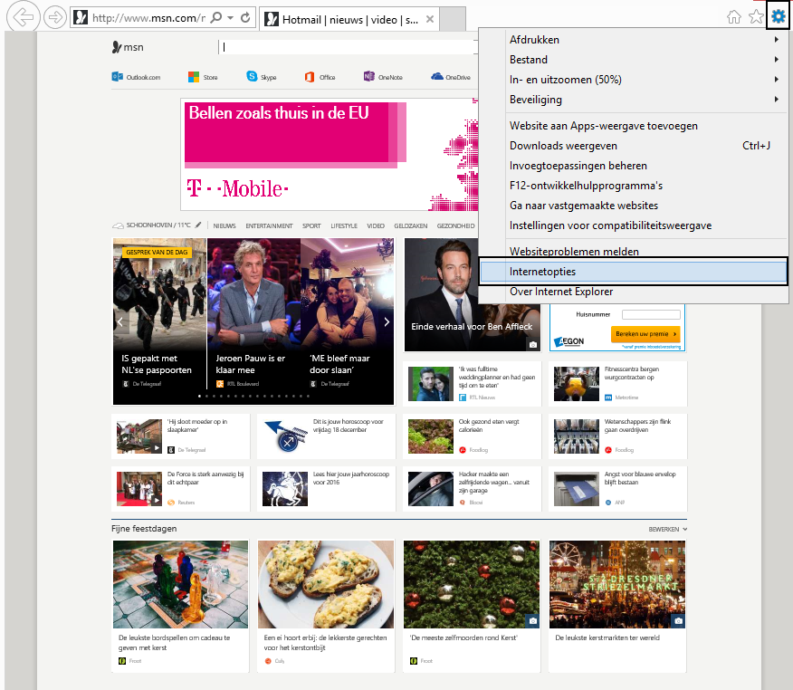
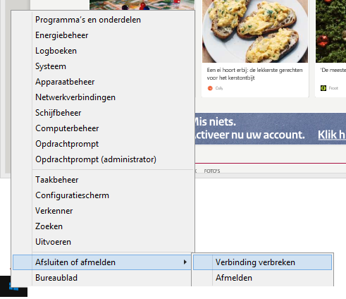

<properties>
	<page>
		<title>Geschiedenis leegmaken</title>
	</page>
	<menu>
		<position>Het Systeem </position> 
		<title>Geschiedenis leegmaken</title>
	</menu>
</properties>

# Geen scherm meer kunnen openen #

Als je in Hybrid SaaS geen vensters meer kan openen dien je de volgende handeling te volgen.

* Alle schermen sluiten
* Internet Explorer openen (geen andere webbrowsers)
* Instellingen
* Internetopties
* Browsergeschiedenis verwijderen (de volgende vinkjes moeten aanstaan)
	* Tijdelijke internetbestanden en websitebestanden
	* Cookies en websitegegevens
	* Geschiedenis
	* Downloadgeschiedenis
* Computer of remote helemaal afsluiten en opnieuw opstarten

Nu kan je Hybrid SaaS opnieuw openen

----------

