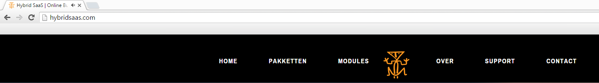
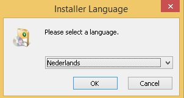
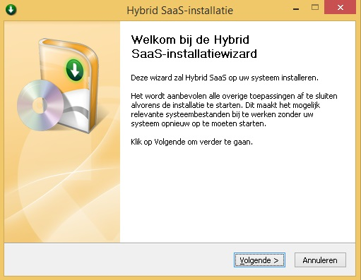
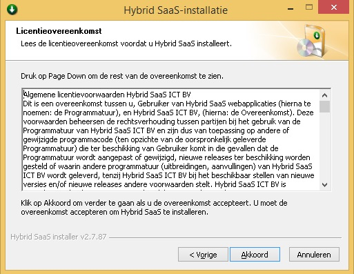
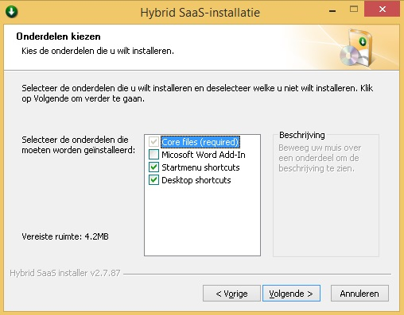
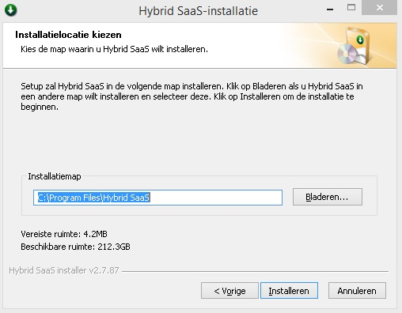
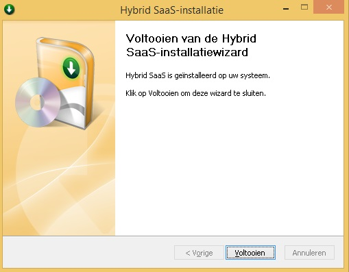
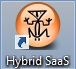
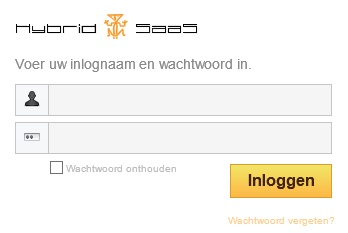

<properties>
	<page>
		<title>Installeren Hybrid SaaS (Browser)</title>
			</page>
	<menu>
		<position>Het Systeem / Installeren </position> 
		<title>Installeren Hybrid SaaS</title>
		<sort>a</sort>
	</menu>
</properties>

## Installeren Hybrid SaaS ##

Hoe installeer ik de Hybrid SaaS browser om mijn werkplek. 

Ga naar de website van Hybrid SaaS [www.hybridsaas.com](http://hybridsaas.com/support), en ga naar Support

Er staan 3 download opties

- Hybrid SaaS browser 
	- Hiermee kan je Hybrid SaaS op je werkplek installeren
- Hybrid SaaS Word ADD-in
	- Hiermee kan je in Hybrid SaaS gebruik maken van WORD om word-sjablonen te maken en of aan te passen 
- Hybrid SaaS Outlook ADD-in
	- Hiermee kan je vanuit je outlook binnengekomen mail converteren naar een ticket t.b.v. van de module "Ticketsysteem" 

Kies de Hybrid SaaS Browser
  
 

Kies voor "Uitvoeren" in de melding die onderaan het scherm verschijnt.
  
 

Selecteer hier de taal. Standaard is dit Nederlands. 

Na de taalkeuze wordt de installatie wizard opgestart. Kies volgende om door te gaan.

Klik op akkoord om de licentievoorwaarde te accepteren.

Bij dit onderdeel staan standaard de Startmenu en Desktop shortcuts aan gevinkt. Het onderdeel Microsoft Word ADD-In kan je optioneel aanzetten. Dit doe je als je zelf word-sjablonen gaat maken of aanpassen. En klik op volgende om door te gaan.     

Klik op "installeren" om de installatie te starten. De Installatiemap (C:\Program Files\ Hybrid SaaS) die wordt voorgesteld kan je zo laten staan. 

Op het scherm zie je de installatie lopen en uiteindelijk verschijnt onderstaand scherm waarop je de installatie kan voltooien.

Op je desktop staat nu het Hybrid SaaS logo, waarmee je de applicatie kan starten.

Bij de eerste keer opstarten vraagt het systeem nog om een locatie, dit is het internetadres van je omgeving.
Dit is **bedrijfsnaam** gevolgd door **.hybridsaas.com**.

Gebruik de knop "Sla instellingen op" om deze instelling op te slaan.

Nu kan je de applicatie starten. (Mits je in het bezit bent van geldige inlognaam en wachtwoord)

---------

