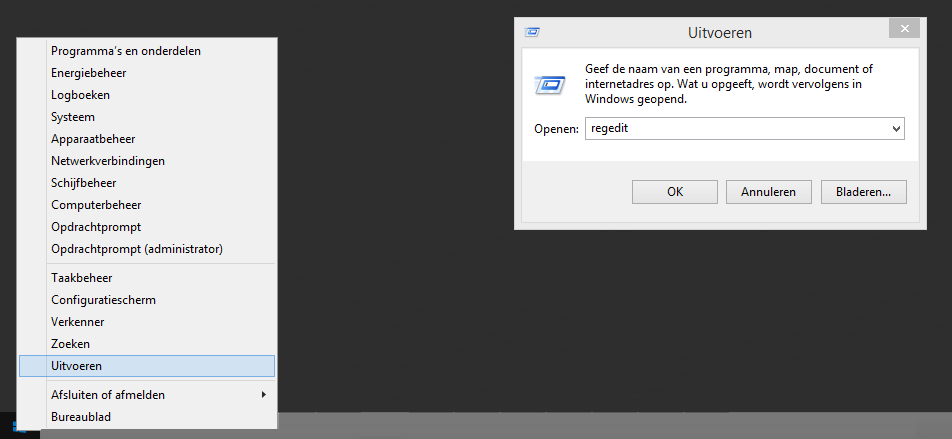
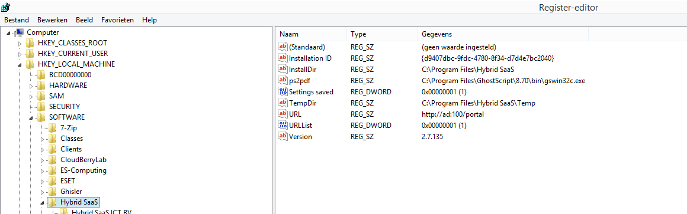
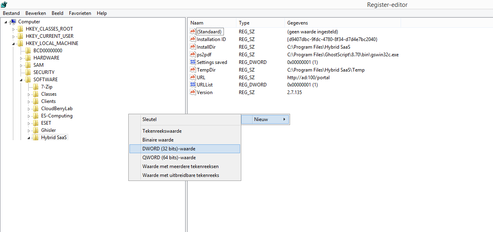
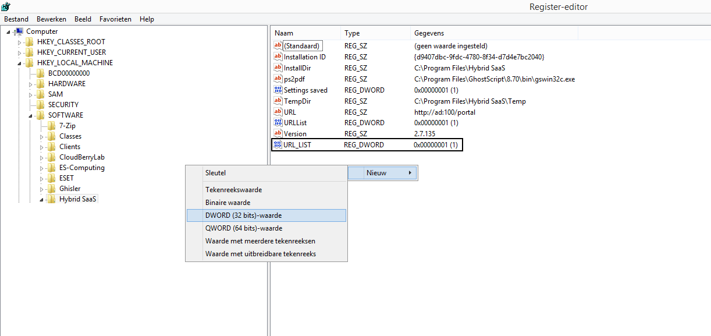
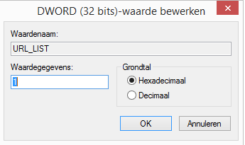
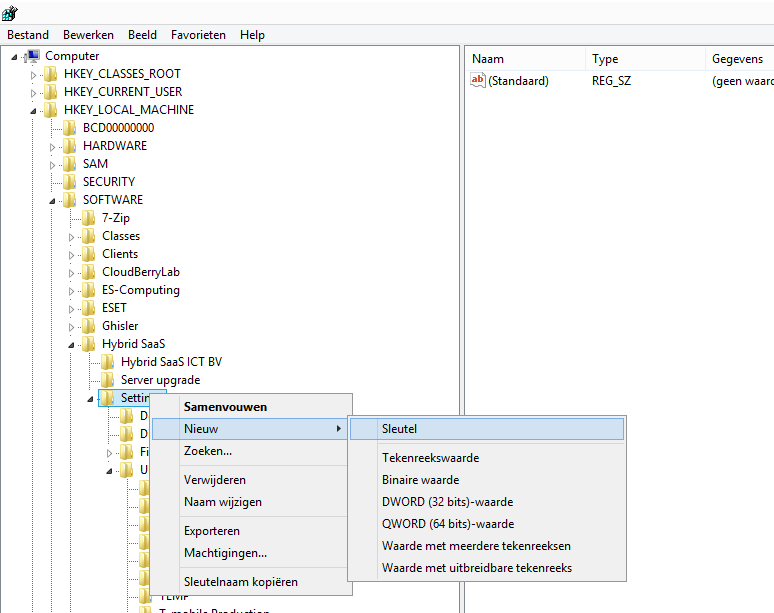
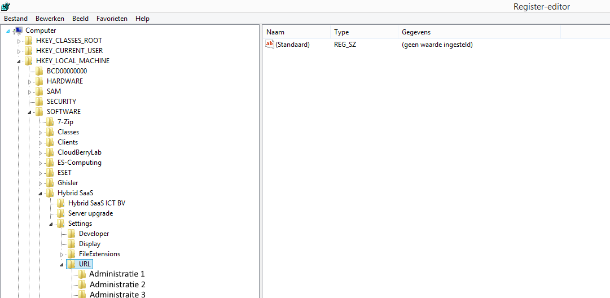
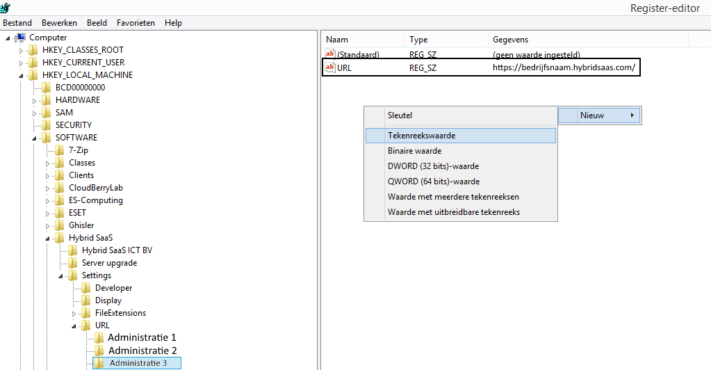
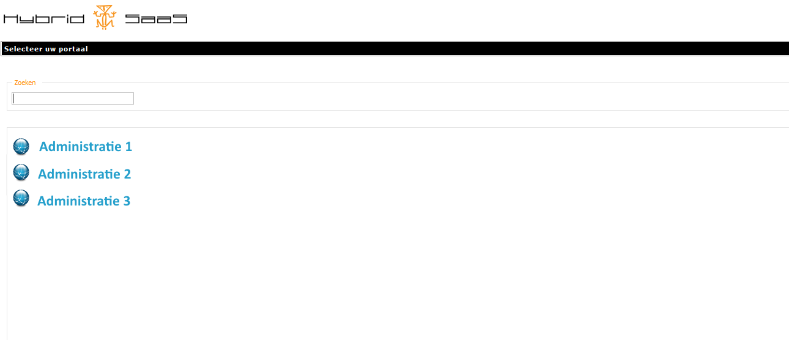

<properties>
	<page>
		<title>meerdere-omgevingen-instellen</title>
			</page>
	<menu>
		<position>Het Systeem / Installeren </position> 
		<title>Meerdere omgevingen instellen</title>
		<sort>b</sort>
	</menu>
</properties>

## Meerdere omgevingen instellen ##

Als je met meerdere omgevingen werkt, is het makkelijk om deze vast te laten zetten op het begin scherm van Hybrid SaaS. Hieronder word per stap uit gelegd hoe je dit kan doen 

* Ga dan naar regedit via de windows knop - Uitvoeren

* Je komt dan in het volgende scherm

 
* ga naar:
	* HKEY_LOCAL_MACHINE
	* SOFTWARE
	* Hybrid SaaS
	
In de map van Hybrid SaaS kan je met de rechtmuisknop iets toevoegen

* Kies hiervoor nieuw
* DWORD (32-bits)-waarde
* Deze kan je benoemen naar URL_LIST

* Dubbelklikken op deze regel en bij de waarde een 1 neerzetten

* Nu rechtermuisknop op de map Settings de nieuwe toegevoegde map noem je URL

* In deze map (URL) kan je op de zelfde manier nog meer mappen toevoegen, net zo veel als hoeveel administraties je hebt. Hier geef je dan de naam van de administratie in

* In deze map kan je via je rechtersmuis knop een tekenreeks toevoegen en deze geef je de naar URL

* Dubbel klikken op de regel en bij waardegegevens dien je https://bedrijfsnaam.hybridsaas.com (als je deze niet weet kan je hem opvragen via support@hybridsaas.com)

* Nu kan je de omgevingen kiezen

---------
