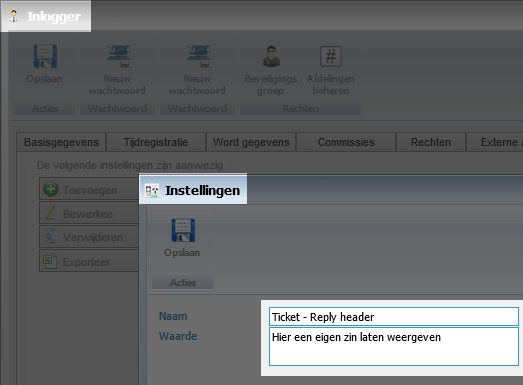
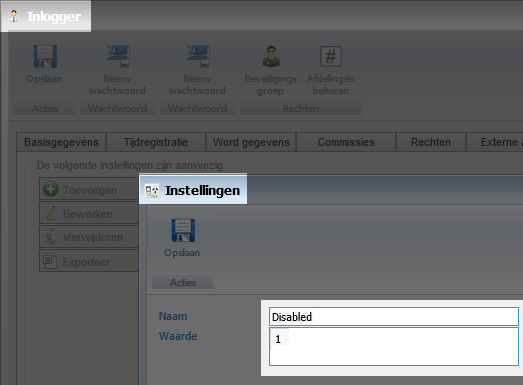

<properties>
	<page>
		<title>Instellingen door hsbeheerder</title>
	</page>
	<menu>
		<position>Het Systeem </position> 
		<title>Instellingen door hsbeheerder</title>
	</menu>
</properties>

# Instellingen door HS beheerder #

Hieronder zullen diverse onderdelen beschreven worden welke alleen in te stellen zijn door de beheerders van Hybrid SaaS.

Dit kan je aangeven door een email te sturen naar de support afdeling

## ---===[Aanpassen naar wens]===--- ##

Als je een update verstuurd van een ticket zien klanten deze regel boven aan in de mail staan deze is aan te passen naar een zin naar wens

**Voor de beheerder:**

## Functies uitschakelen, maar omgeving actief ##

Je kan de omgeving voor een aantal maanden op non-actief laten zetten, hier kan een bedrag voor worden afgesproken i.p.v. het volledige maandbedrag. dit kan je aanvragen bij de afdeling administratie

Hiervoor word het omgeving zo ingesteld dat je wel alles nog kan zien maar niks mee kan doen

**Voor de beheerder:**

----------