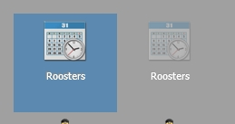

<properties>
	<page>
		<title>Bureaublad instellingen</title>
	</page>
	<menu>
		<position>Het Systeem / Diverse Instellingen </position>
		<title>Bureaublad instellingen</title>
	</menu>
</properties>

## Bureaublad instellingen ##

Als u er voor kiest om zelf uw bureaublad in te richten zullen automatisch de bestaande snelkoppelingen verwijderd worden. Zodra u uw eigen aangemaakte snelkoppelingen verwijderd zal het bureaublad automatisch weer de originele snelkoppelingen weergeven.

TIP: SHIFT + F5 is het scherm verversen

Om iconen toe te voegen aan je bureaublad kan je via start op de gewenste icoon gaan staan en dan met je rechter muisknop toon op bureaublad.

hij zet hem dan automatisch op het eerste vrije plekje vanaf links bovenin, daarna kan je hem verslepen naar de gewenste plek

Ook kan je hem weer verwijderen van je bureaublad door middel van je rechtermuisknop op het icoontje.
Met deze handeling kan je ook de naam veranderen of de teller verwijderen

Als je een andere kleur achtergrond wilt kan je dit aanpassen bij weergave wijzigen.

----------