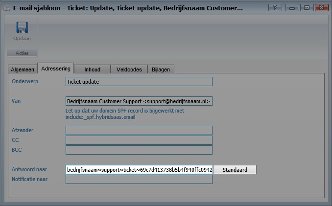

<properties>
	<page>
		<title>E-mailadres genereren</title>
	</page>
	<menu>
		<position>Het Systeem / Mail Instellingen </position> 
		<title>E-mailadres genereren</title>
	</menu>
</properties>

# E-mailadres voor antwoord genereren #

Om er voor te zorgen dat een antwoord op een ticket terug komt in het ticketsysteem is het van belang dat het antwoordadres van de e-mail goed is ingesteld. Via "E-mail sjablonen" en tabblad "Adresseringen" is het mogelijk om een antwoordadres te genereren. Wanneer de tegenpartij het ticket beantwoord zal deze naar het gegenereerde adres antwoorden en zal het antwoord aan het juiste ticket worden toegevoegd.

## E-mailadres genereren ##

Voor het genereren van het e-mailadres ga je naar "E-mail sjablonen" 

Naast het veld "Antwoord naar" staat een knop genaamd "Standaard". Door op "Standaard" te klikken wordt automatisch een antwoordadres aangemaakt.

Het gegenereerde e-mailadres kan ook worden gebruikt om een bestaand e-mailadres te forwarden. In de e-mailinstellingen van je mailclient is dit aan te passen. 

**MS Exchange :** [https://support.office.com/nl-be/article/Mijn-berichten-automatisch-doorsturen-naar-een-ander-e-mailaccount-9f124e4a-749e-4288-a266-2d009686b403](https://support.office.com/nl-be/article/Mijn-berichten-automatisch-doorsturen-naar-een-ander-e-mailaccount-9f124e4a-749e-4288-a266-2d009686b403 "Microsoft Exchange")

**Office 365 :** [https://support.office.com/nl-nl/article/E-mail-doorsturen-naar-een-ander-e-mailaccount-1ed4ee1e-74f8-4f53-a174-86b748ff6a0e](https://support.office.com/nl-nl/article/E-mail-doorsturen-naar-een-ander-e-mailaccount-1ed4ee1e-74f8-4f53-a174-86b748ff6a0e "Office 365")

**Gmail :** [https://support.google.com/mail/answer/10957?hl=nl](https://support.google.com/mail/answer/10957?hl=nl "Gmail")

----------

