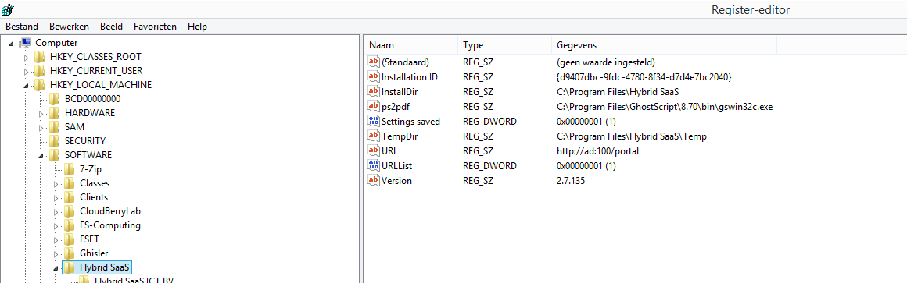

<properties>
	<page>
		<title>meerdere-omgevingen-installeren</title>
			</page>
	<menu>
		<position>Het Systeem </position> 
		<title>meerdere-omgevingen-installeren</title>
		<sort>c</sort>
	</menu>
</properties>

## Meerdere omgevingen installeren ##

Als je met meerdere omgevingen werkt, is het makkelijk om deze vast te laten zetten op het begin scherm van Hybrid SaaS. Hieronder word per stap uit gelegd hoe je dit kan doen 

* Ga dan naar regedit via de wondows knop

* Je komt van in het volgende scherm

 
 

---------
