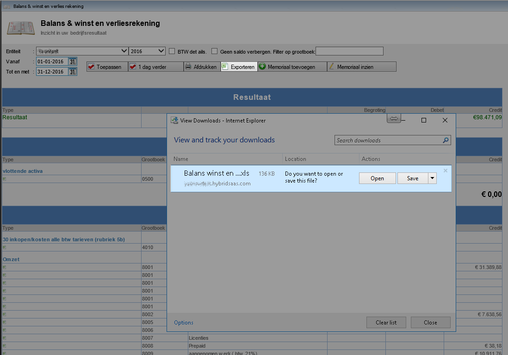
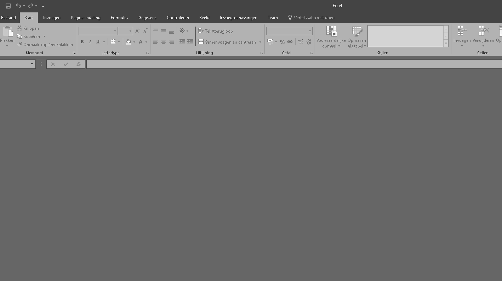
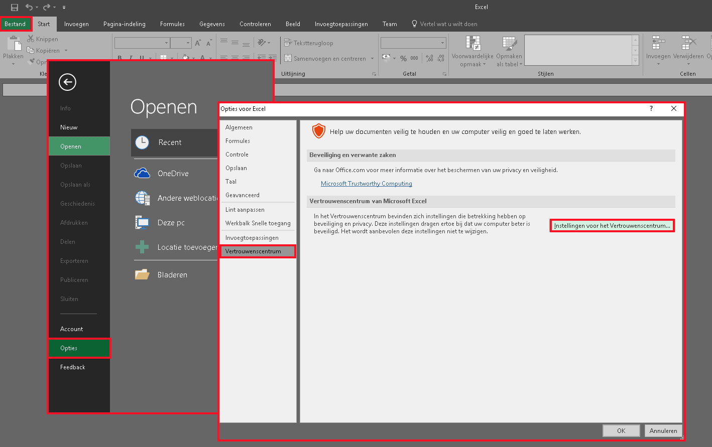
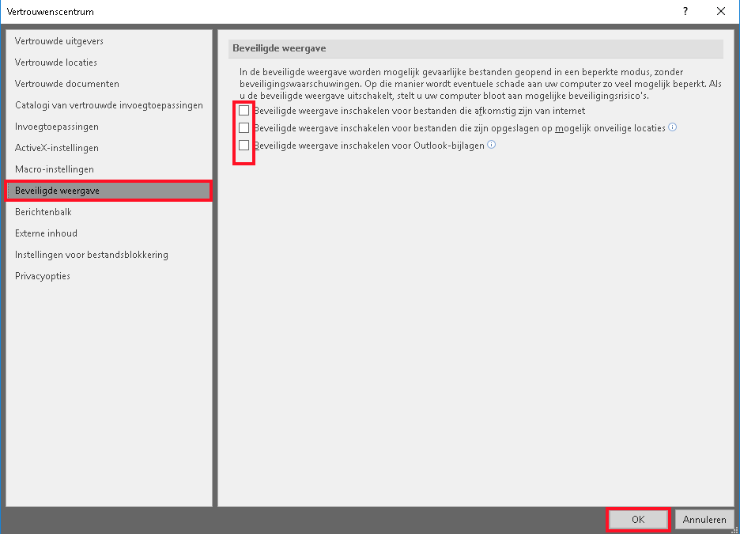
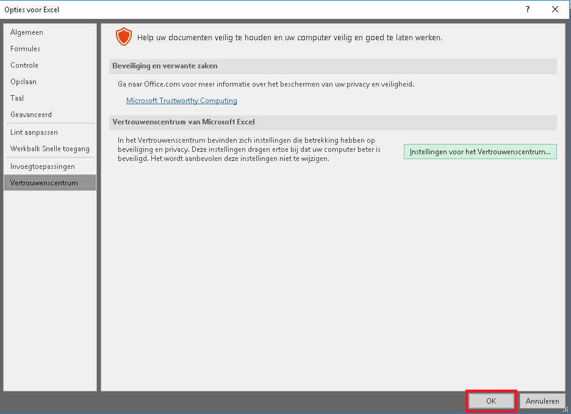
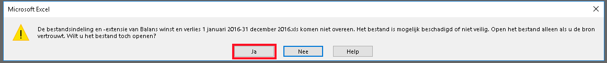
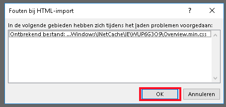

<properties>
	<page>
		<title>Beveiliging van Excel</title>
	</page>
	<menu>
		<position>Het Systeem / Resetten</position> 
		<title>Beveiliging van Excel</title>
	</menu>
</properties>

# Er wordt een dicht Excel bestand geopend #

Het kan voorkomen dat het sommige waarde niet meer naar Excel te exporteren zijn, Excel laat dan wel een venster zien maar deze bevat geen informatie. 
Dit kan komen door de beveiliging van Excel zelf, (dit kan veranderen door de verschillende updates van Windows) hieronder zal worden uitgelegd hoe je deze beveiliging uit kan zetten zodat de gevraagde informatie weer te exporteren is.

Het meest voorkomende is dit bij de Module Winst en Verlies Rekening, in deze handleiding wordt dan ook beschreven vanuit het gebruik van de Winst en Verliesrekening, indien het vanuit een andere module ook voorkomt kunnen dezelfde stappen worden doorgelopen

## Exporteren vanuit Hybrid SaaS ##

Bij de Winst en verliesrekening is er de optie om de waarde te exporteren naar Excel, na het klikken op de button exporteren zal er een download scherm worden gedownload, hier kan er gekozen worden voor opslaan of openen. Na het kiezen van 1 van deze opties zal het Excel bestandje worden geopend.

In dit geval zal er een leeg Excel bestand worden geopend, Het getoonde scherm zal er als volgt uitzien:

## Beveiliging opties uitschakelen in Excel ##

Om de beveiliging uit te zetten dienen er een paar stappen te worden doorgelopen

- Ga in Excel naar **Bestand**
- Kies vervolgens voor **Opties**
- Open het venster **Vertrouwenscentrum**
- Klik op de button **Instellingen voor het Vertrouwenscentrum...**

Nu zal het vertouwenscentrum worden geopend

- Open het venster **Beveiligde weergave**
- Hier zullen 3 opties worden weergegeven
  - indien er hiervan vinkjes aanstaan dienen deze te worden uitgezet
- Kies voor opslaan

Het scherm van de Opties zal weer in beeld komen

- Sla ook deze instellingen op

## Opnieuw het bestand uitvoeren via Hybrid SaaS ##

Als de vorige stappen zijn doorgelopen kan er opnieuw een export worden gemaakt van de Winst en Verliesrekening.

Na het klikken op de button exporteren zal er een download scherm worden gedownload, hier kan er gekozen worden voor opslaan of openen. Na het kiezen van 1 van deze opties zal het Excel bestandje worden geopend.

### Foutmelding ###

Na het openen van Excel zal er nog 2 maal een foutmelding naar voren, dit heeft te maken omdat de beveiliging is uitgezet.

Beide meldingen kunnen geaccepteerd worden:

Hierna zal Excel weer worden geopend met de juiste waarde

----------

