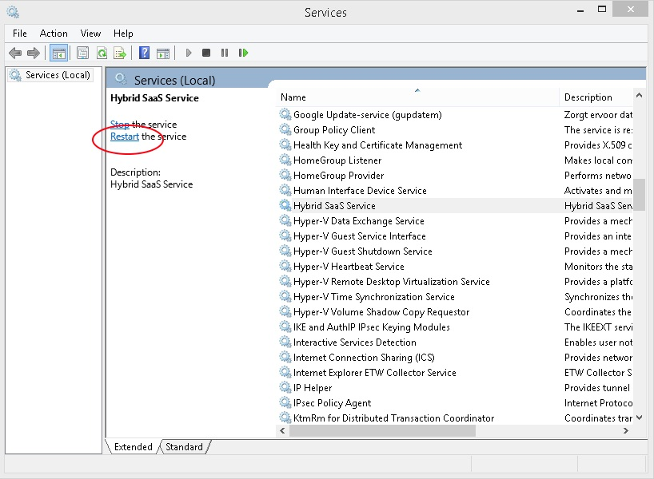
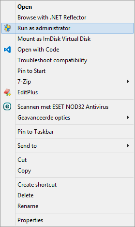
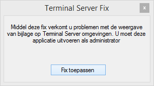
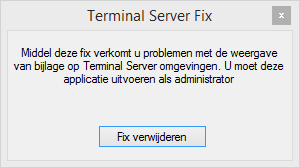

<properties>
	<page>
		<title>Bijlages uploaden werkt niet meer</title>
	</page>
	<menu>
		<position>Het Systeem / Resetten</position> 
		<title>Hybrid SaaS Service resetten</title>
	</menu>
</properties>

# Hybrid SaaS Service resetten #

Om dit te kunnen uitvoeren dien je administrator te zijn van de computer waar je gebruik van maakt

Hybrid SaaS gebruikt lokaal op de computer een [service](https://en.wikipedia.org/wiki/Windows_service) waardoor het uploaden van bestanden mogelijk is.

**De stappen voor het herstarten van de Hybrid SaaS Service**

>Klik op start.
>Typ bij het zoeken '**Uitvoeren**' (in het engels '**Run**').

>Druk op enter en typ vervolgens '**services.msc**'.

>Druk op enter en vervolgens krijg je een scherm met services. Zoek naar '**Hybrid SaaS Service**'

Als je op de H toets drukt dan verspringt de computer naar de eerst volgende service naam met een H. 

>Als je de service hebt gevonden, klik dan op '**Herstarten**' (of in het engels '**Restart**').

----------

Komen de problemen vaker voor en moet je regelmatig de service herstarten, dan is het aan te raden om het volgende bestandje te installeren om je computer.

Via de website  onder downloads kan je het bestandje **TerminalServerFix** vinden om te downloaden

Als je de exe in de zipfile uitvoert op de server (onder het administrator account/of door een gebruiker met deze rechten). Zal er een taak worden aangemaakt die de service elke nacht automatisch herstart.

De fix is ook weer te verwijderen door hem nog een keer uit te voeren:

