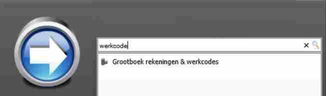
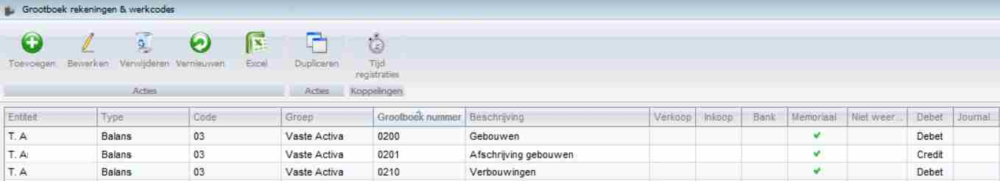
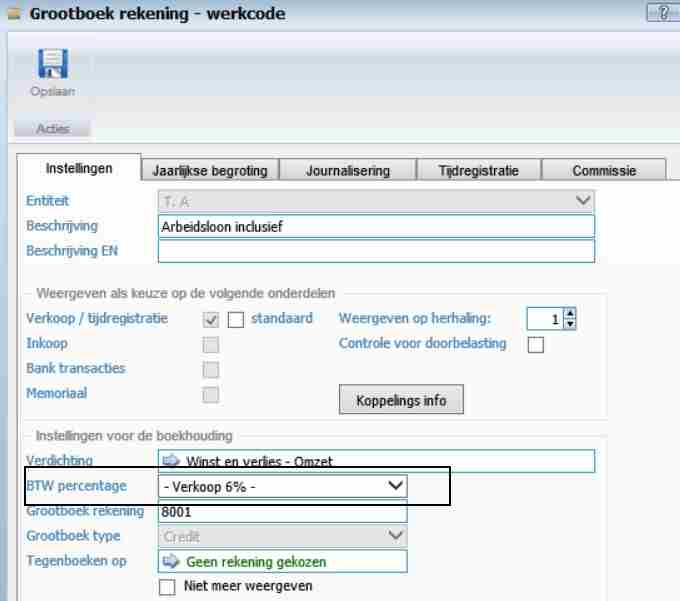

<properties>
	<page>
		<title>Btw aanpassen</title>
		<description>Btw aanpassen</description>
	</page>
	<menu>
		<position>Modules A - M / Balans</position>
		<title>Btw aanpassen</title>
		<sort>e</sort>
	</menu>
</properties>

# Btw aanpassen #

Hoe structureel een btw % te wijzigen :

Ga via de startknop naar Grootboek rekeningen & werkcodes, 

Je komt dan in de lijst met grootboekrekeningen.
 

Ga naar de werkcode welke moet worden aangepast en selecteer deze.
 

Verander het btw % naar 21 % en sla deze op. Als je nu in een factuur deze werkcode selecteert dan wordt er 21% berekend ipv de 6%.

----------