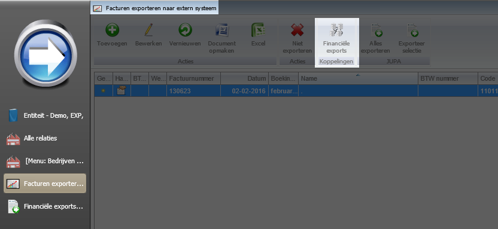
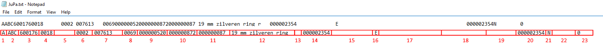
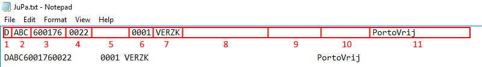

<properties>
	<page>
		<title>Export Jupa</title>
	</page>
	<menu>
		<position>Modules A - M / Facturatie </position> 
		<title>Export Jupa</title>
		<sort>c</sort>
	</menu>
</properties>

# Exporteren facturen naar Jupa #

In dit artikel zal worden beschreven welke stappen er gevolgd dienen te worden om facturen via een bestand aan Jupa (Eijssink afrekensustemen http://www.eijsink.nl/Jupa/jupa.html) 

## Instellen stamgegevens ##

Wanneer je gebruik gaat maken van de koppeling zal Eijssink een leverancierscode verstrekken. Dit leveranciersnummer is een uniek kenmerk waarmee je organisatie bekent staat bij Eijssink. 

Vul de leverancierscode in bij **Entiteiten**

Gebruik hiervoor HOOFDLETTERS

## Instellen e-mailadres bij relatie ##

Voor iedere afzonderlijke relatie, waar de facturen van naar Jupa gezonden dienen te worden, dient een e-mailadres ingesteld te worden. Dit adres kan bij betreffende relatie of bij Eijssink worden opgevraagd.

Ga naar de contactgegevens van de relatie en voeg een e-mailadres toe. Zet het vinkje aan voor "Export naar extern systeem"  en kies in het dropdownmenu voor **Jupa**

## Facturen Exporteren ##

Ga naar **Facturen exporteren naar extern systeem**. In dit venster zullen alle facturen worden weergegeven welke nog niet zijn geëxporteerd. Selecteer de facturen welke geëxporteerd dienen te worden en klik op **exporteer selectie**

Het versturen van de facturen naar Jupa is een hamdmatige actie. Het systeem stuurt dus niet automatisch de facturen naar Jupa.

## Exports bekijken ##

Via de button **Financiële exports** is het mogelijk om de geëxporteerde bestanden te bekijken en indien wenselijk te controleren.

Selecteer de factuur en klik **Download bestand** om de betreffende export te downloaden.

Het bestandsformaat betreft een zogenaamd " ascii bestand" . Het is gewoon mogelijk om deze met bijvoorbeeld " notepad" te openen.

## Beschrijving van de content van de export ##

Op het eerste gezicht is het lastig om te kijken welke gegevens er in de export te zien zijn. In deze rubriek zal worden uitgelegd wat alle genoemde onderdelen betekenen. Op deze manier is het mogelijk om het bestand te begrijpen bij eventuele onduidelijkheden.

1. Er volgt eerst een uitsnede van een voorbeeldregel van de export
2. Het gemarkeerde gebied is uitgerust met een nummer
3. Aan de hand van het nummer wordt de beschrijving weergegeven
4. Onderaan de beschrijving wordt de locatie binnen Hybrid SaaS aangegeven *(Dialoog - Tabblad - Veldnaam)*

Niet alle beschikbare velden welke in Jupa worden gebruikt, worden ook in Hybrid SaaS gebruikt. In dit geval zal het betreffende item leeg zijn.

### Kopregel export factuurrecord en Totaalrecord ###

1. **Recordbeschrijving** *(Recordbeschrijving - Factuurrecord)*
2. **Leverancierscode**
	(Entiteit - Instellingen - Afkorting)
3. **Factuurnummer**
	(Factuur - Factuurkaart - Factuurnummer)
4. **Regelvolgnummer in de export**
5. **Factuurdutum**
	(Factuur - Factuurkaart - Factuurdatum)
6. **Lege ruimte** *(Niet in gebruik binnen Hybrid SaaS)*
7. **Valuta**
8. **Klantnummer** *(Laatste 4 cijfers van de klantcode)*
	(Relaties - Relatiekaart - N.A.W. - Code)

1. **Recordbeschrijving** *(Recordbeschrijving - Totaalrecord)*
2. **Leverancierscode**
	(Entiteit - Instellingen - Afkorting)
3. **Factuurnummer**
	(Factuur - Factuurkaart - Factuurnummer)
4. **Regelvolgnummer in de export**
5. **Lege ruimte** *(Niet in gebruik binnen Hybrid SaaS)*
6. **Datum kredietbeperking** *(Niet in gebruik binnen Hybrid SaaS)*
7. **Lege ruimte** *(Niet in gebruik binnen Hybrid SaaS)*
8. **Totaal BTW bedrag** 
	(Factuur - Factuurkaart - BTW)
9. **Totaal factuur bedrag** *(Totaal bedrag incl BTW)*
	(Factuur - Factuurkaart - Totaal incl. BTW)
10. **Kredietbeperking** *(Niet in gebruik binnen Hybrid SaaS)*

### Factuurregels ###

1. **Recordbeschrijving** *(Recordbeschrijving - Volgregels (factuurregels))*
2. **Leverancierscode**
	(Entiteit - Instellingen - Afkorting)
3. **Factuurnummer**
	(Factuur - Factuurkaart - Factuurnummer)
4. **Regelvolgnummer in de export**
5. **Leveringsnummer** *(Niet in gebruik binnen Hybrid SaaS)*
6. **Aantal van het product**
	(Factuur - Factuurkaart - Factuurregel - Aantal)
7.  **Productcode** ***(Artikelnummer leverancier)***
	*(Producten - Productkaart - Productcode)*
8.  **Gewicht** ***(In grammen vb 0069 6,9 gram)***
	(Producten - Productkaart - Instellingen - Productonderdeel - aantal (vinkje dit is een gewicht))
9.  **Basis verkoopprijs** ***(Prijs per stuk excl. metaal)***
	(Producten - Productkaart - Instellingen - Basis verkoop prijs)
10.  **Verkoopprijs** ***(Prijs per stuk incl. metaal)***
	(Producten - Productkaart - Prijzen - Verkoopprijs)
11.  **Korting** ***(Korting per stuk)***
	(Factuur - Factuurkaart - Factuurregel - korting (kortingspercentage * verkoopprijs)
12.  **Omschrijving van het product**
	(Producten - Productkaart - Informatie - Beschrijving)
13.  **Lege ruimte** *(Niet in gebruik binnen Hybrid SaaS)*
14.  **Advies verkoopprijs**
	(Producten - Productkaart - Prijzen - Advies verkoopprijs)
15.  **Barcode** *(Niet in gebruik)*
16.  **Artikelstatus** ***(E-Eigendom, Z-zicht, C-consignatie)***
17.  **Extra productcode** *(Niet in gebruik)*
18.  **Lege ruimte** *(Niet in gebruik binnen Hybrid SaaS)*
19.  **Ordernummer Jupa**
20.  **Advies verkoopprijs**
	(Producten - Productkaart - Prijzen - Advies verkoopprijs)
21.  **Standaard artikel** *(indien niet beschikbaar 'N')* *(Niet in gebruik binnen Hybrid SaaS)*
22.  **Standaard artikel** *(indien niet beschikbaar 'N')* *(Niet in gebruik binnen Hybrid SaaS)*
23.  **Advies voorraadaantal** *(Niet in gebruik binnen Hybrid SaaS)*
	

1. **Vervolgregels van de export**
2. **Leverancierscode**
	(Entiteit - Instellingen - Afkorting)
3. **Factuurnummer**
	(Factuur - Factuurkaart - Factuurnummer)
4. **Regelvolgnummer in de export**
5. **Leveringsnummer** *(Niet in gebruik binnen Hybrid SaaS)*
6. **Aantal van het product**
	(Factuur - Factuurkaart - Factuurregel - Aantal)
7.  **Type** ***(bijv. verzendkosten)***
	*(Producten - Productkaart - Instellingen)*
8.  **Lege ruimte** *(Niet in gebruik binnen Hybrid SaaS)*
9.  **Basis verkoopprijs** ***(Prijs per stuk excl. metaal)***
	(Producten - Productkaart - Instellingen - Basis verkoopprijs)
10.  **Lege ruimte** *(Niet in gebruik binnen Hybrid SaaS)*
11.  **Omschrijving van het product**
	(Producten - Productkaart - Informatie - Beschrijving)