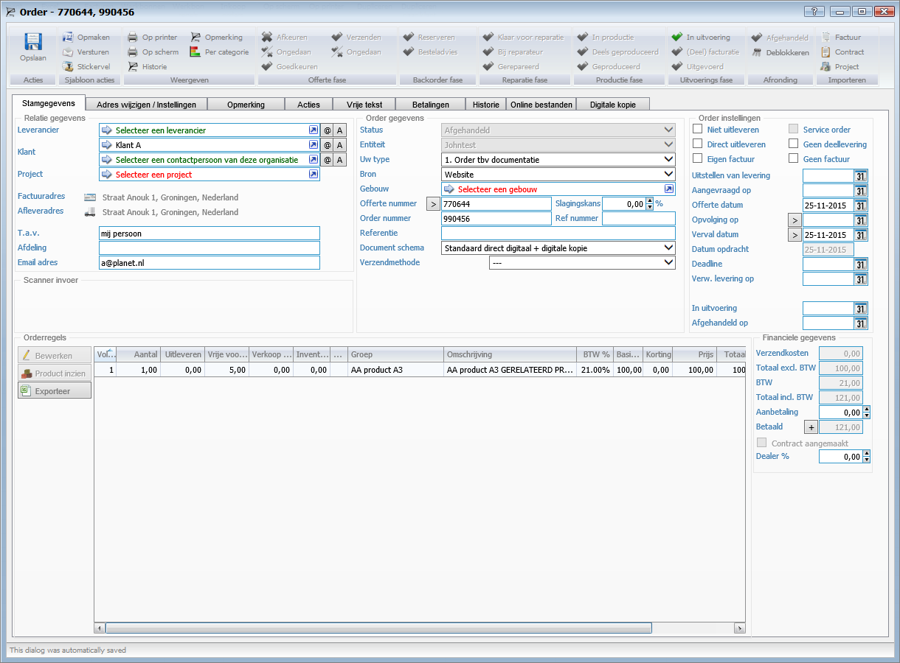
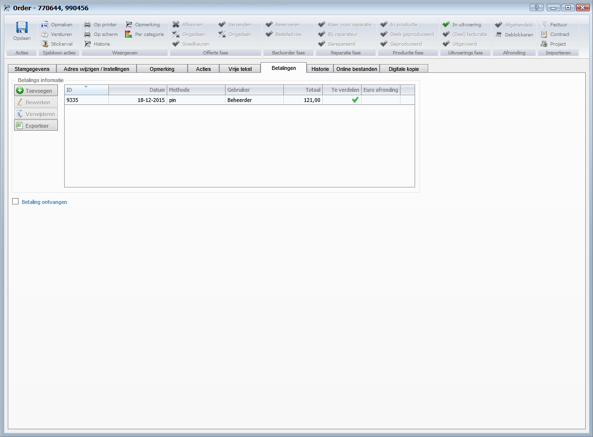
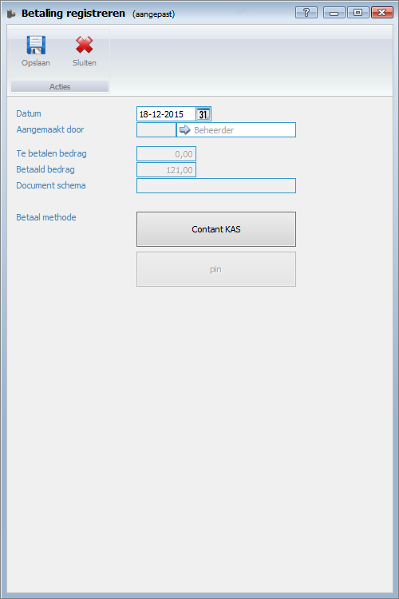

<properties>
	<page>
		<title>Betaalwijze aanpassen</title>
	</page>
	<menu>
		<position>Modules N - Z/ Offertes en orders </position> 
		<title>Betaalwijze aanpassen</title>
	</menu>
</properties>

## Betaalwijze aanpassen ##

Als een order bijvoorbeeld op PIN is doorgevoerd maar klant betaald toch contant kan je de betaling aanpassen.

* Ga naar de order
 

* Kijk op het tabblad betalingen op welke betaalmethode de betaling staat

 
* Selecteer de regel en klik op bewerken

* Maak de keuze waar de betaling op moet komen te staan en sla het record op. Hierna kan je de order ook opslaan en is de betaling veranderd

----------
