<properties>
	<page>
		<title>Offerte en Order</title>
	</page>
	<menu>
		<position>Modules  N - Z / Offertes en orders</position> 
		<title>Zicht-Consignatie factuur omzetten</title>
	<sort>B</sort>
	</menu>
</properties>

## Zicht-Consignatie factuur omzetten naar Retour/Factuur ##

Een consignatie factuur is een factuur waarbij je goederen tijdelijk op een andere locatie worden geplaatst. Deze goederen worden uiteindelijk verkocht of retour gegeven. 
Een consignatie factuur vertegenwoordigd wel een waarde maar deze waarde wordt pas berekend op het moment dat er iets met de goederen gebeurt. Wel wordt de voorraad afgeboekt.

- Goederen worden verkocht en dan volgt er een verkoopfactuur
- Goederen worden retour gestuurd en dan wordt de voorraad weer opgeboekt. 

Hieronder worden deze optie uitgelegd.

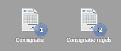 

Op je desktop wordt aangegeven hoeveel consignatie facturen er zijn en ook hoeveel consignatie factuurregels er zijn.

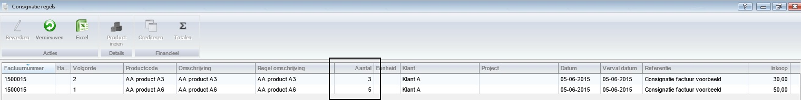 

Hoe gaan we deze producten retour nemen?
Dubbelklik op de regel die je retour wilt nemen, je komt dan in de factuur met alle regels. (je kan ook via de consignatiefactuur naar dit scherm). Op dit scherm zie je links onderaan bij de producten 2 grijzen knoppen staan.

 **Factureren en Retour.**

Op het moment dat je 1 productregel selecteert worden de knoppen bruikbaar.

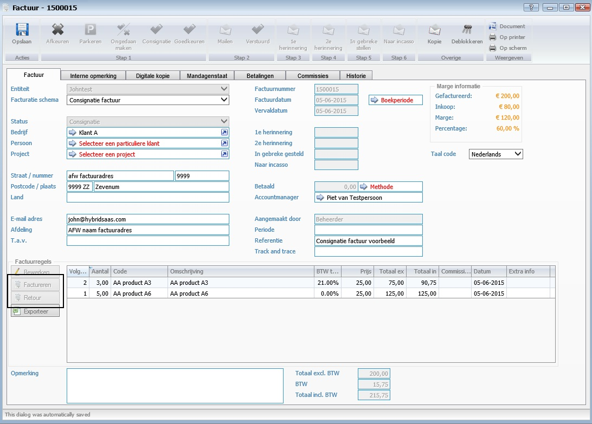 

**Retour nemen**

Als je alle regels retour wilt nemen dan selecteer je alle regels (dmv ALT of CTRL toetsen) en drukt op de knop Retour.   
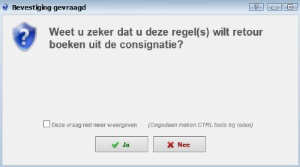

Dit resulteert in een nieuwe factuur met een tegenboeking van de aantallen. Vul de factuur verder in (Facturatie schema moet opnieuw gekozen worden) en behandel deze als iedere andere factuur.

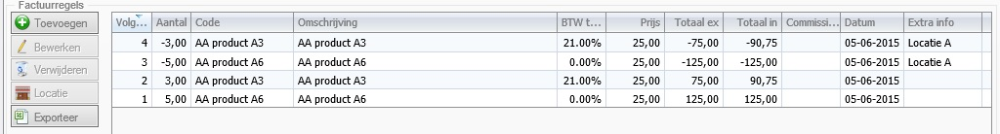

Als de factuur uiteindelijk wordt verzonden, dan worden de goederen terug geboekt in de voorraad, er verschijnt dan een pop-up scherm.

**Factureren**

Als je alle regels wilt factureren dan selecteer je alle regels (dmv ALT of CTRL toetsen) en drukt op de knop Factureren.   

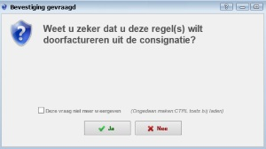

Dit resulteert in een nieuwe factuur. Vul de factuur verder in (Facturatie schema moet opnieuw gekozen worden) en behandel deze als iedere andere factuur.

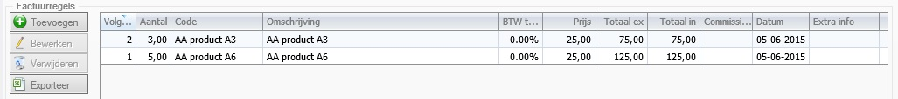

**Gedeeltelijk retour nemen of factureren**

Het komt ook voor dat je een gedeelte van een productregel retour wilt nemen of wilt factureren. In zo'n geval ga je naar de consignatieregels en selecteert de productregel (dubbel klikken).

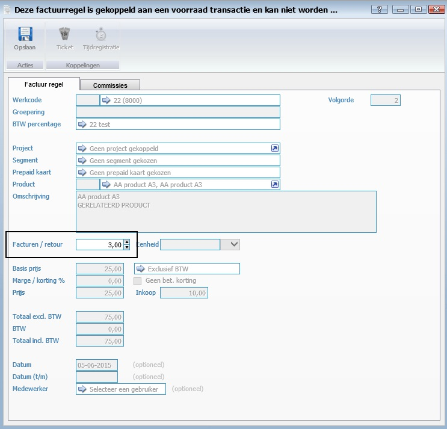

Pas het aantal aan en sla de regel op. Herhaal dit voor alle productregels waarvan je iets wilt retour nemen. Je ziet dat er voor het veld dat je kan wijzigen **"Facturen / retour"** staat. Er is dus geen apart veld voor retour of factuur. Dit wordt bepaald aan de hand van de knop.

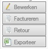

LET WEL OP. Je kiest voor Retour nemen of Factureren, je kan dus niet in één keer producten retour nemen en factureren.
Dit doe je dan in 2 stappen.

De aangepaste aantallen komen nu in het **ROOD** zichtbaar in de factuur. 
Kies nu d.m.v. de knop "Retour" om deze aantallen terug te nemen.
Dit resulteert in een nieuwe factuur met een tegenboeking van de gewijzigde aantallen. Vul de factuur verder in (Facturatie schema moet opnieuw gekozen worden) en behandel deze als iedere andere factuur. Als de factuur uiteindelijk wordt verzonden, dan worden de goederen terug geboekt in de voorraad, er verschijnt dan een pop-up scherm waarop deze producten staan.
 
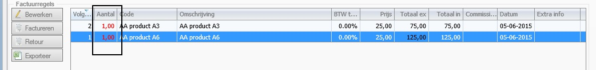

Als uiteindelijk alle aantallen van de productregels retour genomen of gefactureerd zijn, zal de consignatie factuur verdwijnen.

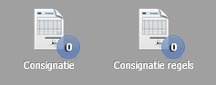 

----------
