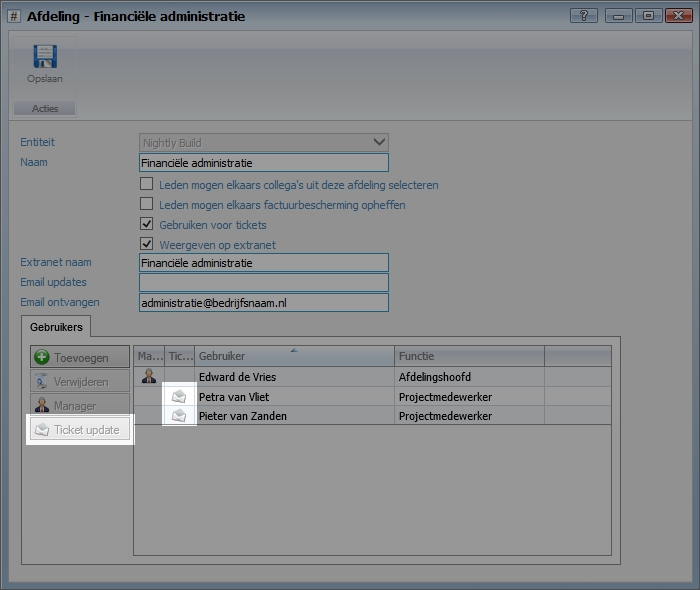
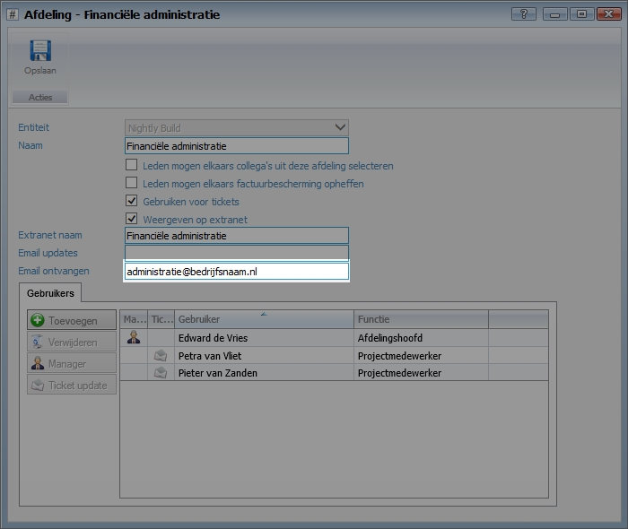

<properties>
	<page>
		<title>Ticketupdate</title>
		<description>Ticketupdate</description>
	</page>
	<menu>
		<position>Modules N - Z / Ticketsysteem</position>
		<title>Update instellen per gebruiker</title>
		<sort>B</sort>
	</menu>
</properties>

# Ticketupdate per afdeling en/of gebruiker Instellen #

Wanneer er een ticket wordt aangemaakt, of wanneer er een wijziging of antwoord op een ticket wordt gegeven kan er een e-mail update naar gebruikers worden verzonden. Deze instellingen kunnen per gebruiker bij de "afdelingen" worden ingesteld. Daarnaast is het mogelijk in inkomende e-mail aan bepaalde mailadressen te koppelen aan afdelingen.

## Update per gebruiker instellen ##

Selecteer de gebruiker en klik op "Ticket update" 

## Tickets automatisch koppelen aan de juiste afdeling  ##

Het is tevens mogelijk is tickets direct aan een afdeling te koppelen. Wanneer een e-mail aan een specifiek mailadres wordt verzonden kan deze direct aan de juiste afdeling worden gekoppeld.

Vul bij "Email ontvangen" het e-mailadres welke aan de afdeling gekoppeld dient te worden.

Tevens is mogelijk om bij het e-mailsjabloon het antwoordadres direct door te laten verwijzen naar de afdeling. 

[spf-record toevoegen](http://hybridsaas.support/het-systeem/spf-record-instellen/toevoegen)

----------