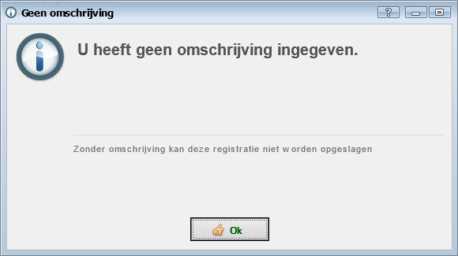
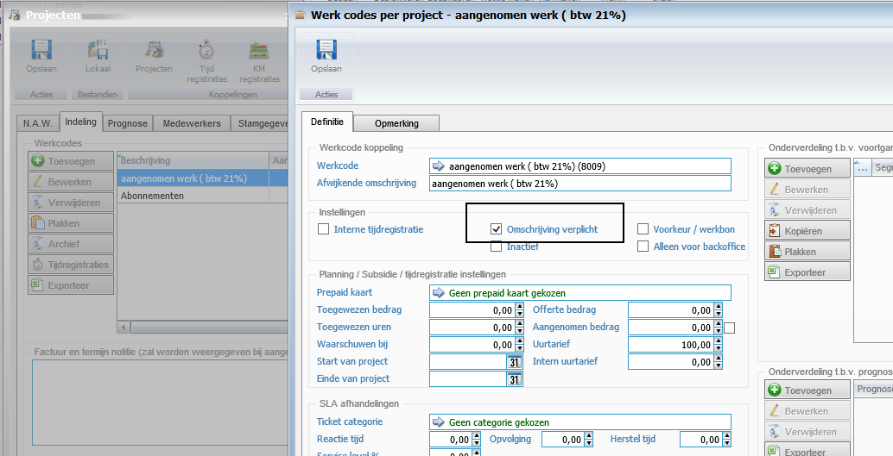

<properties>
	<page>
		<title>Omschrijving verplicht</title>
		<description>Omschrijving verplicht</description>
	</page>
	<menu>
		<position>Modules N - Z / Tijdregistratie</position>
		<title>Omschrijving verplicht</title>
	</menu>
</properties>

## Omschrijving verplicht of niet ##

Als er een tijdregistratie gemaakt word voor een project kan je een keuze geven of het verplicht is dat er een omschrijving ingevuld moet worden, dit kan je aangeven in het project onder de betreffende werkcode

- vinkje aan = verplicht
- vinkje uit = niet verplicht

 

--------------

