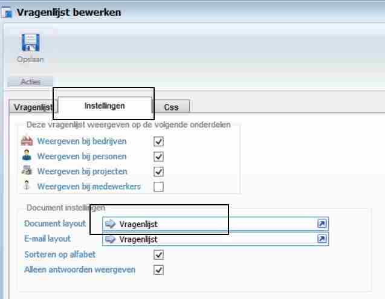
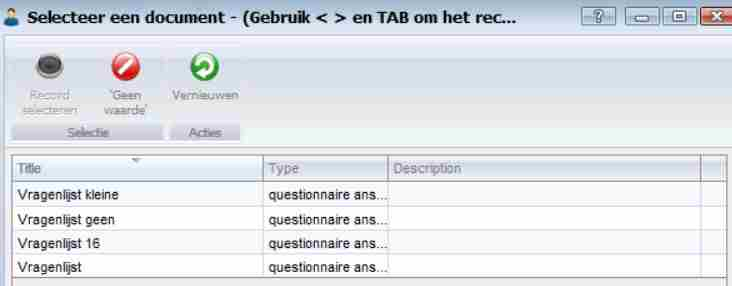
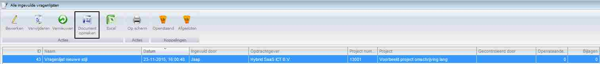
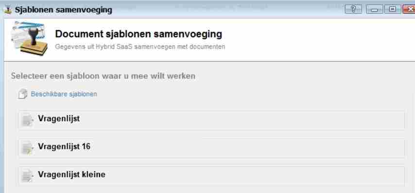
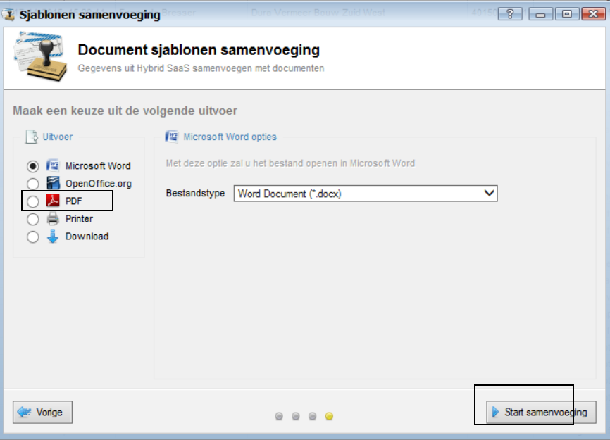

<properties>
	<page>
		<title>Instellen Vragenlijsten</title>
	</page>
	<menu>
		<position>Modules N - Z / Vragenlijsten</position> 
		<title>Instellen Vragenlijsten</title>
	<sort>B</sort>
	</menu>
</properties>

## Het instellen van de vragenlijst ##

Ga via start naar vragenlijst beheren
Open de gewenste vragenlijst en ga naar het tabblad *instellingen*.

Hier kan je de *Document lay-out* kiezen.

 

Nu kan je de gewenste document lay-out selecteren.

**Incidenteel aanpassen**

Je kan altijd een ingevulde vragenlijst op een andere lay-out bekijken.

Ga naar ingevulde vragenlijsten.

Selecteer de gewenste vragenlijst en klik op de knop *Document opmaken*.

Je krijgt dan een keuze uit de verschillende lay-outs die beschikbaar zijn voor de vragenlijst.

Kies de juiste en lay-out.
Vervolgens krijg je onderstaand scherm.

Kies hier de uitvoer 
En klik daarna op de knop “Start samenvoegen”.

De vragenlijst komt dan op scherm of op de printer, wat je zelf gekozen hebt.

----------
