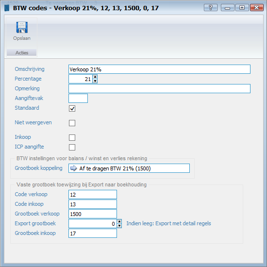

<properties>
	<page>
		<title>Btw</title>
		<description>Btw</description>
	</page>
	<menu>
		<position>Modules / Balans</position>
		<title>Btw</title>
		<sort>e</sort>
	</menu>
</properties>

# Btw #

Je hebt in het systeem verschillende btw codes nodig zie hieronder hoe je ze kan toevoegen 

Door de knop toevoegen kan je een nieuwe btw aanmaken
 

- Omschrijving
	- Hier kan je de naam van de btw aangeven
- Percentage
	- Hier geef je de btw percentage aan
- Standaard
	- Hiermee kan je aangeven dat als er een in/verkoopregel word toegevoegd dat deze btw er standaard word aangegeven
- Niet meer weergeven
	- Hiermee geef je aan dat deze btw code niet meer weergegeven mag worden
- Inkoop
	- Hiermee geef je aan dat deze btw voor de inkoop bedoeld is	 
- Grootboek koppeling
	- Hierin koppel je de btw met een grootboekrekening

----------