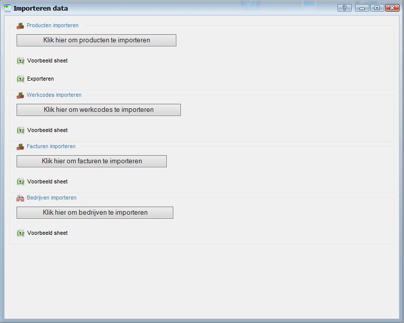

<properties>
	<page>
		<title>Werkcodes importeren</title>
		<description>Werkcodes importeren</description>
	</page>
	<menu>
		<position>Modules / Balans</position> 
		<title>Werkcodes importeren</title>
		<sort>e</sort>
	</menu>
</properties>

## Importeren Producten ##

**Met deze import kan je werkcodes toevoegen aan de omgeving, Je kan bestaande ook veranderen hiervoor heb je de juiste werkcode nodig. deze zal dan overschreden worden met de nieuwe informatie**

Zoek in start naar Importeren

Om te importeren klik je eerst op 
*Werkcodes importeren - Voorbeeldsheet*

Je krijgt een hele lijst met kolommen, Zie voor uitleg kolommen hieronder

- Entity
	- **Entiteit**
- Type
	- **Verdichting** (Hoofdgroep)
		- Als de verdichting nog niet bestaat dan zal die aangemaakt worden
- Group Code
	- **Verdichting** (Hoofdgroep code)
		- Als de verdichting nog niet bestaat dan zal die aangemaakt worden
- Group description
	- **Verdichting** (Beschrijving)
		- Als de verdichting nog niet bestaat dan zal die aangemaakt worden
- General Ledger
	- **Grootboekrekening**
- Description
	- **Beschrijving** 
- Sale
	- **Verkoop/tijdregistratie**
		- vinkje aan is 1; vinkje uit is 0
			- Deze kan alleen maar aanstaan als de andere vinkjes uit staan

- Purchase
	- **Inkoop**
		- vinkje aan is 1; vinkje uit is 0
			- Deze kan samen aanstaan met "Bank"
- Bank
	- **Bank transacties**
		- vinkje aan is 1; vinkje uit is 0
			- Deze kan samen aanstaan met "Inkoop"
- Memorial
	- **Memoriaal**
		- vinkje aan is 1; vinkje uit is 0
			- Deze kan alleen maar aanstaan als de andere vinkjes uit staan
- Debet
	- **Grootboek type**
		- Credit is 0; Debet uit is 1
- Vat
	- **BTW percentage**
		- Deze dient onder de exacte zelfde naam te worden overgenomen uit het systeem anders zal die hem niet inlezen

Nu kan je het exportbestand opslaan op je bureaublad en afsluiten.

**Importeren**

Gebruik nu de knop "Klik hier om werkcodes te importeren" om de werkcodes te importeren. 
Zoek het juiste bestand op en selecteer deze.
Na de import verschijnt er een internet pagina met daarin het resultaat van de import.

 Je moet het Excel bestandje sluiten voordat je hem gaat importeren anders zal die een fout melding aangeven 

Je kan nu in Hybrid SaaS bij de werkcodes de geïmporteerde gegevens terugvinden.

----------