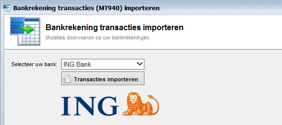

<properties>
	<page>
		<title>Banktransactie importeren MT940</title>
		<description>Banktransactie importeren MT940</description>
	</page>
	<menu>
		<position>Modules / Bankrekeningen </position> 
		<title>Banktransactie importeren MT940</title>
		<sort>g</sort>
	</menu>
</properties>

## Banktransacties importeren (MT940) ##

Een MT940 bestand, of (SWIFT)-MT940 bestand, is een bestandsformaat om financiële banktransacties te kunnen importeren. Het is bekend als de "Customer Statement Message" en volgt een specifieke opmaak. Hybrid SaaS biedt de mogelijkheid om deze bestanden in te lezen als elektronisch bankafschrift.
U dient het IBAN bankrekeningnummer in te geven voordat u de banktransacties kunt importeren. Ga naar Bankrekeningen voor meer informatie.

- Download MT940 bestand bij uw bank en sla het bestand op uw computer op.
- Selecteer uw bank > Klik op Transacties importeren > Open MT940 bestand  

----------
