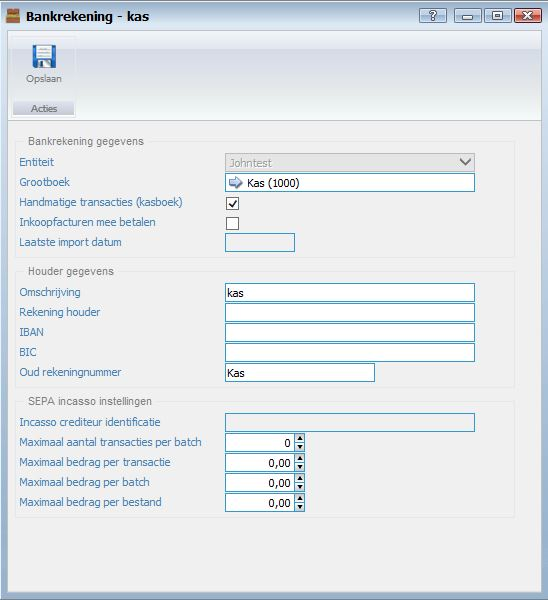

<properties>
	<page>
		<title>Kas als bankrekening</title>
		<description>Kas als bankrekening</description>
	</page>
	<menu>
		<position>Modules / Bankrekeningen </position> 
		<title>Kas als bankrekening</title>
		<sort>h</sort>
	</menu>
</properties>

## De kas als bankrekening aanmaken ##

In dit artikel wordt het proces om de kas als bankrekening aan te maken beschreven. Met een kas als bankrekening kunt u handmatige transacties inboeken en verwerken.

*Bankrekening gegevens*

- Entiteit
	- Entiteit word automatisch ingegeven. Tenzij u meerdere entiteiten heeft aangemaakt. In dat geval kunt u hier de entiteit selecteren.
- Grootboek
	- Selecteer de grootboekrekening welke bij de bank hoort.
- Handmatige transacties (kasboek)

 Let op! Wanneer u het vinkje handmatige transacties niet aanzet kunt op deze kas rekening geen transacties inboeken en verwerken

- Inkoopfacturen mee betalen
- Laatste import datum
	- Dit veld wordt automatisch aangepast bij het importeren van bankrekeningtransacties.

*Houder gegevens*

- Omschrijving
	- Geef de naam in van de bankrekening. (bijvoorbeeld kas of Rabobank)
- Rekening houder
	- Geef de naam van de rekeninghouder in.
- IBAN
	- (Niet verplicht bij een kas rekening)
- BIC
	- (Niet verplicht bij een kas rekening)
- Oud rekeningnummer

*SEPA incasso instellingen*

- Incasso crediteur identificatie
- Maximaal aantal transacties per batch
- Maximaal bedrag per transactie
- Maximaal bedrag per batch
- Maximaal bedrag per bestand

----------
