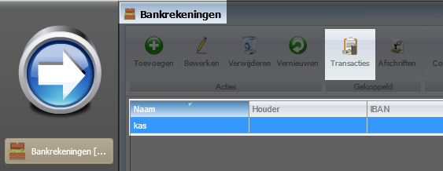
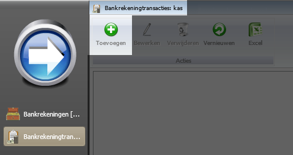
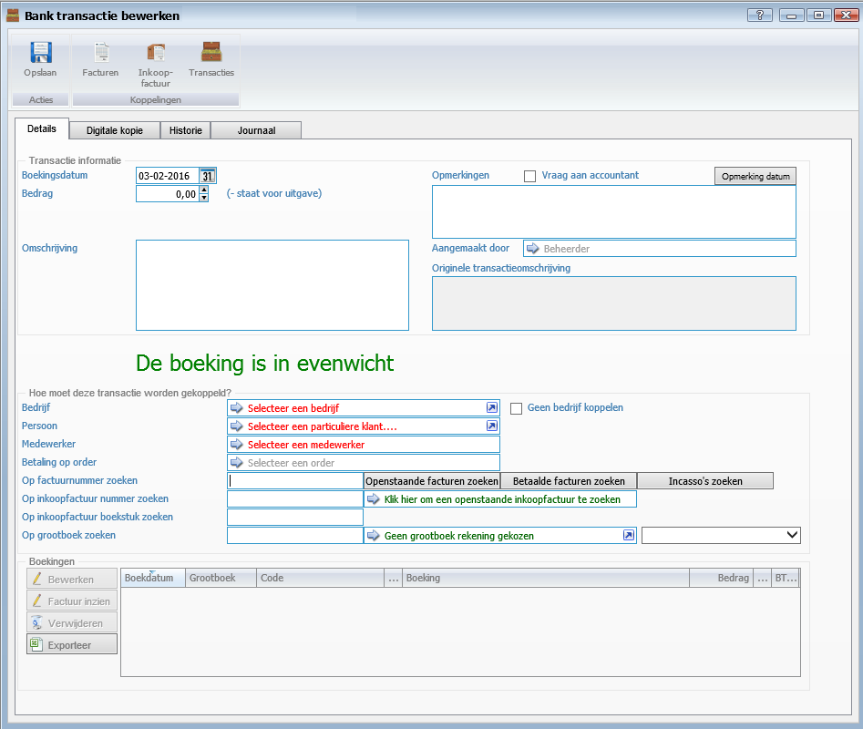
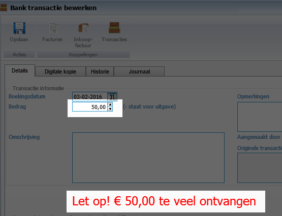
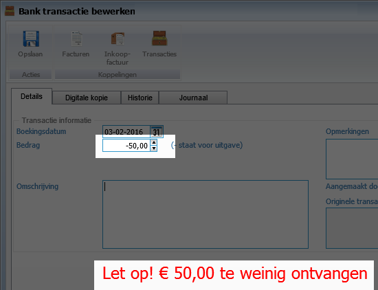
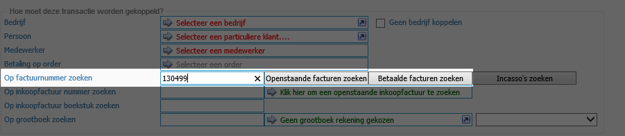
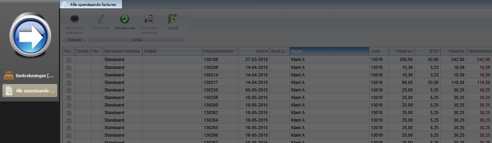
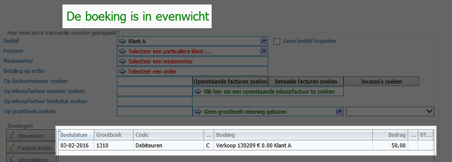
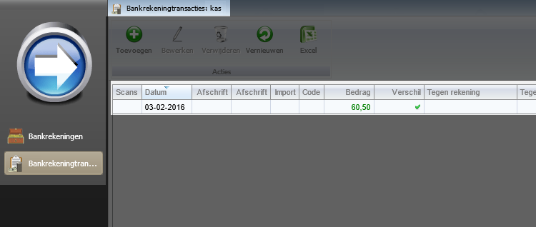
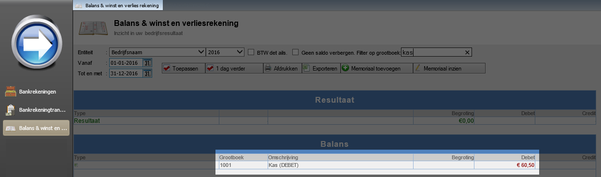

<properties>
	<page>
		<title>Kastransactie aanmaken</title>
		<description>Kas als bankrekening</description>
	</page>
	<menu>
		<position>Modules / Bankrekeningen </position> 
		<title>Kastransactie aanmaken</title>
		<sort>h</sort>
	</menu>
</properties>

## Een kas transactie aanmaken ##

In dit artikel wordt het proces om een transactie aan te maken op de rekening kas. Dit is een handmatige transacties.

- Ga via start naar bankrekeningen.
- Zoek hierin de rekening kas als deze al is aangemaakt zie anders [Kas rekening aanmaken](http://hybridsaas.support/pages/support-site/modules/bankrekening/kas-als-bankrekening/de-kas-als-bankrekening-aanmaken)

- Selecteer de rekening en klik op de button: **transacties**
- Je komt dan in het scherm waar de transacties zullen komen te staan: **bankrekeningtransacties**
- Klik op toevoegen

- Er zal nu een transactie scherm worden getoond welke handmatig is in te vullen

Welke gegevens er moeten worden ingevuld licht aan de transactie. in dit voorbeeld gebruiken we een factuur die contant betaald is

- de boekingsdatum
	- Deze kan je aanpassen naar de datum van het ontvangen bedrag
- Het bedrag
	- als je een bedrag ontvangt: 50.00 , als je een bedrag uitgeeft: -50.00
- De omschrijving
	- Hier kan je eventuele informatie kwijt over deze transactie

Na het invullen van het bedrag zal het scherm veranderen met de melding dat er te veel of te weinig is ontvangen

- 
- 

Nu zullen we de bijbehorende transactie opzoeken

- Als je het factuurnummer weet, kan je deze in het zoekbalkje invullen en op enter drukken
	- Op deze manier word de factuur er direct bij gezocht.
- Weet je niet het nummer niet uit je hoofd dan gebruik je de knop: **Openstaande facturen zoeken**

- Hierin kan je de factuur opzoeken

- Als de bedragen met elkaar overeen komen zal de transactie in evenwicht zijn en kan je hem opslaan
- Nu is de transactie te zien in het overzicht van bankrekeningtransacties

Als er transacties zijn toegevoegd aan deze rekening zal dit ook zichtbaar zijn op de balans winst en verlies rekening

----------
