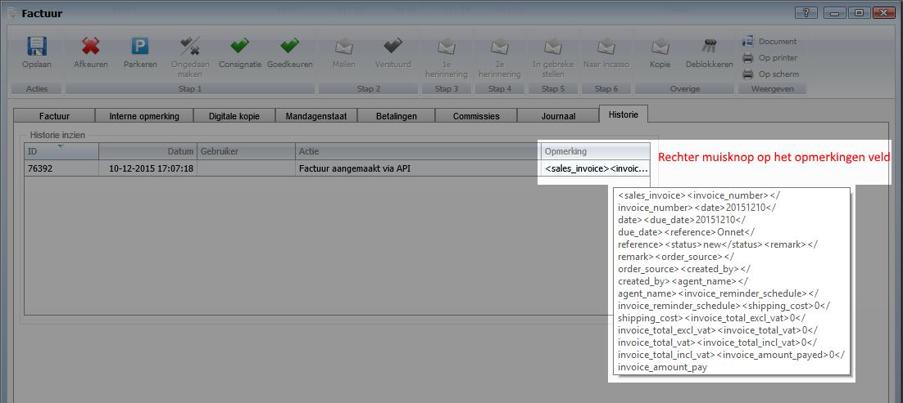
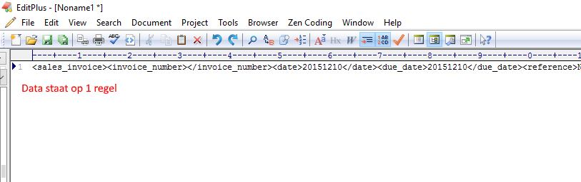
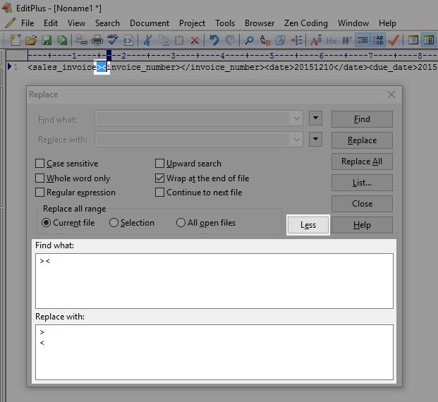
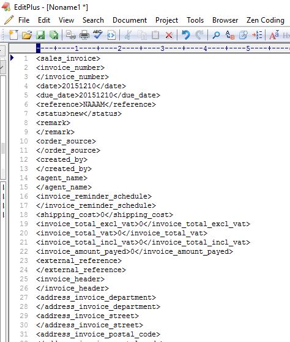

<properties>
	<page>
		<title>DataAdapter help</title>
	</page>
	<menu>
		<position>Modules / DataAdapter </position> 
		<title>DataAdapter help</title>
	</menu>
</properties>

# DataAdapter Help #

De DataAdapter is een belangrijk instrument om bestaande data in Hybrid SaaS in te lezen. Doordat het toewijzen van de juiste data secuur en exact gedaan dient te worden is het mogelijk dat er hinder wordt ondervonden. In dit artikel proberen we een aantal stappen te beschrijven waarmee onderzocht kan worden waar een eventuele fout is opgetreden.

## Bron inzien ##

Klik een factuur aan welke is geïmporteerd.

Ga naar het tabblad "historie"

Klik met de rechtermuisknop op het opmerkingen veld.

 

## Tekst vervangen  ##

Plak de gekopieerde tekst in een edit programma. Wij adviseren EditPlus www.editplus.com (of een soortgelijk programma)

De gekopieerde tekst wordt op 1 regel weergegeven. Om de data leesbaar te maken dient de data onder elkaar weergegeven te worden. Dit kan worden gedaan door tekst te vervangen.

Gebruik **CTRL+H** om tekst te vervangen.

Voor dit voorbeeld willen we "><" vervangen voor ">
<". 

Nadat de tekst is vervangen is het overzichtelijker en kan worden gekeken welke data er ingelezen wordt

