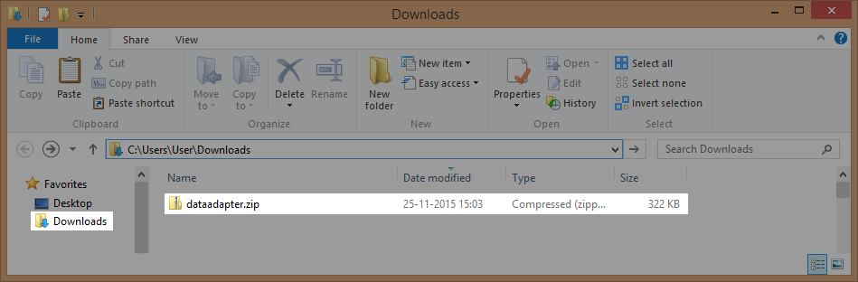
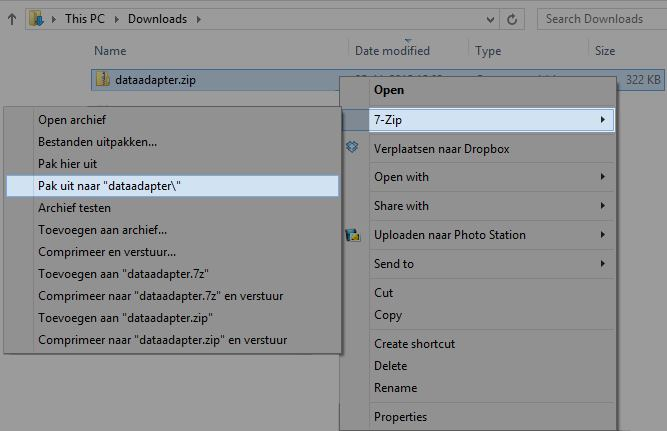
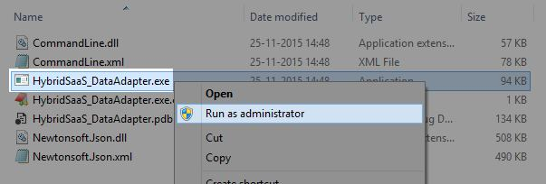
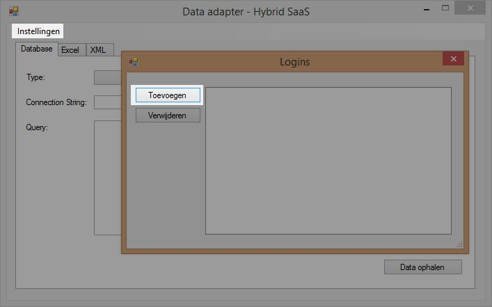
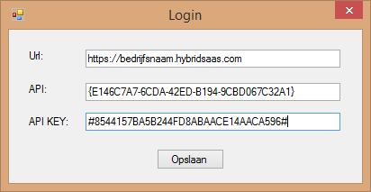
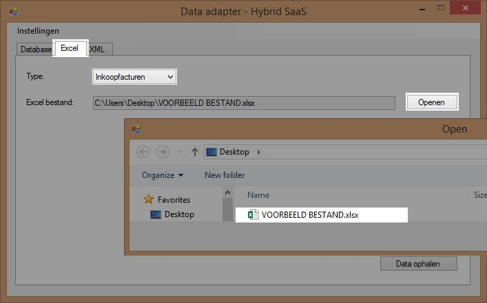
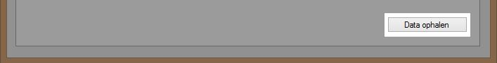
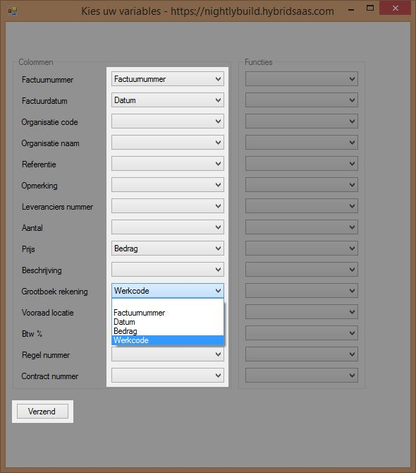

<properties>
	<page>
		<title>DataAdapter instellen</title>
	</page>
	<menu>
		<position>Modules / DataAdapter </position> 
		<title>DataAdapter instellen</title>
	</menu>
</properties>

# DataAdapter #

Door middel van de Hybrid SaaS DataAdapter krijg je de mogelijkheid om externe gegevens in Hybrid SaaS te importeren. Denk hierbij aan het importeren van facturen, inkoopfacturen, orders e.d. De data kan vanuit een database, Excelsheet of via een XML bestand worden geïmporteerd. 

## DataAdapter Downloaden ##

De DataAdapter kan je [hier](http://hybridsaas.com/support) downloaden.

## DataAdapter uitpakken ##

Nadat de download is voltooid dient het bestand te worden uitgepakt. Het bestand vind je terug in de map "download op je computer.

 

Voor het uitpakken van het bestand dien je een programma te hebben om waarmee je dit kunt doen. Wij raden aan om [7-zip](http://www.7-zip.org/download.html) te gebruiken. 

Indien er bij het openen een foutmelding verschijnt, dient het openen als "administrator" uitgevoerd te worden. Klik hiervoor met de rechtermuisknop op het "HybridSaaS_DataAdapter.exe" bestand en kies voor de optie: "Uitvoeren als administrator". 

Wil je in de tokemst de DataAdapter automatisch als "administrator" uitvoeren? Klik met de rechtermuisknop op "HybridSaaS_DataAdapter.exe". Ga naar "Eigenschappen" > Tabblad "Compatibiliteit" en zet het vinkje aan bij "Uitvoeren als administrator"

## DataAdapter instellen ##

Om de DataAdapter te kunnen gebruiken dient deze ingestald te worden zodat de data in de juiste Hybrid SaaS omgeving wordt geïmporteerd. Klik op "instellingen" en vervolgens op "Toevoegen" om de API gegevens in te vullen

Vul bij de gegevens in. API URL: https://**BEDRIJFSNAAM**.hybridsaas.com (vul op de plaats van "bedrijfsnaam" je bedrijfsnaam in) en geef de API ID en API KEY in.

API ID en API KEY kunnen worden aangemaakt in Hybrid SaaS. Zie de onderstaande beschrijving hoe je deze aanmaakt.

## API sleutel aanmaken ##

Zoek in Hybrid SaaS naar "API sleutels" 

Klik op toevoegen om een nieuwe sleutel aan te maken. 

Geef de sleutel een naam door bij "Naam" bijvoorbeeld "DataAdapter" in te vullen.

Klik één maal op "Opslaan" zodat de API gegevens worden aangemaakt. Klik nogmaals op "Opslaan" om het scherm af te sluiten

# DataAdapter #

Er zijn verschillende mogelijkheden om data te importeren. Hieronder leggen we uit hoe je data vanuit een Excelsheet kunt importeren.

## Bestand selecteren ##

Klik op het tabblad "Excel" en klik op "Openen" en selecteer het bestand wat geïmporteerd dient te worden.

Klik na de selectie op de knop "Data ophalen"

LET OP! Het bestand wat geïmporteerd wordt dient niet open te staan op de computer.

## Datakolommen selecteren ##

Nadat de data is opgehaald verschijnt er een venster waarin de benodigde data kan worden geselecteerd. Naast de verschillende velden uit Hybrid SaaS kan de gewenste data uit de Excelsheet worden geselecteerd. In de dropdown worden de kolomnamen van de Excelsheet weergegeven. 

Klik nadat alle benodigde data is geselecteerd op "Verzenden" De data zal nu worden aangemaakt in Hybrid SaaS.

GEAVANCEERD: Wil je bijvoorbeeld inkoopfacturen direct aan contracten koppelen ga dan als volgt te werk:

- Zorg dat de externe referentie bekend is op het contract
- Zorg dat de leverancierscodes zijn ingesteld

Importeren en modificeren:

- Open het Excelbestand van de leverancier
- Eventuele beveiligingen opheffen
- Overbodige rij(en) verwijderen
- Alle aantallen op 1 zetten
- Kolommen toevoegen:
	- Grootboekrekening
	- BTW percentage
	- Leveranciers code

Sla het document op

tabblad: Excel 
dropdown :inkoopfacturen

Selecteer de Excelfile (zorg ervoor dat de file gesloten is)
Klik op bestand ophalen
Selecteer de juiste kolommen en klik op verzend

Open Hybrid SaaS en check de inkoopfactuur

 