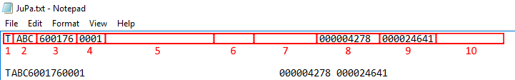

<properties>
	<page>
		<title>Export Jupa</title>
	</page>
	<menu>
		<position>Modules / Facturatie </position> 
		<title>Export Jupa</title>
		<sort>c</sort>
	</menu>
</properties>

## Exporteren van een Jupa bestand ##

Hier word in uitlegt wat er in werking gezet moet worden om een Jupa bestandje te kunnen maken

## Het instellen voor de Jupa koppeling ##

- Het invullen van de afkorting op de **Entiteit**
	- Gebruik hiervoor HOOFDLETTERS 

- Het email adres aanvinken welke geschikt is voor Jupa op de **Relatiekaart**
	- Dit kan je doen door middel van de communicatie email te openen en het vinkje **export naar extern systeem ; Jupa** aan te zetten

- Als deze stappen zijn ingevuld zullen de facturen van deze klant in het bakje **Facturen exporteren naar extern systeem** komen. Hierin kan je de factuur selecteren en de button **exporteer selectie** gebruiken.

- Via de button **Financiële exports** kom je in het bakje waar nu de factuur klaar staat om gedownload te worden
	- Deze is ook te vinden via start het bakje heet: **Financiële exports**

- Hier kan je de regel selecteren en het bestand downloaden via de button **Download bestand**

- Er zal nu een tekst bestand uitkomen welke geschikt is voor Jupa.

## Beschrijving van het tekst bestandje ##

Hier zal beschreven worden welke gegevens er in het bestandje zitten verwerkt

- Lees de rode vlakken van links naar recht 
	- welk veld het is in Hybrid SaaS staan eronder aangegeven *(Dialoog - Tabblad - Veldnaam)*

Van links naar recht

- **Begin van de export**
- **Code in de Entiteit**
	- *(Entiteit - Instellingen - Afkorting)*
- **Factuurnummer**
	- *(Factuur - Factuur - Factuurnummer)*
- **Factuurnummer regel in de export**
- **Valuta**
- **Laatste 4 cijfers van de klantcode**
	- *(Relatiekaart - N.A.W. - Code)*

- **2e regel van de export**
- **Code van de Entiteit**
	- *(Entiteit - Instellingen - Afkorting)*
- **Factuurnummer**
	- *(Factuur - Factuur - Factuurnummer)*
- **Factuurnummer regel in de export**
- **Totaal bedrag van de factuur**
	- *(Factuur - Factuur - Totaal incl. BTW)*

1. **Vervolgregels van de export**
2. **Leverancierscode**
	(Entiteit - Instellingen - Afkorting)
3. **Factuurnummer**
	(Factuur - Factuurkaart - Factuurnummer)
4. **Factuurregelnummer in de export**
5. **Leveringsnummer** *(Niet in gebruik binnen Hybrid SaaS)*
6. **Aantal van het product**
	(Factuur - Factuurkaart - Factuurregel - Aantal)
7.  **Productcode** *(Artikelnummer leverancier)*
	*(Producten - Productkaart - Productcode)*
8.  **Gewicht** *(In grammen vb 0069 6,9 gram)*
	(Producten - Productkaart - Instellingen - Productonderdeel - aantal (vinkje dit is een gewicht))
9.  **Basis verkoopprijs** *(Prijs per stuk excl. metaal)*
	(Producten - Productkaart - Instellingen - Basis verkoop prijs)
10.  **Verkoopprijs** *(Prijs per stuk incl. metaal)*
	(Producten - Productkaart - Prijzen - Verkoopprijs)
11.  **Korting** *(Korting per stuk)*
	(Factuur - Factuurkaart - Factuurregel - korting (kortingspercentage * verkoopprijs)
12.  **Omschrijving van het product**
	(Producten - Productkaart - Informatie - Beschrijving)
13.  **Lege ruimte** *(Niet in gebruik binnen Hybrid SaaS)*
14.  **Advies verkoopprijs**
	(Producten - Productkaart - Prijzen - Advies verkoopprijs)
15.  **Barcode** *(Niet in gebruik)*
16.  **Artikelstatus** *(E-Eigendom, Z-zicht, C-consignatie)*
17.  **Extra productcode** *(Niet in gebruik)*
18.  **Lege ruimte** *(Niet in gebruik binnen Hybrid SaaS)*
19.  **Ordernummer Jupa**
20.  **Advies verkoopprijs**
	(Producten - Productkaart - Prijzen - Advies verkoopprijs)
21.  **Standaard artikel** *(indien niet beschikbaar 'N')* *(Niet in gebruik binnen Hybrid SaaS)*
22.  **Standaard artikel** *(indien niet beschikbaar 'N')* *(Niet in gebruik binnen Hybrid SaaS)*
23.  **Advies voorraadaantal** *(Niet in gebruik binnen Hybrid SaaS)*
	
- **Export**

----------