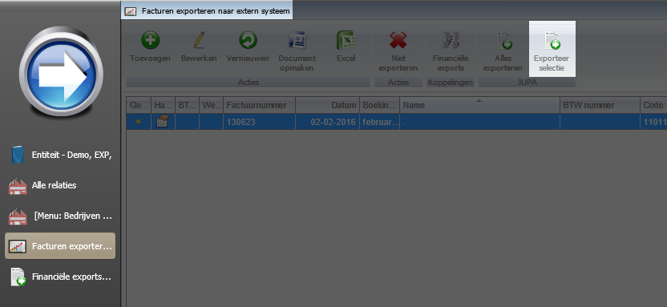

<properties>
	<page>
		<title>Export Jupa</title>
	</page>
	<menu>
		<position>Modules / Facturatie </position> 
		<title>Export Jupa</title>
		<sort>c</sort>
	</menu>
</properties>

## Exporteren van een Jupa bestand ##

Hier word in uitlegt wat er in werking gezet moet worden om een Jupa bestandje te kunnen maken

## Het instellen voor de Jupa koppeling ##

- Het invullen van de afkorting op de **Entiteit**
	- Gebruik hiervoor HOOFDLETTERS 

- Het email adres aanvinken welke geschikt is voor Jupa op de **Relatiekaart**
	- Dit kan je doen door middel van de communicatie email te openen en het vinkje **export naar extern systeem ; Jupa** aan te zetten

- Als deze stappen zijn ingevuld zullen de facturen van deze klant in het bakje **Facturen exporteren naar extern systeem** komen. Hierin kan je de factuur selecteren en de button **exporteer selectie** gebruiken.

- Via de button **Financiële exports** kom je in het bakje waar nu de factuur klaar staat om gedownload te worden
	- Deze is ook te vinden via start het bakje heet: **Financiële exports**

- Hier kan je de regel selecteren en het bestand downloaden via de button **Download bestand**

- Er zal nu een tekst bestand uitkomen welke geschikt is voor Jupa.

## Beschrijving van het tekst bestandje ##

Hier zal beschreven worden welke gegevens er in het bestandje zitten verwerkt

- Lees de rode vlakken van links naar recht 
	- welk veld het is in Hybrid SaaS staan eronder aangegeven *(Dialoog - Tabblad - Veldnaam)*

Van links naar recht

- **Begin van de export**
- **Code in de Entiteit**
	- *(Entiteit - Instellingen - Afkorting)*
- **Factuurnummer**
	- *(Factuur - Factuur - Factuurnummer)*
- **Factuurnummer regel in de export**
- **Valuta**
- **Laatste 4 cijfers van de klantcode**
	- *(Relatiekaart - N.A.W. - Code)*

- **2e regel van de export**
- **Code van de Entiteit**
	- *(Entiteit - Instellingen - Afkorting)*
- **Factuurnummer**
	- *(Factuur - Factuur - Factuurnummer)*
- **Factuurnummer regel in de export**
- **Totaal bedrag van de factuur**
	- *(Factuur - Factuur - Totaal incl. BTW)*

- **Vervolgregels van de export**
- **Code van de Entiteit**
	- *(Entiteit - Instellingen - Afkorting)*
- **Factuurnummer**
	- *(Factuur - Factuur - Factuurnummer)*
- **Factuurnummer regel in de export**
- **Aantal van het product**
	- *(Factuur - Factuur - Factuurregel - Aantal)*
- **Productcode**
	- *(Producten - Informatie - Productcode)*
- **Aantal gewicht in onderdeel**
	- *(Producten - Instellingen - Productonderdeel - aantal (vinkje dit is een gewicht))*
- **Basis verkoopprijs**
	- *(Producten - Instellingen - Basis verkoop prijs)*
- **Verkoopprijs**
	- *(Producten - Prijzen - Verkoopprijs)*
- **Afgeronde verkoopprijs**
- **Omschrijving van het product**
	- *(Producten - Informatie - Beschrijving)*
- **Advies verkoopprijs**
	- *(Producten - Prijzen - Advies verkoop prijs)*
- **Export**

----------