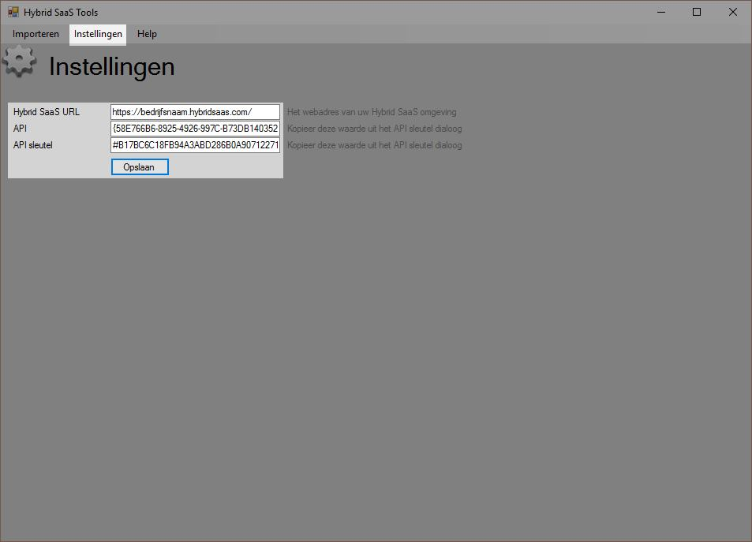
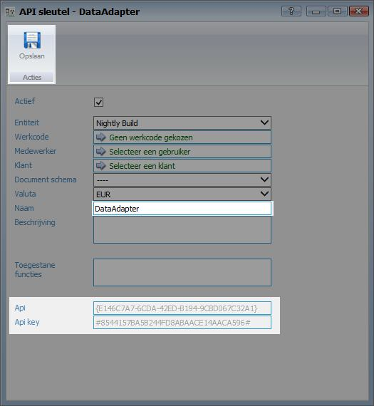

<properties>
	<page>
		<title>FotoAdapter instellen</title>
	</page>
	<menu>
		<position>Modules / Fo </position> 
		<title>FotoAdapter instellen</title>
	</menu>
</properties>

# FotoAdapter #

De Hybrid SaaS FotoAdapter geeft de mogelijkheid om productafbeeldingen en foto's bij producten Hybrid SaaS te importeren. Door de bestandsnaam van de afbeelding het productnummer te geven zal deze automatisch bij het juiste product worden toegevoegd.
## DataAdapter Downloaden ##

FotoAdapter kan hier [hier](http://hybridsaas.com/support) worden gedownload.

## FotoAdapter instellen ##

Om de FotoAdapter te kunnen gebruiken dient deze ingesteld te worden zodat de data in de juiste Hybrid SaaS omgeving wordt geïmporteerd. Klik op "instellingen" om de API gegevens in te vullen

Vul bij de gegevens in. API URL: https://**BEDRIJFSNAAM**.hybridsaas.com (vul op de plaats van "bedrijfsnaam" de bedrijfsnaam in) en geef de API ID en API KEY in.

API ID en API KEY kunnen worden aangemaakt in Hybrid SaaS. Zie de onderstaande beschrijving hoe deze aangemaakt dient te worden.

## API sleutel aanmaken ##

Zoek in Hybrid SaaS naar "API sleutels" 

Klik op toevoegen om een nieuwe sleutel aan te maken. 

Geef de sleutel een naam door bij "Naam" bijvoorbeeld "DataAdapter" in te vullen.

Klik één maal op "Opslaan" zodat de API gegevens worden aangemaakt. Klik nogmaals op "Opslaan" om het scherm af te sluiten

# DataAdapter #

Er zijn verschillende mogelijkheden om data te importeren. Hieronder leggen we uit hoe je data vanuit een Excelsheet kunt importeren.

## Bestand selecteren ##

Klik op het tabblad "Excel" en klik op "Openen" en selecteer het bestand wat geïmporteerd dient te worden.

Klik na de selectie op de knop "Data ophalen"

LET OP! Het bestand wat geïmporteerd wordt dient niet open te staan op de computer.

## Datakolommen selecteren ##

Nadat de data is opgehaald verschijnt er een venster waarin de benodigde data kan worden geselecteerd. Naast de verschillende velden uit Hybrid SaaS kan de gewenste data uit de Excelsheet worden geselecteerd. In de dropdown worden de kolomnamen van de Excelsheet weergegeven. 

Klik nadat alle benodigde data is geselecteerd op "Verzenden" De data zal nu worden aangemaakt in Hybrid SaaS.

GEAVANCEERD: Wil je bijvoorbeeld inkoopfacturen direct aan contracten koppelen ga dan als volgt te werk:

- Zorg dat de externe referentie bekend is op het contract
- Zorg dat de leverancierscodes zijn ingesteld

Importeren en modificeren:

- Open het Excelbestand van de leverancier
- Eventuele beveiligingen opheffen
- Overbodige rij(en) verwijderen
- Alle aantallen op 1 zetten
- Kolommen toevoegen:
	- Grootboekrekening
	- BTW percentage
	- Leveranciers code

- Sla het document op

	- tabblad: Excel
	- dropdown :inkoopfacturen

- Selecteer de Excelfile (zorg ervoor dat de file gesloten is)
- Klik op bestand ophalen
- Selecteer de juiste kolommen en klik op verzend

- Open Hybrid SaaS en check de inkoopfactuur

 