<properties>
	<page>
		<title>Nieuw rooster aanmaken</title>
		<description>Nieuw rooster aanmaken</description>
	</page>
	<menu>
		<position>Modules / HRM </position>
		<title>Nieuw rooster aanmaken</title>
	</menu>
</properties>

## Nieuw rooster aanmaken. ##

Ga via start naar: Roosters.

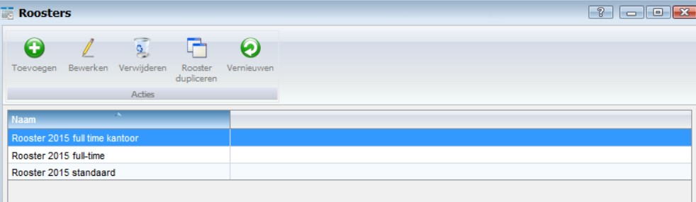

Kies toevoegen

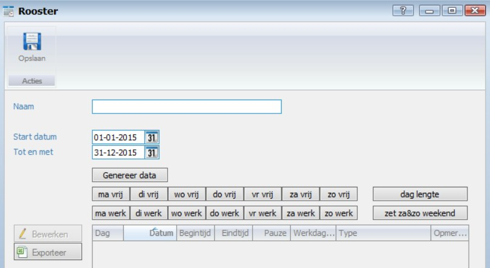 

Vul de naam van het rooster in en de begin en einddatum 

Voorbeeld:

* Naam: Rooster 2016 Full Time
* Startdatum 01-01-2016
* Tot en met  31-12-2016

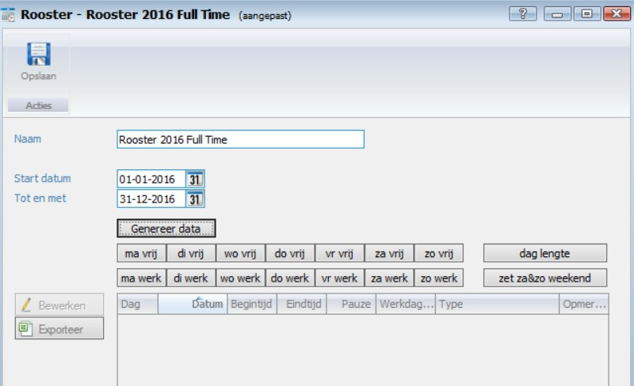
 
Klik nu op de knop “Genereer data”

Nu wordt het rooster aangemaakt met alle dagen in de gekozen periode. De knop genereer data verdwijnt, omdat je dit maar één kan doen.

Aanpassen van het rooster comfort vrije dagen, weekenden en werktijden.

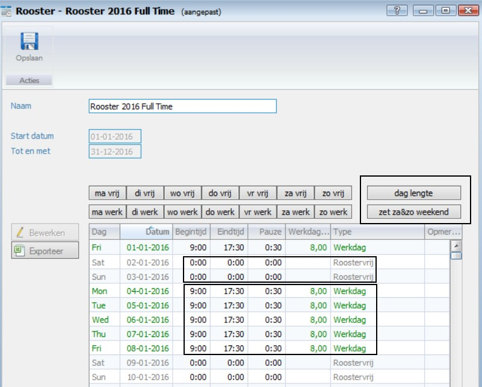 

Je ziet dat de weekenden nu als roostervrije dag zijn ingevuld, als je dit wil je veranderen naar weekend. Doe je dit met de knop “zet za&zo weekend”
 
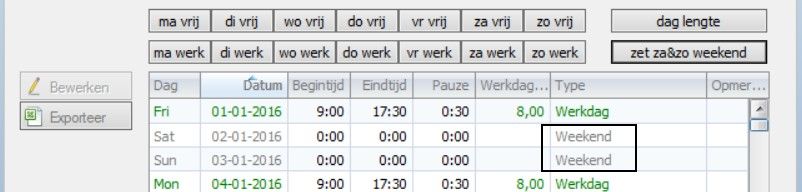

Pas nu de daglengte aan, aan de gewenste werktijden.

Klik op de knop “dag lengte”. Stel dat je om 7.30 uur begint met werken en je werkt 7,40 uur per dag en je hebt 1 uur pauze. (op werkdagen)
Vink dan de dagen aan en vul de rest van de gegevens in.

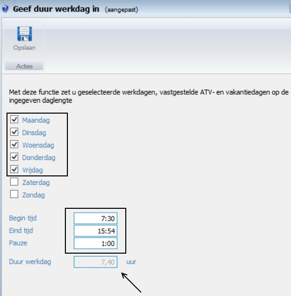

Het resultaat is Dat alle werkdagen nu deze informatie bevat.

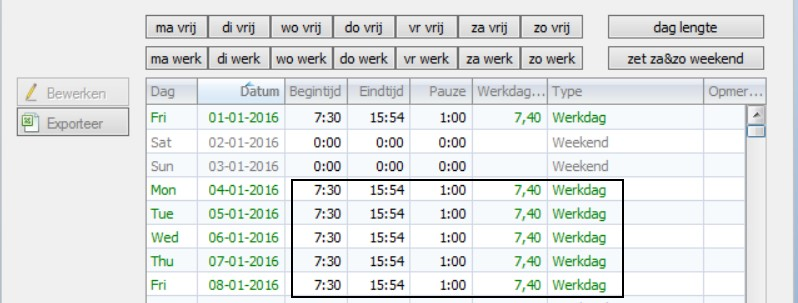

Doe dit eventueel ook voor de weekend dagen, als er dan volgens een bepaald patroon wordt gewerkt. Zo niet, dan hoef je niets te doen.

Nu heb je nog landelijke feestdagen die je in het rooster wilt verwerken.
Bijvoorbeeld 1 januari (nieuwjaarsdag). Deze valt in 2016 op een vrijdag en is dus een “Werkdag”. Deze moet worden gewijzigd naar “Feestdag”.

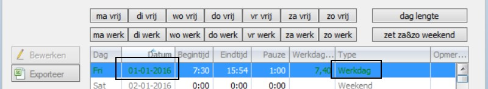

Ga naar de datum van deze feestdag toe en klik op die dag.

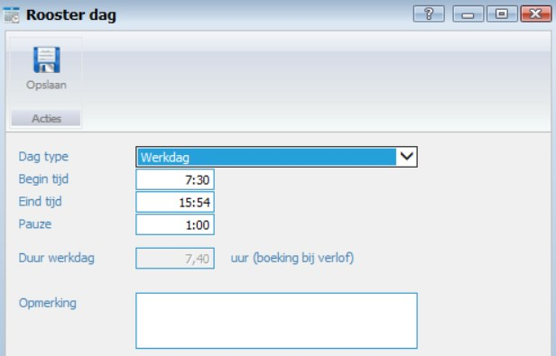

Klik op “Dag type” en wijzig Werkdag naar Feestdag

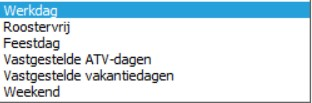

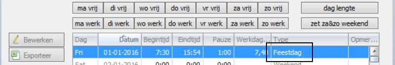

Doe dit voor alle wettelijke feestdagen zoals Pasen, Pinksteren, kerstmis, koningsdag, etc…..)

En sla dit rooster op.

## Toevoegen aan de medewerker ##

Ga naar via start naar: Alle medewerkers
Selecteer de juiste medewerker en ga naar het tabblad Verlof
Voeg d.m.v. de knop ‘Toevoegen” het nieuwe rooster bij deze medewerker toe.
 
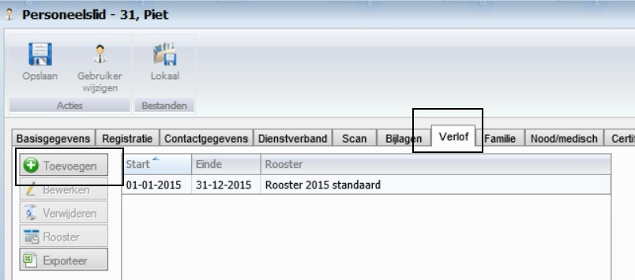

LET OP:
Als je een rooster hebt gekozen moet je wel de Start en Einde nog goed invullen.
Deze staan standaard op de “huidige datum”
Pas deze aan. 
Bij vaste medewerkers is dit het hele jaar. (01-01-2016 t/m 31-12-2016)
Bij medewerkers met een bepaalde tijd contract kan de begin en/of einddatum afwijken.
 
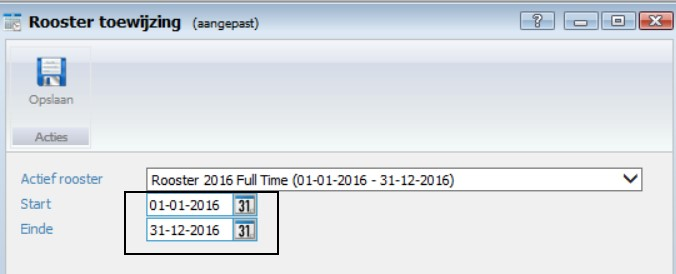

En sla het rooster bij deze medewerker op.

--------------

