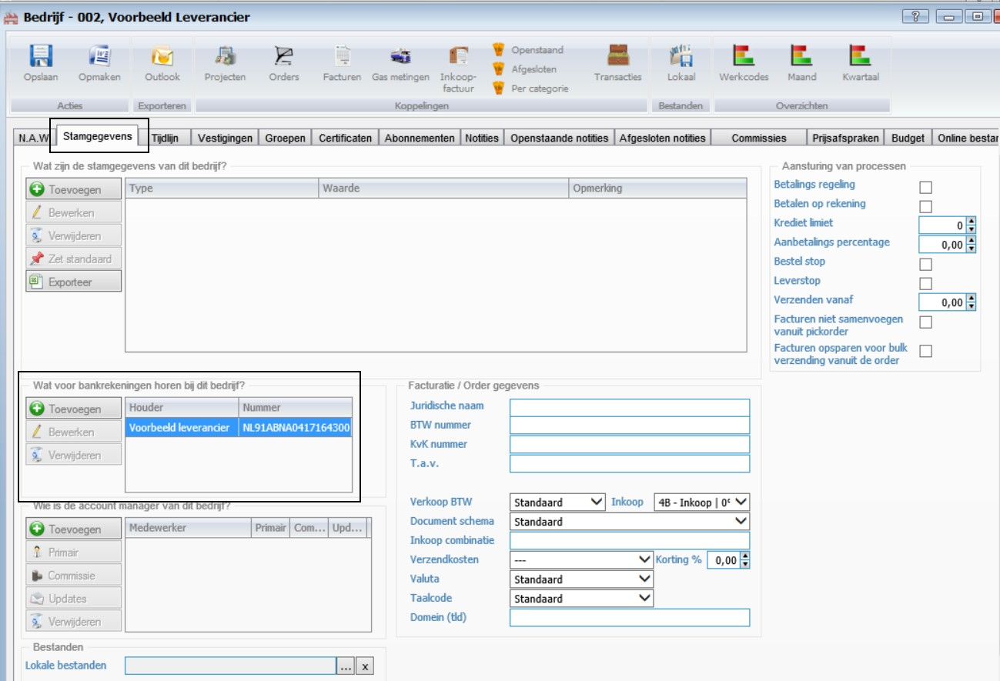
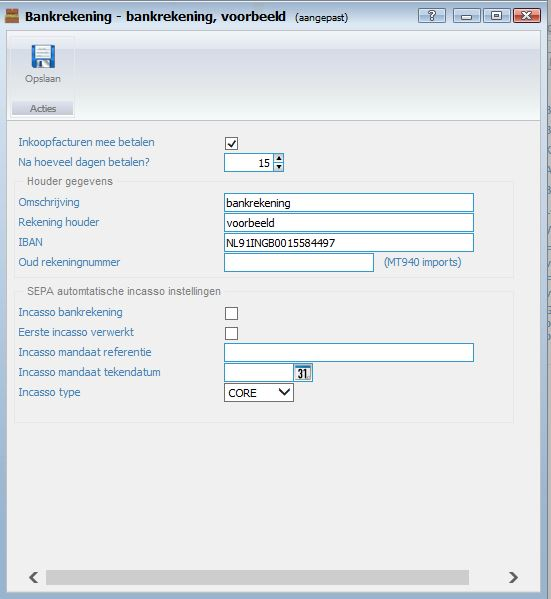
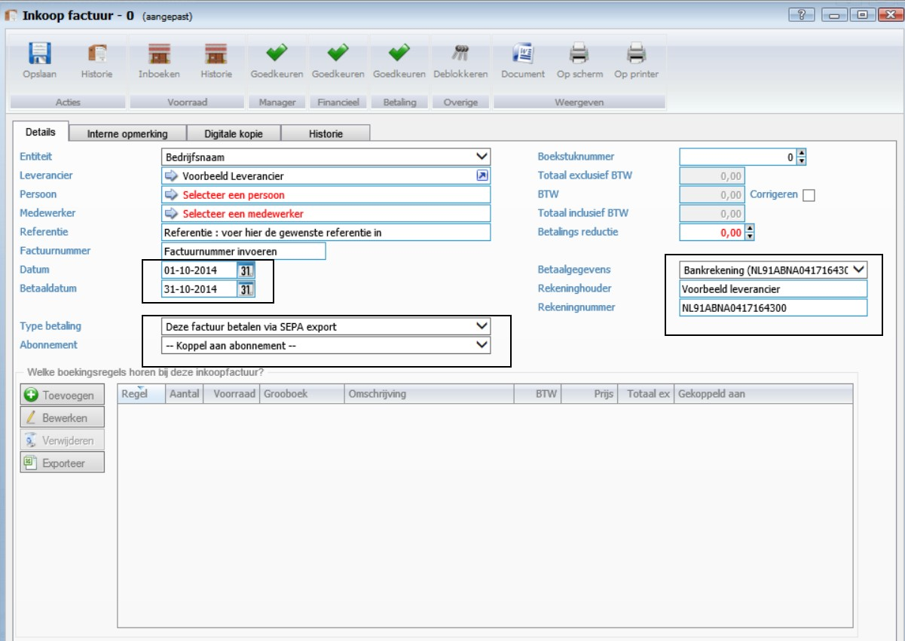
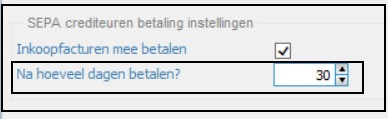
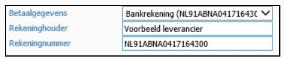
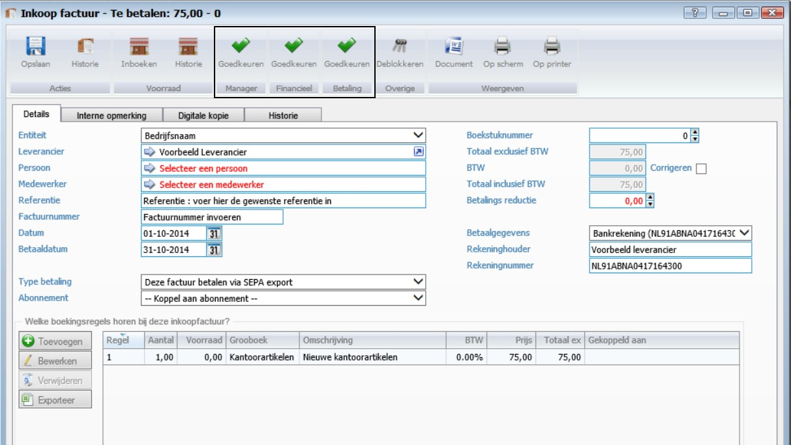
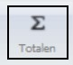
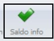
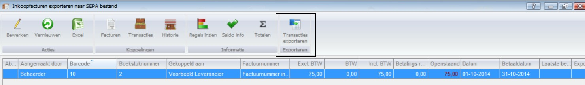
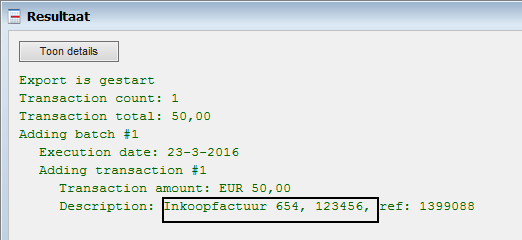

<properties>
	<page>
		<title>Inkoopfacturen via SEPA</title>
		<description>Inkoopfacturen via SEPA</description>
	</page>
	<menu>
		<position>Modules / Inkoopbeheer</position>
		<title>Inkoopfacturen via SEPA</title>
	</menu>
</properties>

## Inkoopfacturen via SEPA ##

Proces automatiseren, van handmatig naar automatisch

Eerst aanmaken bij leverancier: bankrekening t.b.v. SEPA.
Dit kan op de relatiekaart, 2e tabblad Stamgegevens
 

 

Deze gegevens zijn nodig als je bij een inkoopfactuur aangeeft hoe de betaling gaat plaatsvinden.

**Aanmaken nieuwe inkoopfactuur:**
 

Zodra de leverancier gekozen is vul je een referentie en de het factuurnummer in.
Als je de factuurdatum in vult genereert het systeem zelf de betaaldatum (deze is in dagen ingevoerd bij de leverancierskaart)
 

Bij type betaling kies je “deze factuur betalen via SEPA’ er verschijnt dan een extra invoerveld recht op het scherm. Hierin kan je de betalingsgegevens selecteren. Deze zijn ook aangemaakt op de leverancierskaart. Als je de juiste bankrekening kiest wordt de rest gevuld.
 

Zodra je daar mee klaar bent kan de inkoopfactuur opgeslagen worden.
Je kan ook in 1 keer alles goed keuren, dan kies je alleen het vinkje dat boven “Betaling” staat.
 

Als dit is gebeurt dan verdwijnt de factuur uit “Goed te keuren voor betaling” en komt hij in “Exporteren naar SEPA”.
Exporteren naar SEPA: (inkoopfacturen exporteren naar SEPA bestand)
 
Met de knop Totalen kan je zien hoeveel de waarde is van de geselecteerde rijen. Je kan zo bepalen hoeveel je wilt gaan betalen.
 

De knop Saldo info geeft je een overzicht van je saldo als je de geselecteerde regels gaat exporteren. Je hebt zelf invloed op wat en hoeveel je wilt betalen.
 

 Selecteer de regels en druk op de knop *Transacties exporteren*  

Er wordt een SEPA bestand aangemaakt die je zelf kan downloaden, naar een zelf te kiezen locatie.

De downloads zijn ook terug te vinden bij *SEPA betaling downloads (PAIN.001.001.03)*.

Output in XML formaat

    <?xml version="1.0" encoding="utf-8"?><Document xmlns="urn:iso:std:iso:20022:tech:xsd:pain.001.001.03" xmlns:xsi="http://www.w3.org/2001/XMLSchema-instance"><CstmrCdtTrfInitn><GrpHdr><MsgId>d50191a78b8a4f28a6f65334733ad85b</MsgId><CreDtTm>2014-10-06T09:36:44</CreDtTm><NbOfTxs>1</NbOfTxs><CtrlSum>75.00</CtrlSum><InitgPty><Nm>Bedrijfsnaam</Nm><Id><OrgId><BICOrBEI>RABONL2U</BICOrBEI></OrgId></Id></InitgPty></GrpHdr><PmtInf><PmtInfId>1100a2f7d6ce46d7b257ab6650ff85a5</PmtInfId><PmtMtd>TRF</PmtMtd><BtchBookg>false</BtchBookg><NbOfTxs>1</NbOfTxs><CtrlSum>75.00</CtrlSum><PmtTpInf><SvcLvl><Cd>SEPA</Cd></SvcLvl></PmtTpInf><ReqdExctnDt>2014-10-31</ReqdExctnDt><Dbtr><Nm>Bedrijfsnaam</Nm></Dbtr><DbtrAcct><Id><IBAN>NL63FBHL0847287572</IBAN></Id></DbtrAcct><DbtrAgt><FinInstnId><BIC>RABONL2U</BIC></FinInstnId></DbtrAgt><ChrgBr>SLEV</ChrgBr><CdtTrfTxInf><PmtId><EndToEndId>96IAEc7W10ayV6tmUP+FpQ:2</EndToEndId></PmtId><Amt><InstdAmt Ccy="EUR">75.00</InstdAmt></Amt><CdtrAgt><FinInstnId /></CdtrAgt><Cdtr><Nm>Voorbeeld leverancier</Nm></Cdtr><CdtrAcct><Id><IBAN>NL91ABNA0417164300</IBAN></Id></CdtrAcct><RmtInf><Ustrd>Inkoopfactuur Factuurnummer invoeren, ref: 2</Ustrd></RmtInf></CdtTrfTxInf></PmtInf></CstmrCdtTrfInitn></Document>

Als je 1 of meerdere inkoopfacturen tegen elkaar heb afgeletterd dan verschijnt er in de batch alle factuurnummers welke met elkaar verrekend zijn 

----------

