<properties>
	<page>
		<title>Een inkoopfactuur afletteren op:</title>
	</page>
	<menu>
		<position>Modules / Inkoopbeheer </position> 
		<title>Een inkoopfactuur afletteren op:</title>
		<sort>a</sort>
	</menu>
</properties>

## Een inkoopfactuur afletteren op: ##

Je kan een factuur op verschillende manieren afletteren, de stappen die hieronder worden beschreven zijn:

- Op een andere inkoopfactuur
- Op een verkoop factuur
- Op een grootboek

## Op een andere inkoopfactuur ##

Het kan voorkomen dat je een credit inkoopfactuur wilt afletteren op een inkoopfactuur die nog betaald moet worden, zodat deze tegen elkaar weg vallen of dat er nog een deel overblijft wat je nog moet betalen.

In dit voorbeeld gebruiken we een inkoopfactuur van € 1210,00 die we nog moeten betalen en een inkoopfactuur van € -962,13 die we nog moeten ontvangen, het verschil wat overblijft zal € 247,87 zijn wat we nog moeten betalen

Ga naar **alle openstaande inkoopfacturen** en selecteer de regels welke je tegen elkaar wilt afletteren en klik op de knop **Afletteren**

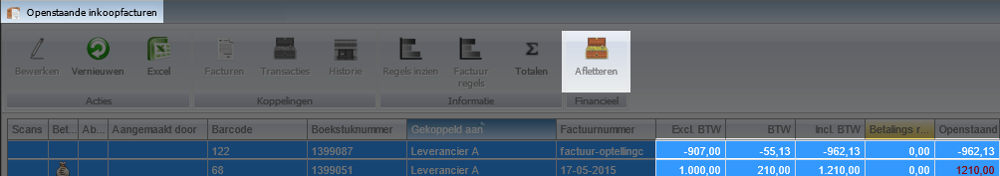

Er zal nu een transactie scherm worden geopend, met onderin de regels van de facturen.
Je ziet dat hij nog niet in evenwicht is, dit komt omdat het bedrag van de factuur wat je nog moet betalen in dit geval hoger is dan het bedrag wat je moet krijgen.

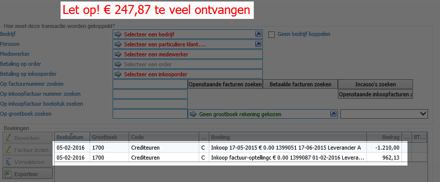

Selecteer de regel welke het hoogste is en open deze door er op de dubbelklikken Hierin kunnen we het bedrag aanpassen naar het bedrag van de credit in dit geval : €-962,13 en deze kan je opslaan

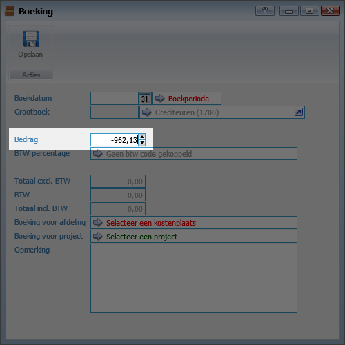

De boeking zal nu in evenwicht zijn, en dit scherm kan je ook opslaan

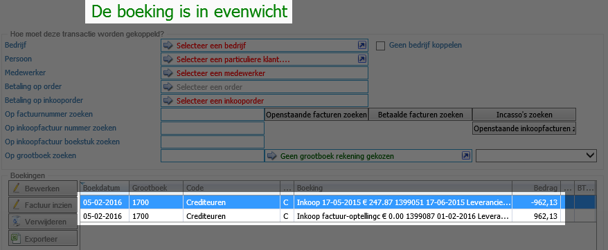

Als je nu weer terug valt in het scherm van **alle openstaande inkoopfacturen** zal je zien dat de credit nota er niet meer tussen staat en het openstaande bedrag van de andere factuur is aangepast.

Dit is nu met elkaar verrekend

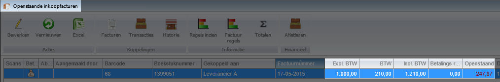

----------

## Op een verkoop factuur ##

Het kan voorkomen dat je een inkoopfactuur wilt afletteren op een verkoop die je nog  moet ontvangen, zodat deze tegen elkaar weg vallen of dat er nog een deel overblijft wat je nog moet ontvangen. 

In dit voorbeeld gebruiken we een inkoopfactuur van € 121,00 die we nog moeten betalen en een verkoopfactuur van € -211,75 die we nog moeten ontvangen, het verschil wat overblijft zal € 90,75 zijn wat we nog moeten betalen

Ga naar **alle openstaande inkoopfacturen** en selecteer de regel welke je wilt afletteren en klik op de knop **Afletteren**

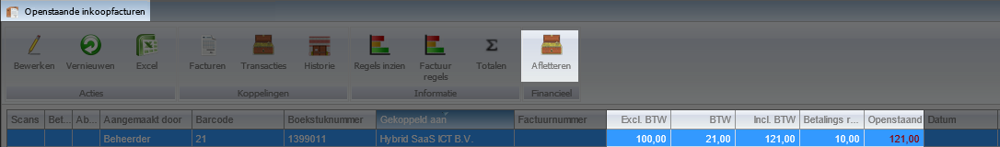

Er zal nu een transactie scherm worden geopend, met onderin de regel van de factuur.
Je ziet dat hij nog niet in evenwicht is, dit komt omdat er nog geen andere regels is toegevoegd.
Hiervoor gaan we naar **op factuurnummer zoeken** of gebruik de button **Openstaande facturen zoeken, Betaalde facturen zoeken, incasso's zoeken**

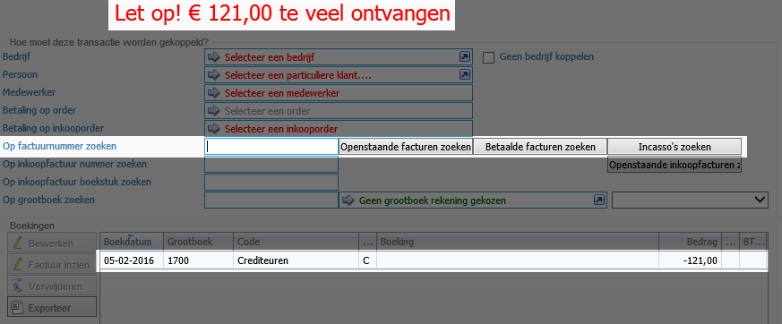

Zoek hierin de verkoopfactuur welke je wilt afletteren en klik op selecteren

Je komt nu weer terug in het transactie scherm, met onderin de regel van de factuur en inkoopfactuur.
Je ziet dat hij nog niet in evenwicht is, dit komt omdat het bedrag van de factuur wat je nog moet betalen in dit geval hoger is dan het bedrag wat je moet krijgen.

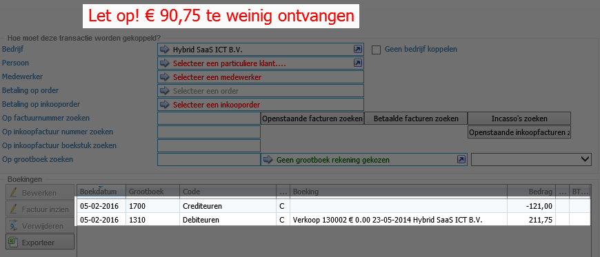

Selecteer de regel welke het hoogste is en open deze door er op de dubbelklikken Hierin kunnen we het bedrag aanpassen naar het bedrag van de inkoopfactuur in dit geval : €121,00 en deze kan je opslaan

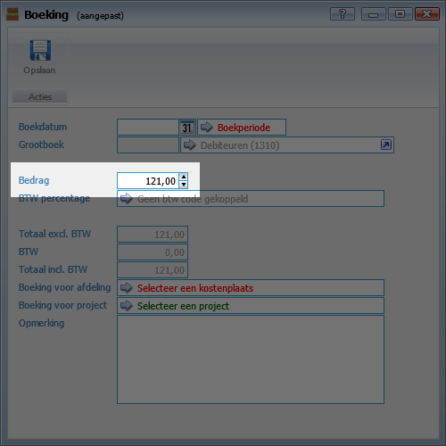

De boeking zal nu in evenwicht zijn, en dit scherm kan je ook opslaan

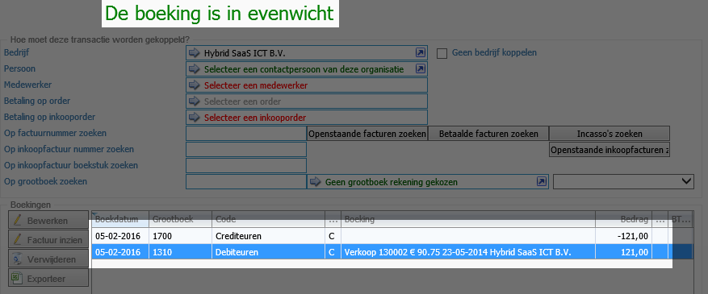

Als je nu weer terug valt in het scherm van **alle openstaande inkoopfacturen** zal je zien dat deze factuur er niet meer tussen staat. en dat het bedrag van de verkoopfactuur is aangepast

Dit is nu met elkaar verrekend

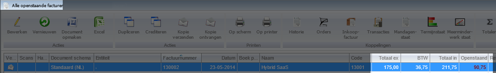

----------

## Op een grootboek ##

Het kan voorkomen dat je een factuur wilt afletteren op een grootboekrekening, zodat deze hierop word afgeletterd. Dit kunnen verschillende grootboekrekeningen zijn 

In dit voorbeeld gebruiken we een factuur van € 101,65 deze boeken we weg op de grootboek inhuur extern 

Ga naar **alle openstaande inkoopfacturen** en selecteer de regel welke je wilt afletteren en klik op de knop **Afletteren**

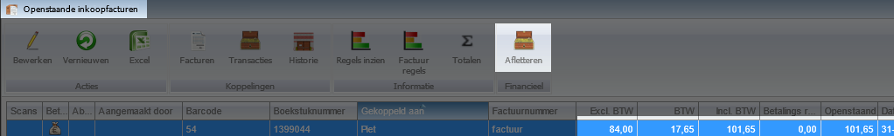

Er zal nu een transactie scherm worden geopend, met onderin de regel van de factuur.
Je ziet dat hij nog niet in evenwicht is, dit komt omdat er nog geen andere regels is toegevoegd.
Hiervoor gaan we naar **Op grootboek zoeken** of klik op de balk **geen grootboek rekening gekozen**

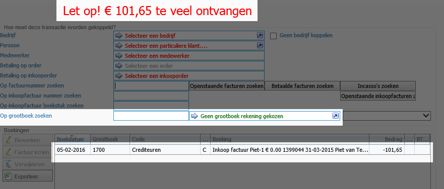

Zoek hierin de grootboeknummer en klik op selecteren

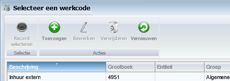

Je komt nu weer terug in het transactie scherm, met onderin de regel van de factuur en het grootboeknummer.
Deze is direct in evenwicht, het volledige bedrag word nu op deze grootboek rekening geboekt, dit scherm kan je opslaan

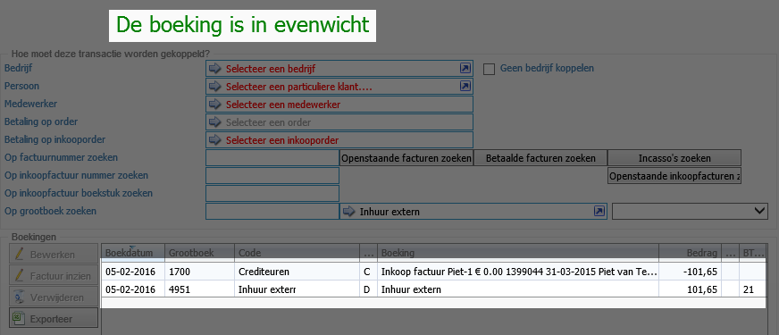

Als je nu weer terug valt in het scherm van **alle openstaande inkoopfacturen** zal je zien dat deze factuur er niet meer tussen staat. dit is terug te vinden bij de grootboekrekening

Dit is nu met elkaar verrekend

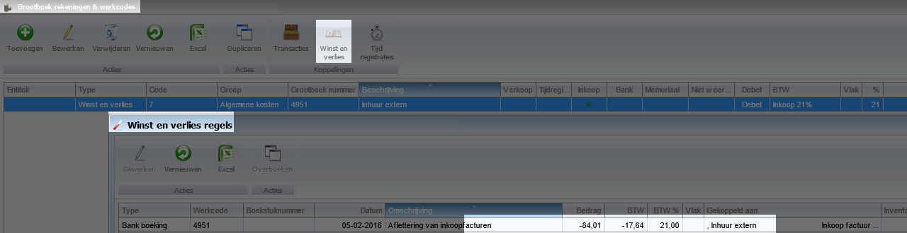

----------