<properties>
	<page>
		<title>inkooporde-routine</title>
		<description>inkooporde-routine</description>
	</page>
	<menu>
		<position>Modules / Inkooporder </position> 
		<title>Inkooporde Routine</title>
	</menu>
</properties>

## Inkooporde Routine ##

Het blijkt erg lastig te begrijpen hoe de inkoop routine nu precies werkt,
In deze beschrijven worden voorbeelden gebruikt.

- De orders die niet op voorraad zijn moeten worden besteld.

Je ben vooraan in de keten.

Je wil artikel 1001 verkopen aan klant, ik zie dat er maar 91 te leveren zijn.
Je heb nu **2 opties**

- **Optie 1** 

Lever uit wat ik heb en de rest bestellen, klik op goedkeuren, reserveren, de order komt in het pickorder proces.

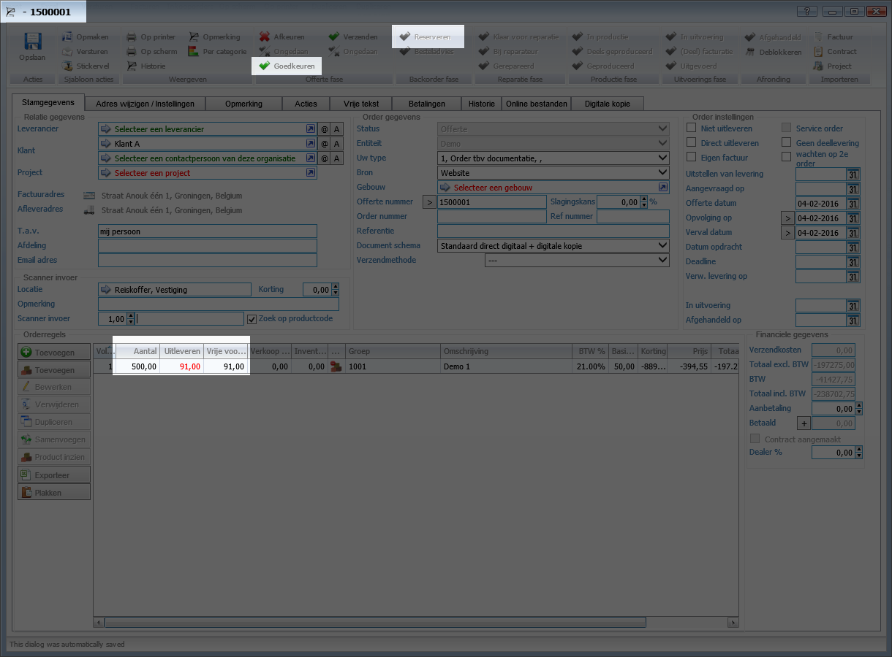
 
**OPTIONEEL**: Indien je van de 91 nog 50 wilt overhouden dan kun je de regel dubbelklikken en deze ook in backorder zetten, het systeem zal er dan maar 41 gaan uitleveren en er 459 bestellen.

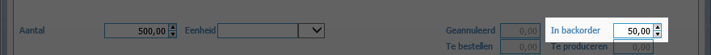 

Dit kan het systeem ook automatisch doen voor je.  Als je op de klantenkaart dit aan zet, (bedoeld voor distributeurs, zodat ze je voorraad niet opkopen)
Het systeem kijkt naar het aantal nabestel dagen wat nodig is om het hier te krijgen, dus in dit geval 49 dagen.
In de afgelopen dagen zijn er 35 verkocht, in de aankomende 49 dagen in het voorgaande jaar  28.

Het systeem zal 35 aanhouden als planvoorraad, zodat je aan normale klanten geen nee hoeft te verkopen.

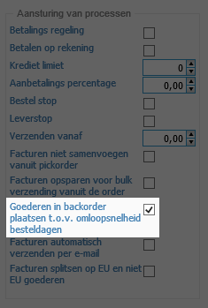 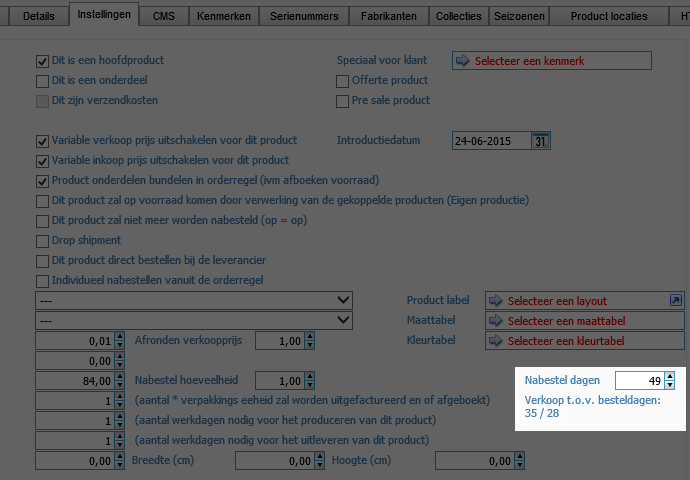

Deze aantallen zijn exclusief bulk orders (dat zijn de orders die direct doorgaan naar een groothandel in het buitenland, dit kun je weer aansturen in de status, en het selecteren van deze status in de order.
Systeem werkt met terugwerkende kracht de cijfers bij, dus als je de status later aanmaakt kun je de orders nog daar naar toe aanpassen.

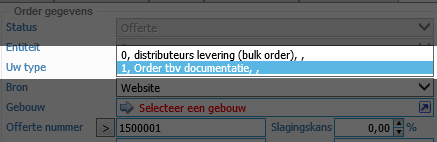 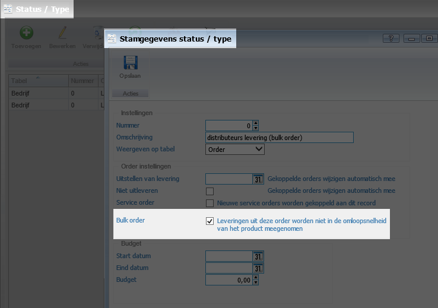

De verkoop afdeling keurt de order goed, waardoor hij naar het magazijn gaat.

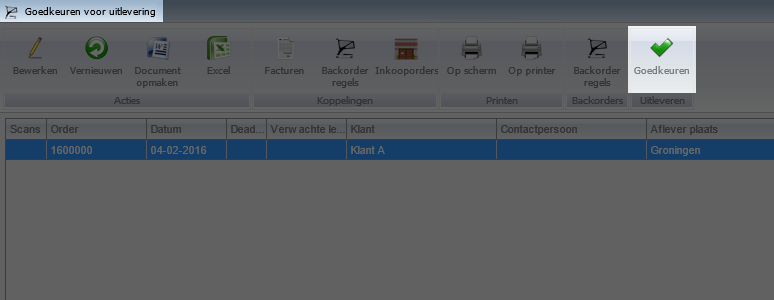

Magazijn zet de picklijst door via de printer, het systeem maakt de bon, op de bon zie je de 91 stuks staan, ook kan magazijn direct een controle houden, er moeten er namelijk 92 in het schap liggen, er blijft er 1 over voor een andere order.
Is dit niet het geval dan moeten zij dit melden aan de inkoop afdeling.

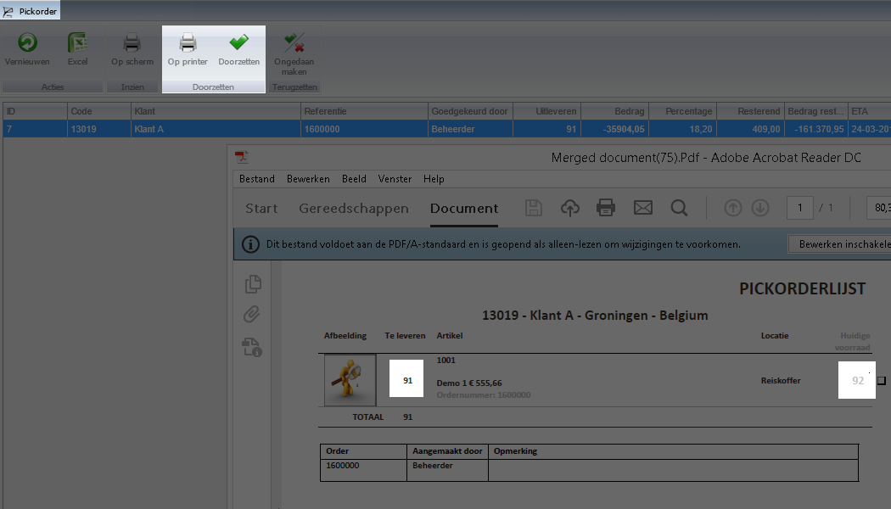

De spullen zijn geraapt, de afgedrukte pickorder kan worden opgezocht in het magazijn. 

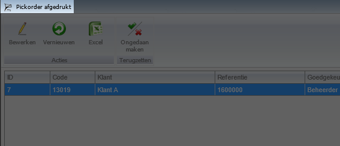

Na het uitscannen kan de order worden verwerkt.
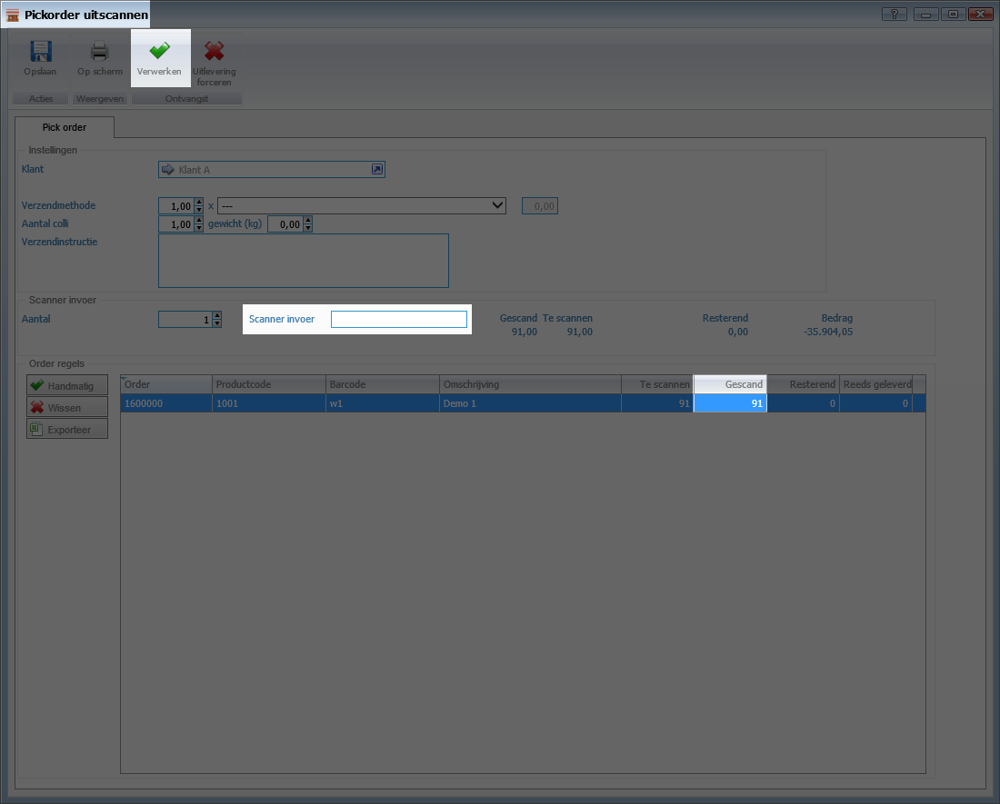

Indien je een verzendmethode hebt gekozen (kan de koppeling met micropakket of GLS worden geactiveerd)

Het systeem print de facturen en de backordelijst (indien aangegeven in het documentschema)
Je ziet hier het restant op staan, ook op te vragen via de klantenlijst, backorders

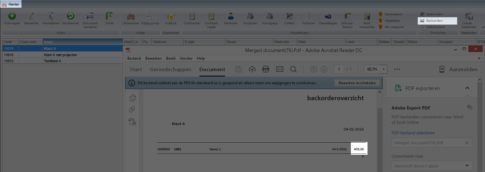

Vanuit de factuur springen kun je altijd even naar de gekoppelde order om te kijken hoe het er voor staat.

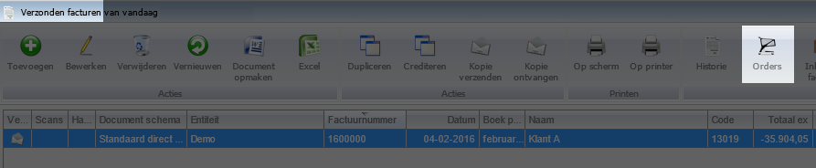

**Optie 2**

We verkopen artikel 1002 aan klant, nu willen we onze voorraad behouden. We klikken op goedkeuren en besteladvies. Alle regels (ook de koppel artikelen, worden besteld)

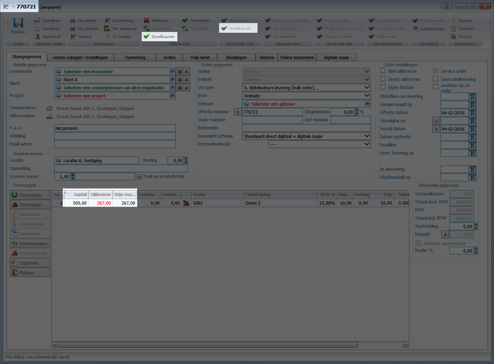

**Beide opties gaan hier verder:**

Vanuit de inkooporder (maakt niet uit welk bakje) is er een filter mogelijkheid gemaakt, hierdoor hoef je niet te zoeken en heb je alles binnen handbereik

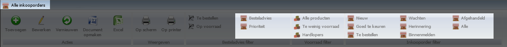

Ten eerste zul je de besteladvies filters moeten doorlopen, het systeem verwerkt bepaalde producten op een andere manier, hierdoor staat het een beetje verspreid,

- **Te bestellen:** hier staan backorderregels in die nog niet op het besteladvies staan.
- **Op voorraad:** hier staan backorderregels in die nog niet op het besteladvies staan, maar wel op voorraad zijn volgens het systeem
 
(met uitzondering van 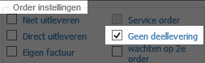 )

- **Besteladvies:** hier kun je leverancier wijzigen en de regels op een inkooporder plaatsen
- **Prioriteit:** het zelfde als besteladvies, echter komen hier de drop shipment artikelen in te staan, deze gaan naar specifieke klanten, zo kun je snel deze orders 1x per dag bestellen zonder na te denken over de rest.

Voorraad filters zijn alle producten die voorraad hebben. + verkoop informatie

- **Te weinig voorraad:** dus lager dan minimum voorraad. + verkoop informatie
- **Hardlopers:** meer verkoop dan besteldagen. + verkoop informatie

Ons advies, loop eerst op voorraad door, hier mee voorkom je onnodige bestellingen bij je leverancier.
Deze regel zou je kunnen leveren 

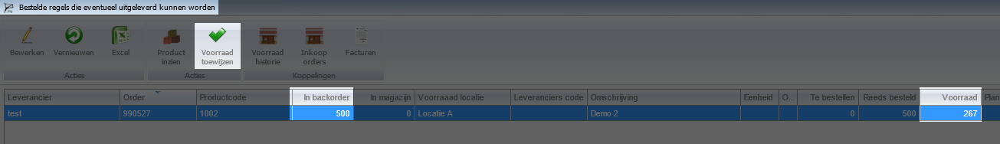

Loop daarna het te bestellen bakje door, je krijgt de keuze om de goederen als nieuwe inkoop te bestellen of om ze te reserveren in een reeds lopende inkooporder (indien er voldoende voorraad is)
 
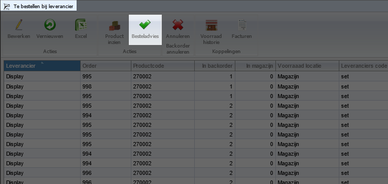

Wat niet meer besteld mag worden bij de leverancier zul je moeten annuleren.
 
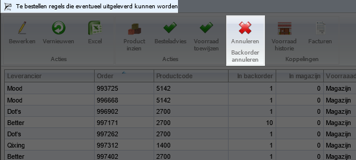

----------
