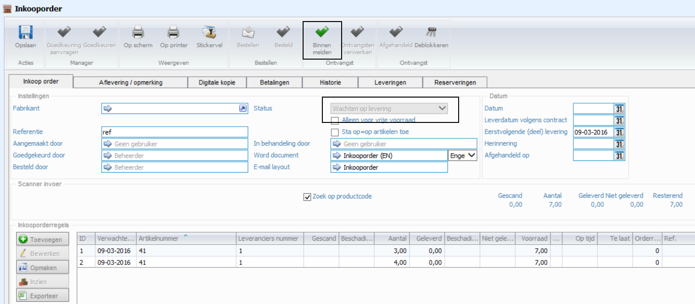
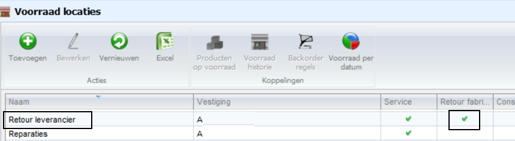
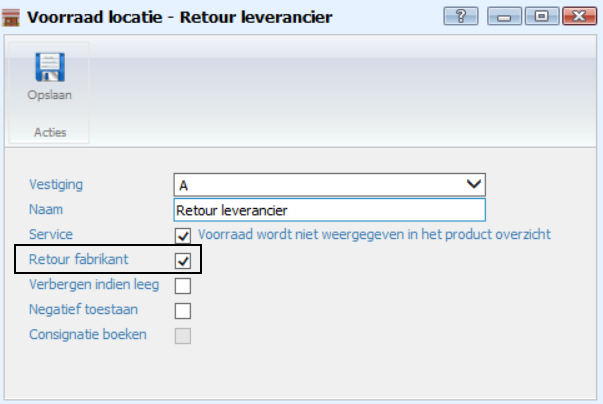
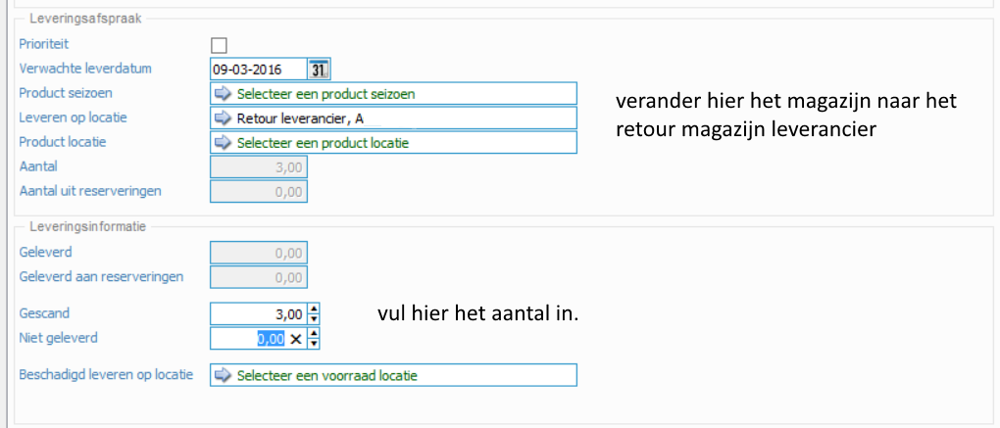
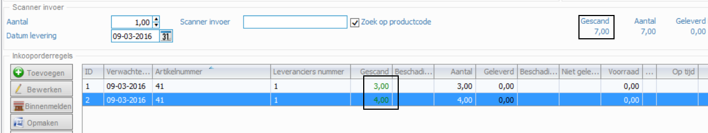
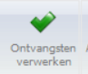
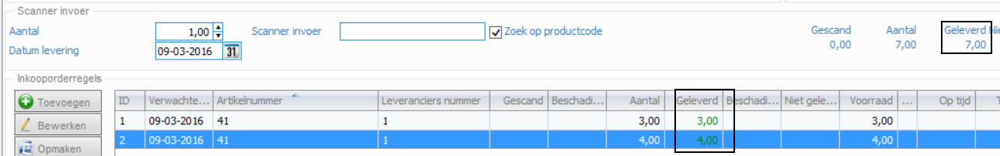
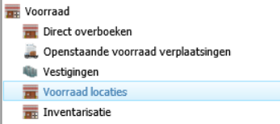
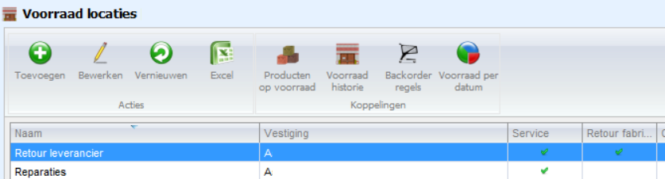

<properties>
	<page>
		<title>inkooporde-vanuit-magazijn-retour-leverancier</title>
		<description>inkooporde-vanuit-magazijn-retour-leverancier</description>
	</page>
	<menu>
		<position>Modules / Inkooporder vanuit magazijn retour leverancier</position> 
		<title>Inkooporde vanuit magazijn retour leverancier</title>
	</menu>
</properties>

## Inkooporde retour sturen vanuit magazijn aan de leverancier ##

Producten uit het standaard magazijn terugsturen naar de leverancier.
Ga naar **“Direct overboeken”**.
 

- Voer het eerste product in.
- Voer dan de **"van locatie"** en de **"naar locatie"** in en zet de reden in het opmerkingsveld
- Vul vervolgens het aantal in en druk op de knop **"verplaats voorraad"**
- Je hoef nu alleen maar voor de volgende producten het productnummer en het aantal in te geven en dan op de knop **"Verplaats voorraad"** te drukken de rest blijft gewoon staan

Nu heb je de aantallen verplaatst naar het magazijn **“Retour leverancier”** .
Ik heb het product 27002545 10 stuks verplaatst
Ik heb het product 27002542 8 stuks verplaatst

Ga nu naar de voorraadlocaties.
 

Selecteer de voorraadlocatie **“Retour leverancier”** en druk op de knop **“Producten op voorraad”**.
 

Selecteer het juiste product en druk op de knop **“Retour naar leverancier”** .
 

Je komt nu in de nieuwe inkooporder. Als je meerdere producten wilt terugsturen, ga dan terug naar het producten scherm van het **“Retour leverancier”** en voer de actie opnieuw uit. Alle regels komen dan in één inkooporder terecht. Weliswaar negatief. Je kan ook meerdere regels selecteren en dan op de knop **“Retour leverancier”** drukken
 

Open de inkooporder.
Loop nu het proces door. Goedkeuring aanvraag, goedkeuren manager en als laatste de knop **“Besteld”**. De order hoeft niet binnen gemeld of in ontvangst te worden genomen.
De voorraad wordt meteen weer afgeboekt.

 
Resultaat is:

Voorraad historie:
 

Producten zijn nu tijdelijk opgeboekt geweest in het Retour leverancier magazijn en van daaruit weer retour gestuurd. Per saldo dus 0.

----------
