<properties>
	<page>
		<title>order_tot_inkooporder</title>
		<description>order-tot-inkooporder</description>
	</page>
	<menu>
		<position>Modules / Inkooporder </position> 
		<title>Van offerte t/m inkooporder </title>
	</menu>
</properties>

# Van verkooporder tot inkooporder #

## STAP 1: Nieuwe order aanmaken ##

Deze rubriek geeft een beschrijving van het proces van verkooporder tot en met een inkooporder. 
Maak een verkooporder (offerte) aan.

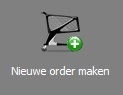 

Keur de order goed door op **Goedkeuren** zodat deze de status “Geaccepteerd” krijgt. 

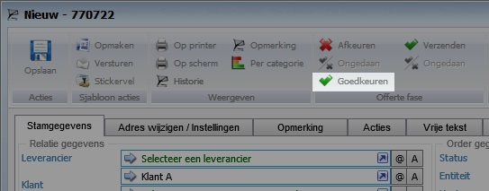 

Nadat de order is geaccepteerd worden bij “Backorderfase” de optie **Reserveren**

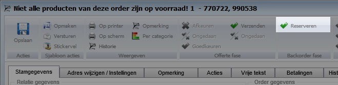 

Door de order te reserveren worden de volgende acties gedaan:

- Er worden een reservering gedaan op de producten welke op vooraard liggen.
- Producten welke niet op voorraad zijn worden toegevoegd aan de lijst “Te bestellen bij leverancier” 

Bij **Te bestellen bij leverancier** worden alle producten weergegeven welke niet op voorraad zijn. 

Dit overzicht geeft alle orderregels weer welke (nog) niet op voorraad zijn en welke besteld dienen te worden. Dit noemt men Backorderregels.

Wanneer orderregels in dit bakje staan is het mogelijk om de order te deblokkeren en eventueel één of meerdere statussen terug te zetten. 

In de orderregel wordt het aantal eenheden weergegeven welke besteld dienen te worden

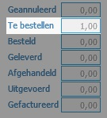 

## STAP 2: Producten op orderregels doorzetten naar een inkoopfactuur ##

Selecteer de producten (lees: orderregels) welke doorgezet dienen te worden naar een inkooporder. 

Klik op **Inkooporder** (**Besteladvies**) om de regels door te zetten. 

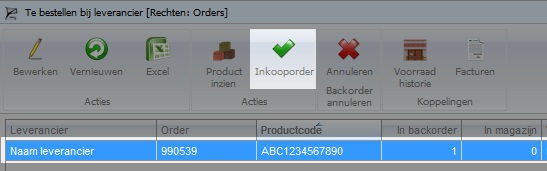 

Hierbij worden twee opties weergegeven:
-	Ja: Producten uit de orderregels toevoegen aan een bestaande lopende inkooporder
-	Nee:  Producten uit de orderregels toevoegen aan een nieuwe inkooporder
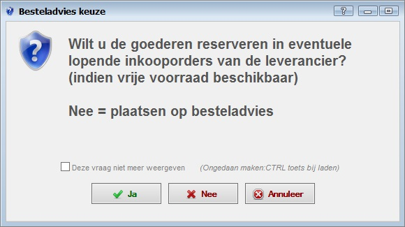 

JA: het systeem kijkt of er een bestaande inkooporder is. Indien deze gevonden is zal het systeem automatisch het aantal beschikbare producten reserveren op de lopende inkooporder(s) met de vroegst mogelijke levering (ETA). Indien het aantal bestelde producten niet voldoende is zal het restant als een nieuwe inkooporder worden aangeboden.

NEE: Alle producten zullen als een nieuwe inkooporder worden aangeboden. Zie stap 3.

**Producten op backorder annuleren**

Het kan voorkomen dat orderregels geannuleerd dienen te worden. De reden kan zijn dat het betreffende product niet meer nabesteld kan of gaat worden. Of dat de betreffende klant de bestelling voor het product wil annuleren.
Selecteer de betreffende orderregels en kies voor Backorder Annuleren

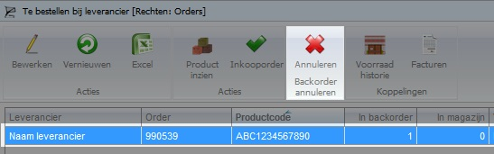
 
In de bevestiging wordt gevraagd of de regel geannuleerd dient te worden. Indien gewenst wordt er een annuleringsfactuur aangemaakt.

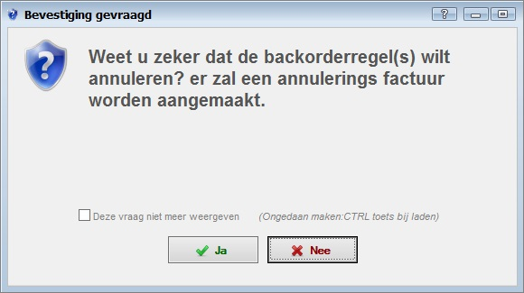 

Wanneer een backorderregel wordt geannuleerd zal het aantal de betreffende orderregel op “0” worden gezet.

Indien alle producten in en order worden geannuleerd zal de order automatisch worden afgehandeld. 

Vergeet niet de klant op de hoogte te brengen wanneer regels worden geannuleerd! 

## STAP 3: Nieuwe inkooporder aanmaken / Besteladvies ##

Wanneer de betreffende orderregels zijn doorgezet naar een inkooporder komen deze in de bak “Inkooporder aanmaken” of “Besteladvies”. Dit is de laatste stap om de producten naar een inkooporder om te zetten. 

Wanneer producten uit een order in dit bakje staan is het niet meer mogelijk de betreffende order te deblokkeren via de knop “Deblokkeren” in de order.

  

Door de ordergel te verwijderen uit dit bakje zal deze weer één plaats terug gaan in het proces en is deze terug te vinden bij “Te bestellen bij leverancier”

In de orderregel wordt het aantal eenheden weergegeven welke besteld zijn

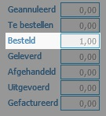 

## Backorderregels koppelen aan een bestaande (lopende) inkooporder  ##

Indien een backorderregel bij **Inkooporder aanmaken / Besteladvies** wordt weergegeven terwijl er reeds een inkooporder is, is het mogelijk deze backorderregel aan de bestaande inkooporder te koppelen. 
Selecteer te betreffende regel en klik op **Verwijderen**

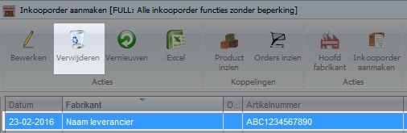 

De status van de betreffende regel zal worden terug gezet waardoor de backorderregel bij “Te bestellen bij leverancier” wordt weergegeven. Ga terug naar stap 2 en kies bij de bevestiging voor de optie **JA**. Hierdoor zal de betreffende backorderregel aan een bestaande inkooporder worden als reservering gekoppeld.

## STAP 4: Inkooporder aanmaken ##

Selecteer te betreffende regel en klik op **Inkooporder aanmaken**

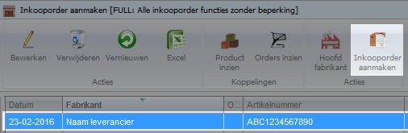 

Kies bij de bevestig voor Ja om de backorderregels om te zetten naar een nieuwe inkooporder

 

Indien er reeds een inkooporder bekend is van de betreffende leverancier, met status “nieuw”, zal de backorderegel aan deze inkooporder toegevoegd worden. Indien dit niet wenselijk is keur dan eerst de inkooporder goed.

# Inkooporder #

## Inkooporder goedkeuren ##

Na het aanmaken van een inkooporder dient deze een aantal goedkeuringen te doorlopen. Deze goedkeuring (fiatteren) kan door diverse personen en/ of afdelingen worden uitgevoerd. Afhankelijk van de rechten zijn deze goedkeuring wel of niet beschikbaar voor een gebruiker.

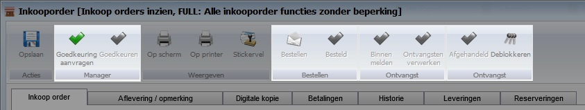 

Door middel van de knop “deblokkeren” is het mogelijk en stap terug te gaan in het proces.

## Reserveringen ongedaan maken ##

Door de reservering van een orderregel in een inkooporder ongedaan te maken wordt de koppeling tussen de orderregel en de inkooporder verwijderd.

Ga naar het tabblad **Reserveringen** in de inkooporder. 

Selecteer de regel welke ongedaan gemaakt dient te worden en kies voor **Bewerken**

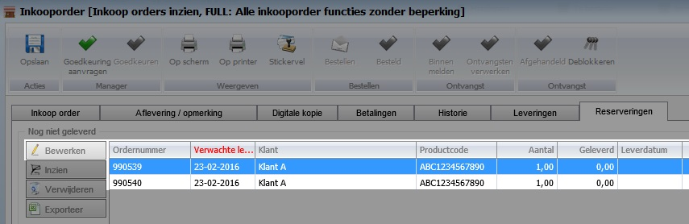 

Wijzig het aantal items welke vrijgegeven dient te worden. Indien de gehele reservering ongedaan gemaakt dient te worden zet dan het aantal op “0”

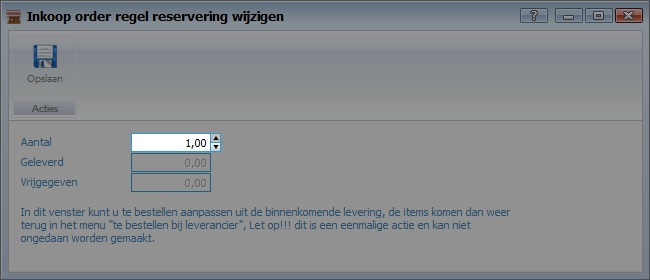 

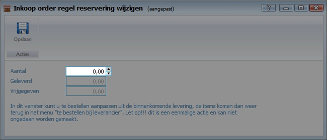 

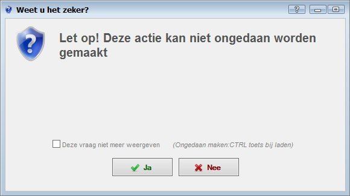 

Door het ongedaan maken van de reserveringen zullen de items weer vooraan in het proces beginnen bij “Te bestellen bij leverancier” Zie STAP 1 voor meer informatie.

