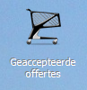
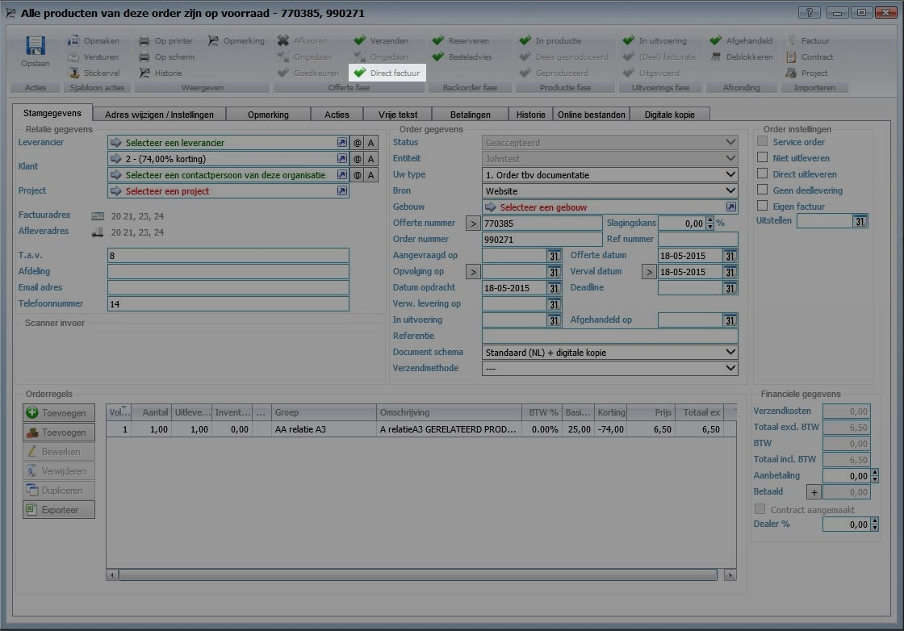
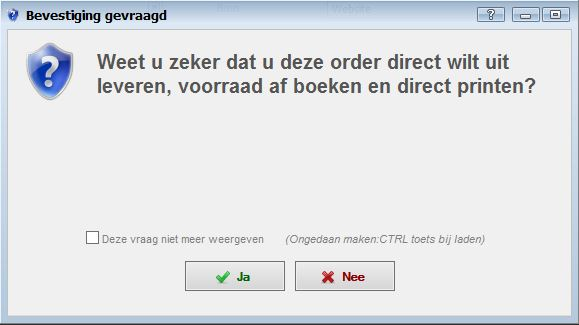

<properties>
	<page>
		<title>Orders met voorraad</title>
		<description>Orders met voorraad</description>
	</page>
	<menu>
		<position>Modules / Offertes en orders</position> 
		<title>Afhandelen met voorraad</title>
		<sort>A</sort>
	</menu>
</properties>

#Een order afhandelen met voorraad#
In dit artikel wordt het proces voor het afhandelen van een nieuwe order met voorraad beschreven.

Je zoekt je order op in

Indien alle goederen op voorraad zijn kunt u de order direct uitleveren

Klik op "Direct factuur" om de order direct af te boeken, uit te leveren en uit te printen.

 

Bevestig de order

 

Je order komt dan in verzonden facturen te staan en je kan de producten uitleveren

----------
