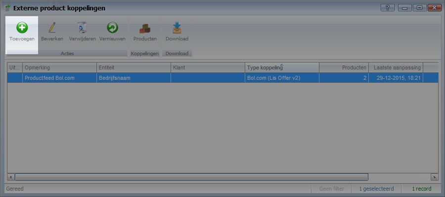
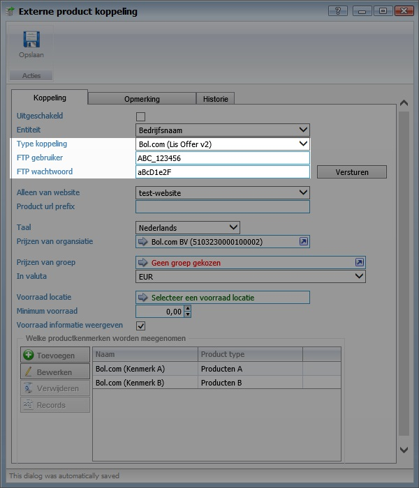
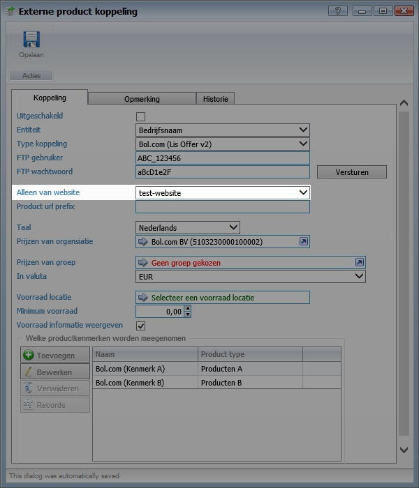
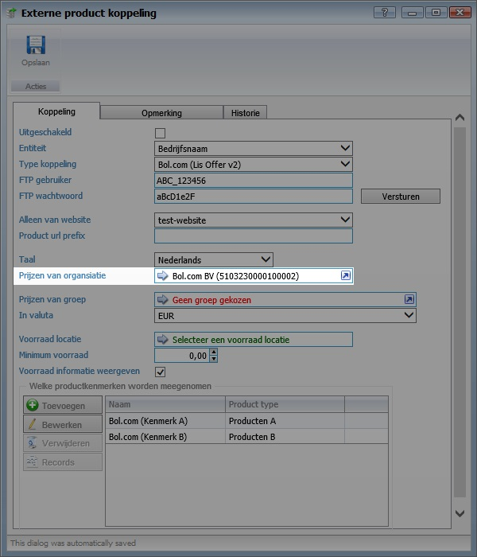
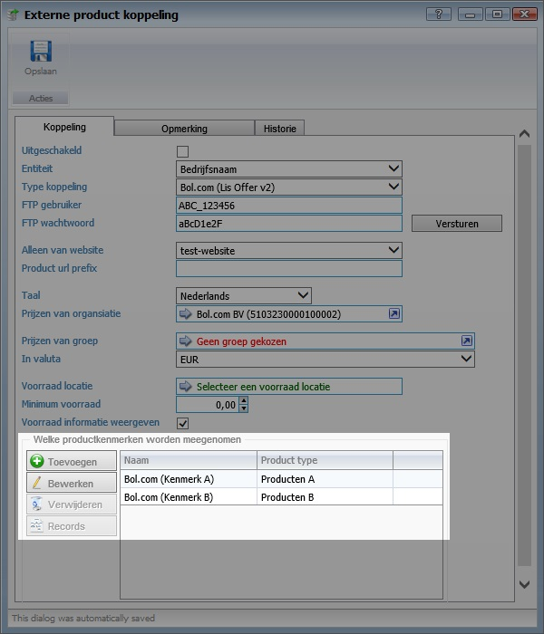
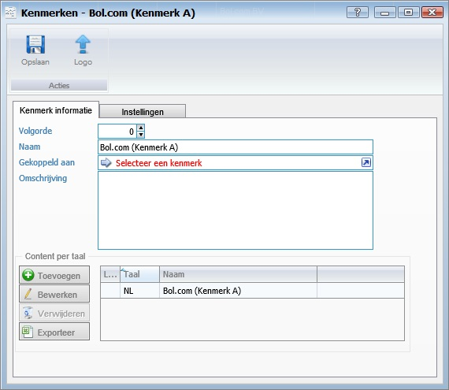
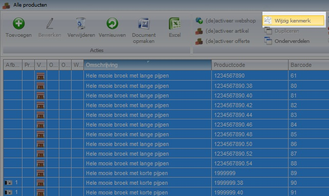

<properties>
	<page>
		<title>Externe productkoppeling</title>
		<description>Externe-factuurkoppeling</description>
	</page>
	<menu>
		<position>Modules / productenbeheer</position>
		<title>Externe Factuurkoppeling</title>
		<sort>a</sort>
	</menu>
</properties>

# Externe productkoppeling #
Met externe productkoppeling van Hybrid SaaS is het mogelijk uw productcatalogus en voorraadinformatie te delen met externe partijen. Momenteel bieden wij ondersteunen wij de volgende partijen:
•	Bol.com
•	Beslist.nl
•	Google

Tevens is het mogelijk om ruwe productsheets aan te leveren aan andere externe partijen.
Voordat u aan de slag gaat dient u eerst e.e.a. af te stemmen met de partij waar u een koppeling mee wilt realiseren. Denk hierbij bijvoorbeeld aan het afstemmen van eventuele product- of productgroep benamingen. Tevens dient u zogenoemde FTP inloggegevens te verkrijgen. 

## Toevoegen externe productkoppeling ##
Klik op start en zoek naar “externe productkoppeling”

Klik op toevoegen om een nieuwe externe productkoppeling toe te voegen

Selecteer het “type koppeling” welke u wilt aanmaken

Vul de verkregen FTP gegevens in bestaande uit een gebruikersnaam en wachtwoord.

## Selecteer website ##
Selecteer bij “Alleen voor website” de website waar de productkoppeling betrekking op heeft. 

Indien er nog geen website te selecteren is dient deze aangemaakt te worden. Zoek in het menu voor “websites” waar u in een paar stappen een nieuwe website aan kunt maken.

## Prijsafspraken vastleggen ##
Selecteer bij “prijzen van organisatie” de organisatie waarmee u de koppeling wilt realiseren.

Indien er geen prijsafspraken zijn vastgelegd dienen deze eerst aangemaakt te worden. Op de relatiekaart van de betreffende organisatie kunnen deze worden vastgelegd  op het tabblad “prijsafspraken”

## Productkenmerken vastleggen ##

Selecteer bij “welke productkenmerken worden meegenomen” de productkenmerken welke meegenomen dienen te worden in de product feed.

Er kunnen meerdere productkenmerken worden geselecteerd. Afhankelijk met de afspraken welke zijn gemaakt met de ontvangende partijen kunnen kenmerken worden toegevoegd.

## Productkenmerken aanmaken ##
Om niet alle producten mee te nemen in de product feed kan er een kenmerk worden aangemaakt. Alle producten welke in gedeeld dienen te worden vervolgens gekoppeld dat het betreffende kenmerk.
Klik op start en zoek “Productkenmerken” 
Klik op toevoegen om een nieuw kenmerk toe te voegen

Koppel de producten welke in de feed naar voren dienen te komen aan het betreffende kenmerken. Het is mogelijk om meerdere producten tegelijk aan een kenmerk te koppelen. Uiteraard is het ook mogelijk om de kenmerken per stuk aan een product te koppelen.

